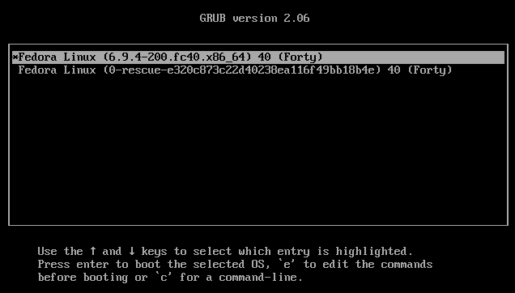
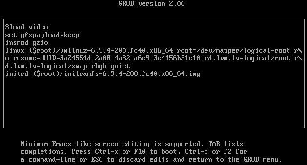
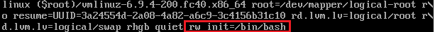
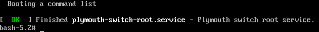

This tutorial explains how to recover the root password on a Fedora Server.

## Recover the root user's password

During the Linux server boot, a boot screen like the one below will appear:



Press the "e" key to open the boot configuration edit mode as shown below:



Find the line that starts with "linux" or "linux16" or "linuxefi" and at the end add "rw init=/bin/bash" as in the example below:



Press CTRL + X to boot Linux with the new settings. The following screen should appear:



Enter the commands below to change the password:

```shell
passwd
```

Restore SELinux permissions with the following command:

```shell
/bin/sed -i s/"SELINUX=enforcing"/"SELINUX=permissive"/ /etc/selinux/config
touch /.autorelabel
```


:::danger[Warning]
If SELinux permissions are not restored using the above steps, the login process may fail and you will have to repeat the password procedure.
:::


Then, reboot the server with the command below:

```shell
/sbin/reboot -r
```


:::note
Use the command below only if you wish to enable SELinux.
:::


After rebooting the server, log in as root and re-enable SELinux with the commands below:

```shell
sed -i s/"SELINUX=permissive"/"SELINUX=enforcing"/ /etc/selinux/config
setenforce enforcing
```