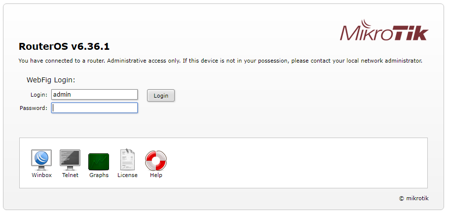
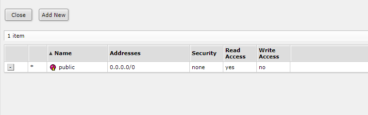
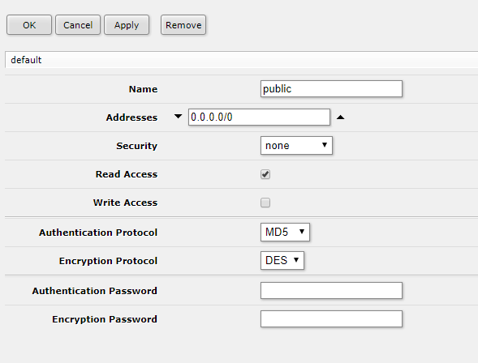
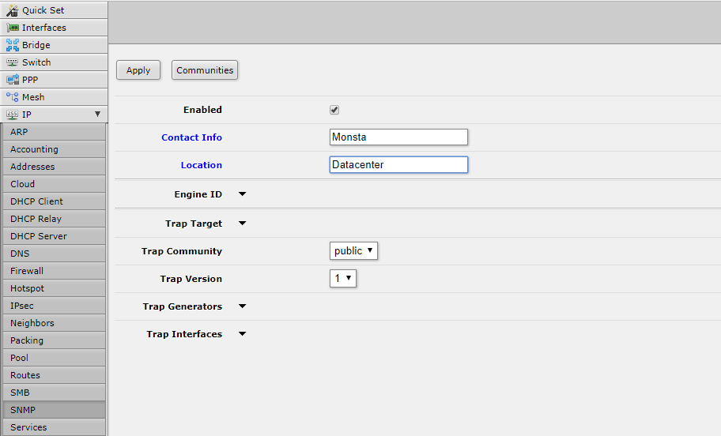

Tutorial aimed at enabling a basic configuration of SNMP services on a MikroTik Routerboard.

## Configuring the SNMP service

:::tip
This procedure can also be performed using MikroTik's Winbox software.
:::

Open a web browser and enter the MikroTik address in the URL. The following screen will appear:

Enter the username and password for your device (the default is admin and leave the password blank). Then, in the left menu, click IP and then click SNMP:

Fill the “Contact Info” field with the person responsible for contacting regarding this device and the “Location” field with its location.

## Configuring a Community

Then, click the “Communities” button; the following screen will be displayed:

  
If the community public already exists, modify the configuration information as shown below; otherwise, click the “Add New” button and fill the screen with the following information:

  
Click the Ok button and then click the Close button to close the community editing window.

## Apply the Configurations

On the SNMP screen, click the Apply button.

  
  
From now on SNMP is available on your MikroTik device and can be monitored by Monsta using versions 1 and 2c with the public community.