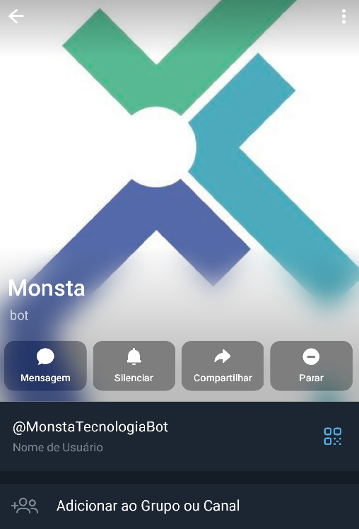
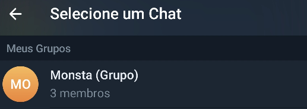
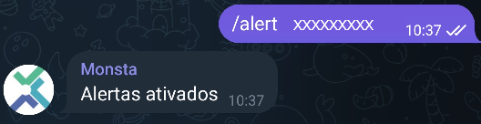

Monsta uses a Telegram bot to send alerts. To add the bot to a Telegram group so the group receives the alerts, do the following:

- **In Monsta**, go to the **"Alert Groups"** menu and click the group where you want to receive the messages;
- Inside the selected group, go to the **"Monsta Alerts"** tab;
- Select the **"Monsta: Telegram"** option and click to enable it;
- Click the **"Manage registered users"** button;
- Copy the **code** shown on the screen;

To enable alerts, **search Telegram for "MonstaTecnologiaBot"**. When you open the bot chat, click on the profile picture; the following screen will be shown:

Then click **"Add to Group or Channel"**. In the screen that appears, select the desired group and add the Monsta bot as a member.

When you return to the profile screen, **click the Groups tab** and click the group you added. Inside that screen, **enter the code provided by Monsta** in the initial step:

If the procedure is successful, you will receive the message "**Alerts Activated**". From that moment on, your Telegram group will start receiving the specific alerts defined in the Monsta alert group.