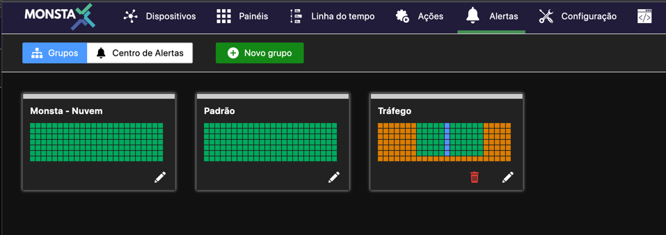
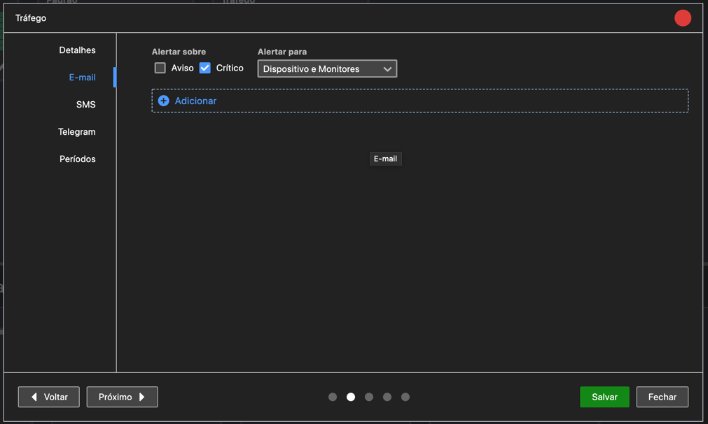
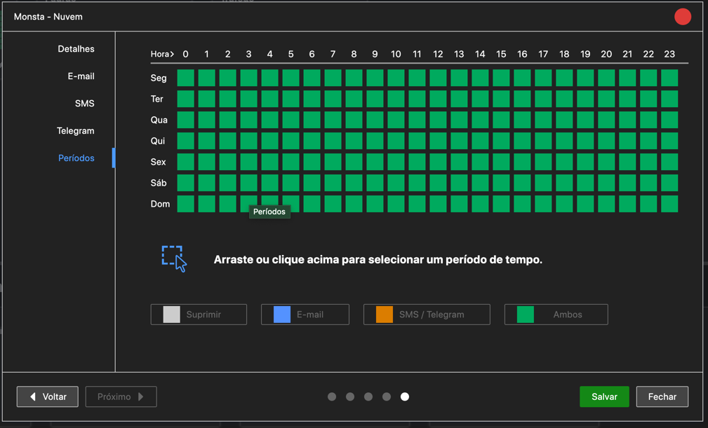
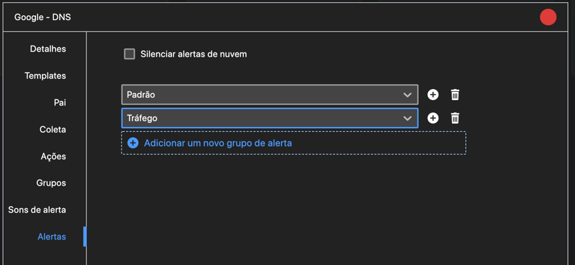

Monsta has a system of alert groups:

Each alert group contains settings for notifications via E-mail, SMS, and Telegram that can be applied to devices and monitors. For each of these three notification delivery mechanisms, the group can be configured to send alerts when there is an event in a warning state, a critical state, or both. Additionally, the group can be configured to alert only for devices, only for monitors, or both:

Finally, the group can be configured to send alerts only during a user-specified time period:

To apply these alert settings, each device or monitor can have zero or more alert groups:

When an event occurs for a device or monitor, all linked alert groups are checked. If the configured conditions match, a notification will be sent.