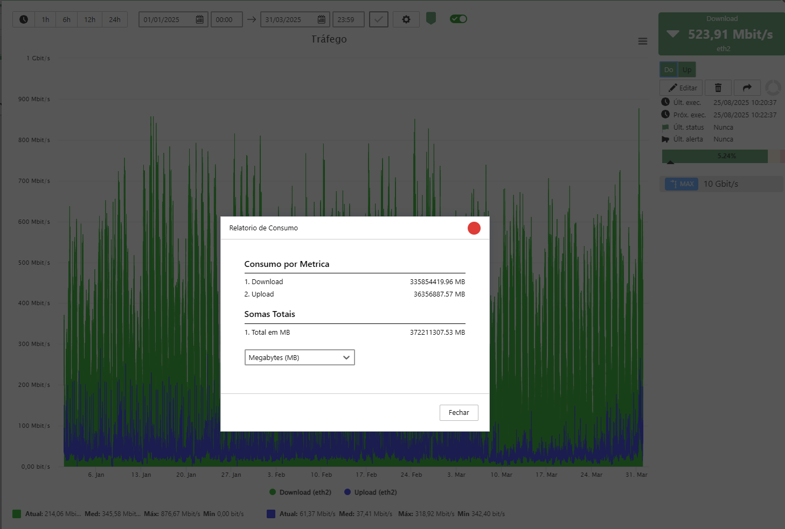

If you are a telecommunications provider, you know that the semiannual calculation of the total bytes transferred to the Internet is a requirement of ANATEL. This task, which often involves manual data collection and spreadsheet processing, can be time-consuming and prone to errors.

At Monsta, we understand the importance of simplifying your daily work. That's why we developed a new feature that completely automates this process.

**Goodbye, Spreadsheets and Hours of Work!**

## ISP: Traffic Calculation for ANATEL with Just One Click!

With just one click, you can generate the complete report with the total Internet traffic, ready to be submitted to ANATEL. Our tool collects all required data accurately and securely, eliminating the need for any manual intervention.

**How Does It Work?**

1. In the Devices menu, select the device and click on the traffic monitor for which you want to perform the calculation.
2. Select the query period.
3. After generating the chart with the period consumption, click on located at the top-right corner of the chart.
4. Select the "Consumption Report" option.

Done! The system performs the calculation and delivers the result in seconds. The total sum is the value that must be reported to ANATEL.

This new feature was created so you can focus on what really matters: managing and growing your business. With Monsta's new tool, complying with ANATEL's requirement becomes a fast, simple, and hassle-free task.

- - - - - -