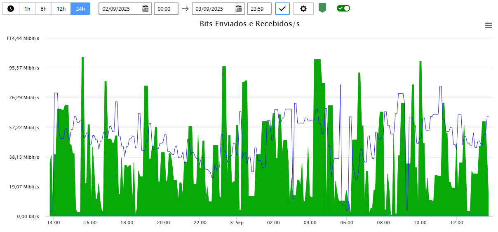
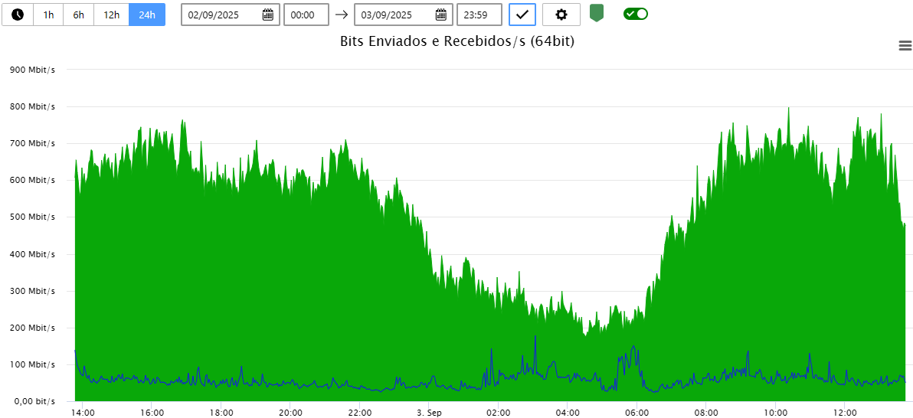

When monitoring network traffic via SNMP, we encounter **32-bit** and **64-bit** monitors. The main difference between them is the maximum counting capacity.

## Traffic Monitor

This monitor uses a 32-bit variable that can store a maximum value of 4 Gigabytes of traffic. On a high-speed network link, for example a 1 Gbps link, this count can be reached in 32 seconds.

- **Occurrence of rollover**: When this variable exceeds the maximum value, the counter resets to zero. This characteristic is known in Monsta as `rollover`.
- **Resulting problem**: This counter overflow can lead to monitoring graphs with abrupt drops, reporting incorrect speeds or speeds lower than the total traffic on the monitored network interface, making analysis and correct traffic calculation difficult. As a result, the real traffic value is lost, since depending on how often the monitor collects data, a rollover can occur without being detected.

  
Example of a 32-bit traffic monitor on a 1 Gbps link with a 5-minute polling frequency.

## Traffic Monitor (64 bits)

This monitor can store a maximum value of 18 Exabytes. This number is so large that a `rollover` on high-speed links is practically impossible. For example, a 100 Gbps link would take approximately 46 years to fill the entire variable.

- **Greater accuracy and reliability**: With a 64-bit counter, you ensure that traffic counting is continuous and accurate, without interruptions.
- **Long-term analysis**: Allows more accurate and reliable traffic analysis over long periods, since the accumulated value is not lost.

The same traffic on a 64-bit monitor.

## Conclusion

For accurate graphs, always use 64-bit monitors, which provide better measurement precision. However, if the equipment you intend to monitor only provides 32-bit traffic, decrease the data collection frequency to a value that matches the speed of the monitored network interface.