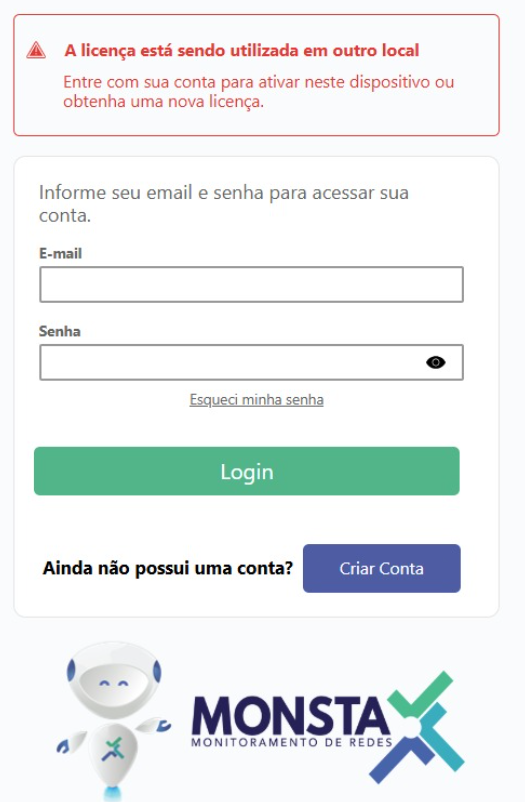
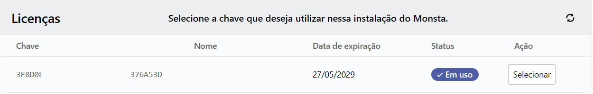

When installing Monsta on a new server or after a reinstallation, the system on the old server displays an alert with the following information:

:::danger[Message in Monsta]
The license is being used elsewhere  
  
Log in with your account to activate it on this device or obtain a new license.
:::

## ✔️ Solution: Reactivating the Key on the New Server

To free the license from the old server and bind it to the current one, follow the steps below directly in the software interface:

### 1. Log in with your Account

- On the web interface of your Monsta, enter the **Email** and **Password** of the account that was created on Monsta's official website, the same login used to purchase the license.

:::caution[Attention]
Do not use your Monsta access credentials on this screen.
:::

### 2. Selecting the Existing License

- After logging in, the system will list all license keys linked to your account.
- Identify the key you want to use and click Select (it is possible to use a key that is currently in use).
- Confirm the operation.

### 3. Finalization

- Monsta will communicate with the validation server and update the status to **"Licensed"**.
- The old server will automatically lose access (if it is still running), and the new one will be ready for use.