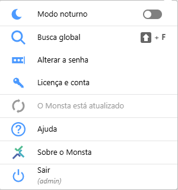

Besides the links to each screen, there are features available in Monsta's top bar.

## Information

In the top-right corner, Monsta displays information about the resources available in the system.

| Ícone | Descrição |
| :---: | :--- |
|  | SMS: This field shows the number of SMS messages available to be sent in case of a status change of any device or monitor. |
|  | E-mail: This field shows the number of emails available to be sent in case of a status change of any device or monitor. |
|  | Notice Center: Indicates when there are messages about Monsta. |
|  | Cloud Communication: This field shows whether Monsta is communicating with the Cloud at https://mind.monsta.com.br. This communication is used for sending alert SMS and emails, for automatic backup of configurations, and for restoring the backup. |

## Tools

Tools: Allows quick access to various tools.

 
- **Dark mode**:  Feature that inverts the colors of Monsta's screens.  
- **Global search**:  Performs a search for the requested words across Monsta's entire data structure.
- **Change Password**: Allows changing the current user's password.
- **License and account**: Returns information about the license in use.
- **Updates**: Allows updating Monsta when a new version is available.
- **Help**: Takes you to Monsta's Wiki page.
- **About Monsta**: Returns information about the current software version. In this option you can also change the user to whom your license belongs.
- **Logout**: Logs out of the system.