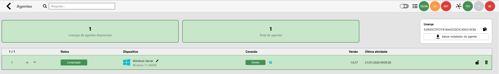
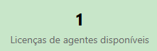
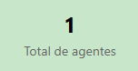
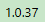
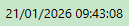

The Monsta Technology Monitoring Agent enables the management of complex, distributed IT infrastructures, ensuring monitoring is efficient, secure, and does not overload your wide area network (WAN). Currently, the Agent is available for Windows and its installation is quick and straightforward in any IT environment. A Linux installer (including the most popular distributions) will be available soon.

## How Does the Monsta Agent Work?

The Agent is the distributed intelligence of our system. Instead of centralizing all work on the server, the Agent performs checks directly on the network where the assets reside, ensuring accurate and high-performance data collection.

Designed for modern network environments, the Agent offers:

- **Decentralized Processing:** By executing monitoring tasks directly on the remote network, the Agent eliminates processing overhead on the main server, allowing the platform to manage a larger scale of devices without compromising the core system's performance.
- **Total Resilience:** The system is immune to intermittent internet connection failures. If communication with the server is interrupted, the Agent continues executing tasks locally, ensuring monitoring integrity, and synchronizes data automatically as soon as the connection is reestablished.
- **Simplified Connectivity:** The Agent works seamlessly without the need to configure complex VPNs or port forwarding (*port forwarding*), ensuring a quick installation while keeping your infrastructure's security intact.

## Agent Management and Distributed Monitoring

| Icon | Description |
| ---------------------------------------------------------------------------------------------------------------------------------------------------------- | ---------------------------------------------------------------------------------------------------------------------------------------------------------------------------------------------------------------------------------------------------------------------------------------------------------------------------------------------------------------------------------------------------------------------- |
|  | **Search**: Use the filter field to locate specific agents. As you type, the list will update automatically to display only results that match the entered text. |
|  | **Available agent licenses**: This field indicates the number of agents available in your subscription. If you need to monitor more devices you can access the customer area on our website and add as many licenses as necessary to your plan. |
|  | **Total agents**: Number of agents configured and occupying a license slot. |
|  | **Sorting**: The arrows allow reordering the agents list. This order defines the priority for using the purchased licenses: agents positioned above your quota limit will be monitored, while the excess will remain on standby. |
|  | **Status**: Indicates the current condition of each device on the network: • **Connected**: The agent is active and communicating normally with the server. • **Disconnected**: The agent is offline or there has been a loss of communication. • **Limit Exceeded**: The agent was installed but is not being monitored because your plan's license quota has been reached. • **Blocked**: The agent has its communication blocked. |
|  | **Device**: Displays information about the Operating System where the agent is running. |
|  | **Connection**: Exclusive to connected agents, this field indicates the communication route. • **Direct**: The agent communicates directly with the server. • **Hybrid**: The agent uses an intermediate server (Proxy) to bypass firewall restrictions or network isolation. |
|  | **Version**: Indicates the current version of the agent installed on the host. This field is managed automatically by the system: whenever a new update is released, Monsta will perform the upgrade automatically, ensuring you always have the latest features and fixes without manual intervention. |
|  | **Last activity**: Records the exact date and time of the last communication received from the agent. It is the primary indicator to check whether monitoring is occurring in real time. |
|  | **Block agent**: Allows you to manually pause or resume the communication of a specific agent. When blocked, the agent stops sending data to the server but remains installed and configured, and can be reactivated at any time with a click. |
|  | **Delete agent**: Permanently removes the agent from your monitoring list. **Note**: For security, this action is only allowed for agents with the status **Disconnected**. If the agent is still active, you must stop the service on the host before deletion. |

:::caution[Attention]
Agent support is available starting from Monsta version **6**.
:::
