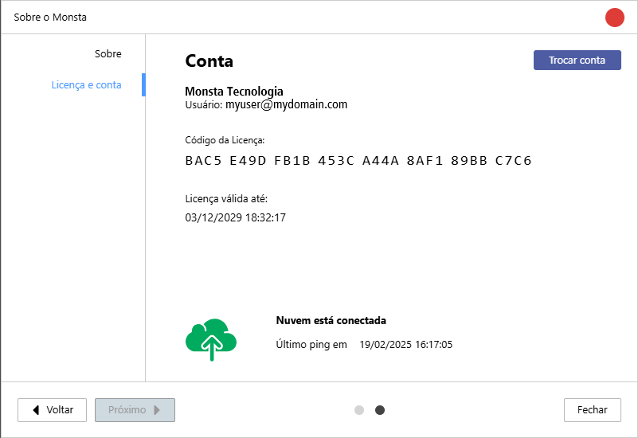

The license information screen allows you to view the details of your software license, including the license key and the expiration date.

| Info / Button | Description |
| :---: | :--- |
| Account | Displays the company name or the person's name associated with the license and the login email for that account. |
| Key | The license key is a unique alphanumeric code that identifies your software license. |
| License valid until: | This is the key's expiration date. It is automatically renewed with your subscription. |
|  | Allows the user to log out of the current account and sign in to Monsta with another account. |