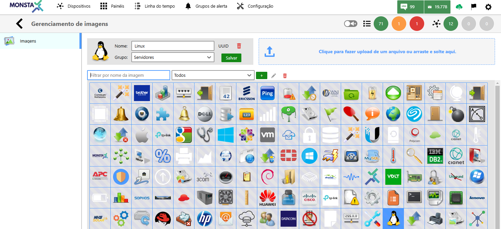
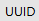

Manage your images easily: upload, organize by groups and custom names, and delete what you no longer need. Your image library, your way.

| Ícone / Opção | Descrição |
| :---: | :--- |
| Nome | Sets a name for the image. |
| Grupo | Specifies which group the image belongs to. |
|  | Displays the identifier of the selected image. |
|  | Removes the selected image |
|  | Saves the selected image and its attributes. |
|  | Uploads a file to the image library. |
|  | Filters the image list according to the entered text. |
|  | Displays only the images belonging to the selected group. |