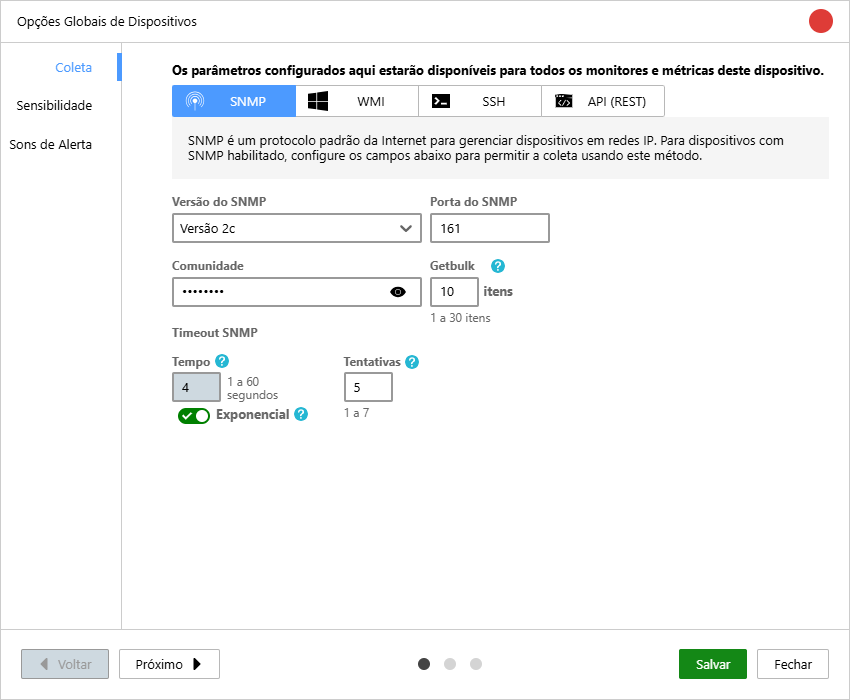
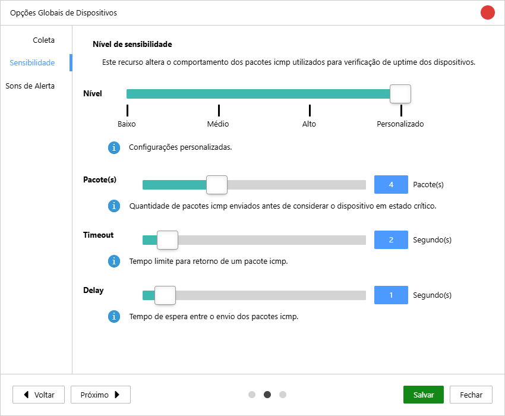
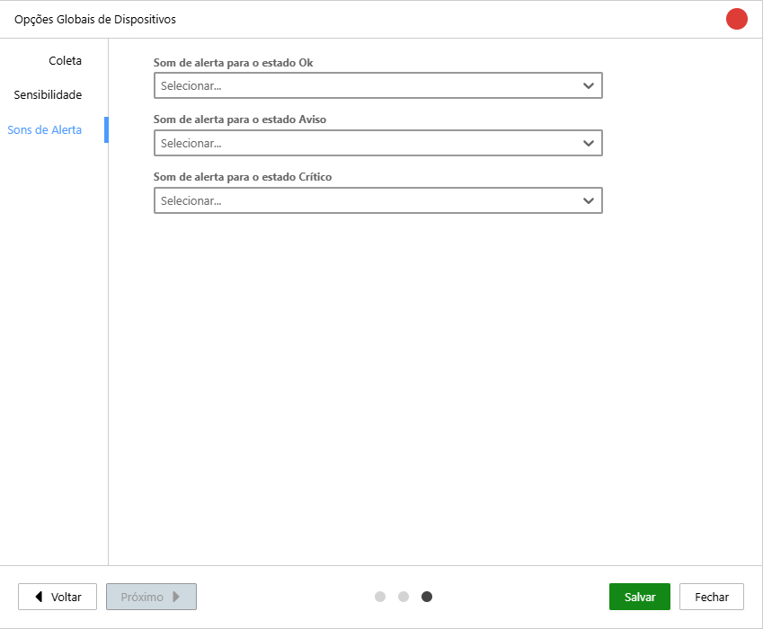
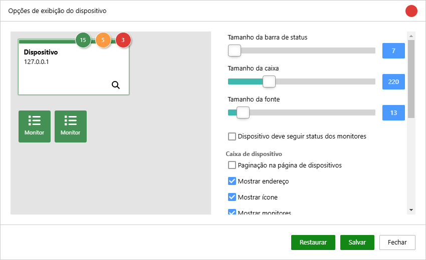

## Global device options

Monsta allows the definition of **Global Values**, which act as an intelligent preset for all registered devices. When a value is defined globally, it is automatically inherited by all devices unless a specific setting is defined individually for the device or for its device group.

### Collection

**Communication Parameters (SNMP, WMI and SSH)**: Centralize access credentials and communication ports. By configuring SNMP communities or SSH/WMI users globally, new devices will be monitored automatically without the need to enter passwords manually for each one.

### Sensitivity  

**Uptime Sensitivity**: Defines the tolerance criteria to consider a device as "offline". Adjusting the global sensitivity allows you to determine how many connectivity tests must fail before the system triggers a down alert, avoiding false alarms in networks with momentary fluctuations.

| **Level** | Predefined patterns can be used or customize each item. |
| --- | --- |
| **Packet(s)** | How many packets will be sent to the equipment before considering it critical in case of no response. |
| **Timeout** | How long Monsta will wait for each sent ping before considering it as not received. |
| **Delay** | After the previous packet is received or times out, how long Monsta should wait before sending the next request. Packets to check uptime are terminated upon receiving a reply. For monitoring the ping time on a device, all packets will be sent and an average time will be returned. |

### Alert Sounds

**Custom Alert Sounds**: Configure the sound experience of the Operations Center (NOC). You can set different audio for the **Normal**, **Warning**, and **Critical** states. This inheritance ensures the entire interface maintains a cohesive sound pattern, facilitating the immediate identification of an event's severity by the technical team.

## Display Options

Monsta allows you to configure the level of visual detail of your assets, prioritizing the information that is most strategic for your daily operations:

- **Dimension Adjustment**: Control the size of device and monitor boxes, allowing greater information density on small screens or better visibility on monitoring dashboards (NMS).
- **Dynamic Label Configuration**: You can choose what each monitor highlights on the main screen:    
    - **Monitor Name**: Ideal for quick identification of the service or parameter being observed (e.g., "CPU Temperature").
    - **Current Collected Value**: Displays the exact collected data in real time (e.g., "45°C"), allowing you to track critical metrics without opening the monitor details.
- **Text and Image Scaling**: Customize the font and image sizes in the monitors to ensure information is legible according to the chosen layout, adapting both to individual desktop use and large operation center screens.

| Item | Description |
| --- | --- |
| **Status bar size** | Defines the size of the bar displayed at the top related to the device status. |
| **Box size** | Defines the size of the device box. |
| **Font size** | Sets the font size of the device name. |
| **Device should follow monitors' status** | When this option is enabled, the device status will assume the status of the monitors, with critical being the highest priority and normal the lowest. |
| **Pagination on the devices page** | Displays the devices screen with pagination instead of infinite scrolling; |
| **Show address** | Displays the host used to monitor the device. |
| **Show icon** | Displays the icon assigned to the device. |
| **Show monitors** | Displays the count of monitors at the top of the device box. |
| **Show animation** | Enables animation of the device box when it changes status. |
| **Monitor box** | Allows the user to change the size of the monitor boxes. |
| **Font size** | Allows the user to change the font size of the monitor text. |
| **Spacing between boxes** | Allows the user to change the space between monitor boxes. |
| **Icon size** | Allows the user to change the size of the icon displayed in the monitor boxes. |
| **Monitor display mode** | Allows selecting the type of information that should appear on the monitor, name or last reading value. |