This screen displays all devices monitored on the network and their respective statuses. Here you can create new devices and add monitors for each of them, as well as view the graphs of the data collected by the selected monitors and customize them.

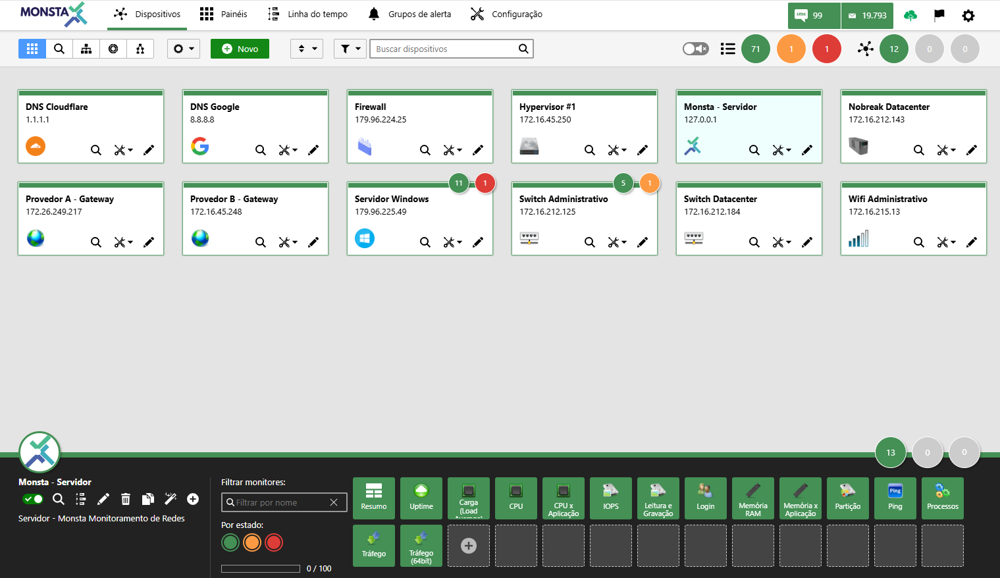

## View Modes

| Ícone | Descrição |
| :---: | :--- |
| 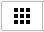 | **Grid**: Displays devices in box format. It is the default landing screen. For more information, see [Grid View](/en/manual/dispositivos/visualizacao-em-modo-grid). |
| 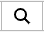 | **Detailed View**: Provides an overview of a selected device. |
| 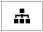 | **Groups View**: Shows the existing device groups. Clicking on a group activates a filter and only the devices belonging to the selected group will be shown. |
| 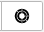 | **Sunburst View**: Starting from the selected parent device this view presents a network structure with equipment organized hierarchically. A summary of statuses and changes on the timeline is also shown. For more information, see [Sunburst View](/en/manual/dispositivos/visualizacao-sunburst). |
| 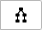 | **Map View**: Shows a graphical and hierarchical view of devices. For more information, see [Map View](/en/manual/dispositivos/visualizacao-em-mapa). |

- - - - - -

## Global Device and Display Options

| Ícone | Descrição |
| :---: | :--- |
| 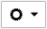 | **Global Options**: Centralize access credentials (SNMP/WMI/SSH), uptime sensitivity levels, and define sound alerts in a single place, applying the settings automatically to all devices and allowing manual exceptions only where necessary. Customize how devices and monitors are presented on the devices dashboard. For more information, see [Options](/en/manual/dispositivos/opcoes). |

- - - - - -

## New Device

| Ícone | Descrição |
| :---: | :--- |
|  | To add new devices, click the "+ New" button. For more information see the topic [New Device](/en/manual/dispositivos/novo-dispositivo). |

- - - - - -

## Sort

| Ícone | Descrição |
| :---: | :--- |
| 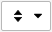 | Sorts the display of devices by name, address, or status. |

- - - - - -

## Filter

| Ícone | Descrição |
| :---: | :--- |
| 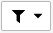 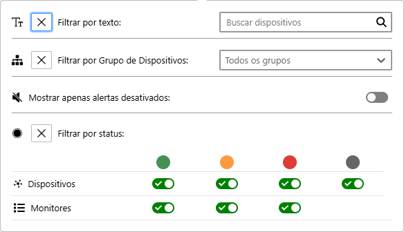| Allows filtering the device display by its description/text, by groups, by their states or the state of their monitors, by disabled alerts, or by deactivated devices. **Filter by Text**: Filters the device display by text or address. **Filter by Device Group**: Filters the device display by the group in which they are registered. **Show only disabled alerts**: Filters the device display to those that have alerts disabled. **Filter by status**: Filters the device display by their respective statuses or those of their monitors.|
| 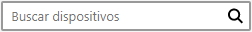 | **Quick Filter**: Filters the device display by text or address. |
|  | **Sound**: Enables/Disables sound alerts in Monsta. |

- - - - - -

## Status

| Ícone | Descrição |
| :---: | :--- |
| 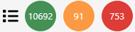 | **Monitors**: Shows the number of monitors per status. Clicking on a status activates the monitor filter to display only the devices that have monitors in that state. |
| 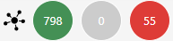 | **Devices**: Shows the number of devices per status. Clicking on a status activates the device filter to display only the hosts that are in that state. |

## Device Box

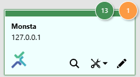

Displays device information and a summary of its status and monitors. 

| Ícone | Descrição |
| :---: | :--- |
|  | **Monitors**: Shows the number of monitors per status on the device. |
| 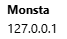 | **Name and Address**: | Shows the name assigned to the device and its respective address for monitoring. |
|  | **Icon**: Image assigned to the device. |
| 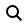 | **Detailed View**: Opens the screen with detailed information about the device. |
| 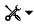 | **Tools**: Performs some actions on the highlighted device. |
| 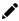 | **Edit**: Opens the edit screen for the highlighted device. |

## Device Properties

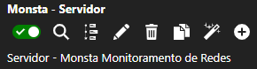

| Ícone | Descrição |
| :---: | :--- |
|  | **Enable Monitoring**: This switch, when inactive, pauses data collection for the device. |
|  | **Detailed View**: Opens a new window with various information about the device, such as uptime, monitor statuses, and its timeline. |
| 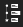 | **Timeline**: Opens the [Timeline](/en/manual/linha-tempo/linha-do-tempo) with the filter set for this device. |
|  | **Edit**: Opens the device edit. See [New Device](/en/manual/dispositivos/novo-dispositivo) for more information. |
|  | **Delete**: Deletes the selected device and all its monitors. |
| 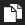 | **Clone Device**: Creates a copy of the selected device along with all its monitors. |
| 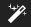 | **Automatic Monitors**: This option creates rules for Monsta to automatically add monitors to the selected device. For more information, consult " |[Automatic Monitors](https://wiki.monsta.com.br/books/manual-do-usuario/page/monitores-automaticos)".
|  | **Add Monitors**: Add monitors from the selected template to the device or allow the creation of a custom monitor just for it. |
