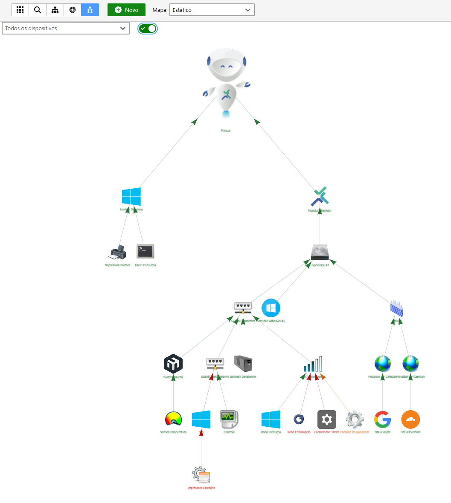
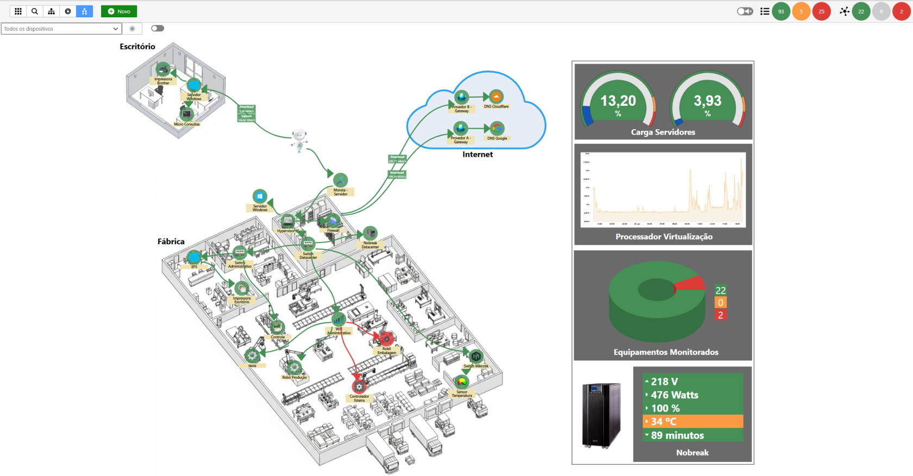
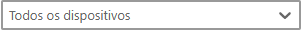

The map view enables a geographic or logical interpretation of the IT infrastructure, facilitating the visual identification of the network topology. In Monsta, you have two operating modes: the **Dynamic Map** and the **Static Map**

## Static Map

This mode offers a simplified and optimized view of the infrastructure.

- **Interactivity**: Icon positions are fixed and determined by the system hierarchy. The user can enable or disable the display of device icons via filters.
- **Customization**: Does not allow moving items or inserting *widgets*, keeping the interface clean and focused on asset status.
- **Application**: Recommended for visualizing large volumes of devices and large-scale infrastructures that require high loading performance.

## Dynamic Map

This mode allows full customization of the network's visual layout.

- **Interactivity**: The user can freely move device icons and position them manually on the map.
- **Customization**: Allows the insertion of *widgets* and additional graphical elements.
- **Application**: Ideal for creating personalized monitoring dashboards and networks that require specific visual organization.

### **Organization and Positioning**

The map offers complete layout freedom so the digital representation can faithfully match the physical installation:

- **Free Movement**: Click and drag any device to position it manually in the desired quadrant.
- **Layout Persistence**: The layout defined by the user can be saved at any time, ensuring that the organization is preserved across sessions.

### **Dependency Management (Hierarchy)**

The hierarchical structure defines the parent-child relationship between devices.

- **Changing Hierarchy**: To modify a device's parent node, click on the parent device node and drag the mouse to the new child device.
- **Logical Impact**: When changing an asset's parent, the system automatically updates the dependency tree and the alert propagation rules associated with that branch.

### **Widget Enrichment**

The map allows inserting **Widgets** directly into the viewing area:

- **Real-time Monitoring**: Add data blocks, performance charts, indicators and more alongside devices.
- **Dashboard Customization**: Widgets can be resized and positioned strategically to highlight critical metrics of specific assets without needing to navigate to other menus.

 
**Primary device**: The map has an intelligent filter system that isolates specific branches. When selecting a device via the filter, the interface hides irrelevant devices and displays exclusively the direct lineage of the chosen item.

 
**Map Properties**: Through the **Properties** button, you can customize the topology display to improve readability and visualization:
- **Elements**: Adjust the size and shape of device icons and texts.
- **Identification**: Enable or hide the display of images.
- **Connectivity**: Select different arrow types and link styles to represent network connections.

 
**Editing**: When activating **Edit** mode, the user gains full control over the network visual interface, allowing:
- **Spatial Organization**: Reposition devices freely via *drag-and-drop* to reflect the physical or logical topology.
- **Connection Metrics**: Insert performance indicators directly on the link lines between devices.
- **Widget Enrichment**: Add extra visual components (charts, gauges, etc.) to create a complete and personalized monitoring dashboard.
- **Reorganize positions**: Automatically reset the positioning of all devices according to the hierarchy defined in the system.