On the grid view screen devices are displayed as boxes that show the state the equipment is in and a summary of their respective monitors.

:::note
**Device**: Equipment with at least one IP address on the network.
:::

## Device Box

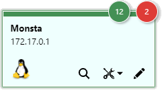

| Information | Description |
| :---: | :--- |
| 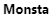 | **Name**: Displays the device name. |
| 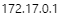 | **Address**: Displays the device address. |
| 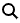 | **Detailed view**: Opens the selected device in a new screen with a more detailed view of its monitoring. |
| 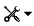 | **Actions**: Processes that can be triggered against the highlighted device. |
| 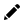 | **Edit**: Edits the device properties. For more information, see: [New Device](/en/manual/dispositivos/novo-dispositivo). |

- - - - - -

## Device View

In this tab you can view the device status and edit information about the device and its monitors, as well as access monitoring graphs.

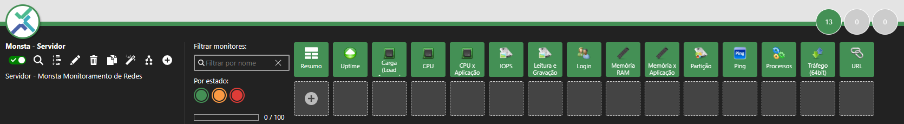

| Icon | Description |
| :---: | :--- |
| 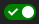 | **Enable / Disable**: Allows enabling or disabling monitoring of the selected device. |
|  | **Detailed view**: Switches to the device view mode with a summary of information. |
| 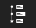 | **Timeline**: Opens the timeline of the selected device. For more information, see: [Timeline](/en/manual/linha-tempo/linha-do-tempo). |
|  | **Edit**: Edits the properties of the selected device. |
|  | **Delete**: Deletes the selected device and its monitors. |
| 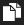 | **Clone**: Creates a copy of the selected device and its monitors. |
| 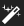 | **Automatic Monitors**: Opens the rule editor to create monitors automatically for the device. For more information see [Automatic Monitors](/en/manual/dispositivos/monitores-automaticos). |
| 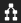 | **Map View**: Opens the map with the filter activated for the highlighted device. For more information see [Map View](/en/manual/dispositivos/visualizacao-em-mapa). |
|  | **Add Monitor**: Adds one or more monitors to the selected device. |
| 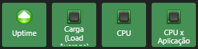 | **Monitors**: By clicking on their icons, their corresponding data are shown on the screen. |
| 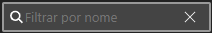 | **Filter Monitors**: Shows only the monitors that contain the filter words on the screen. |
|  | **Filter by State**: Shows only the monitors with the selected states on the screen. |
| 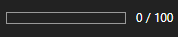 | **Running Metrics**: Shows the number of metrics currently running against the selected device and its maximum limit. |
|  | **Summary**: Clicking this item will open a new window with a summarized view of all device monitors. 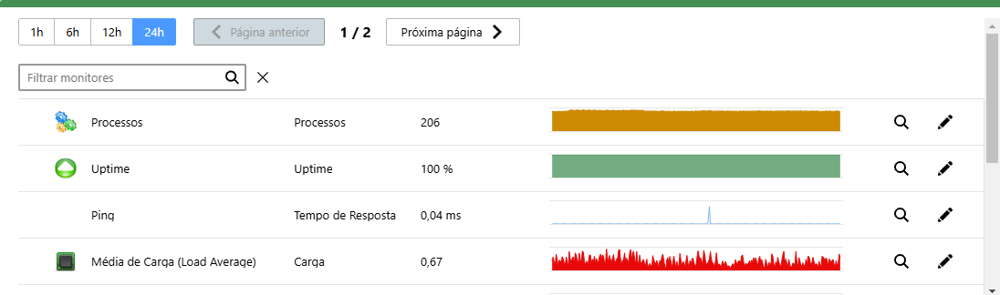 |

- - - - - -

## Monitors

For more information about monitors, see [Monitor View](/en/manual/dispositivos/visualizacao-de-monitores).

### Add Monitors

By clicking the + button in the device menu, it will be possible to select a way to add monitors.

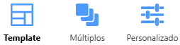

| Icon | Description |
| :---: | :--- |
| 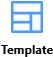 | Displays a screen with monitors related to the highlighted template. When selecting a monitor, it is possible to select the instance to be collected or change the name to be displayed on the monitor icon.  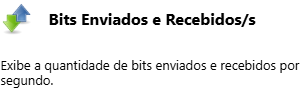 **Description**: Displays a summary of the icon, name and description of the selected monitor.  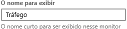 **Short name**: This is the name that will be displayed on the monitor icon. A preview is shown to the side.  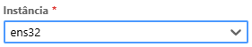 **Parameters**: Allows providing data, when requested, to the monitor, such as the name of the network interface to be monitored.  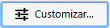 **Customize**: Edits monitor properties. For more information, see: [Edit/Customize a Monitor](/en/manual/dispositivos/visualizacao-de-monitores#editarcustomizar-um-monitor). |
| 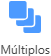 | This option allows adding multiple monitors at once to the device.  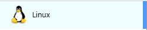 **Template**: Tab for selecting the template. Once a template is selected, its monitors will appear on the right side of the screen.   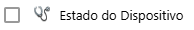 **Monitor**: When checked, tells Monsta that this monitor should be added to the device.  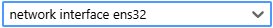 Parameters: Provides a parameter to the monitor to be used when creating the monitor, when necessary, for example, the network interface to be monitored on the device.   **Add monitor**: Repeats the selected monitor below to allow adding multiple monitors of the same type.  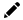 **Editor**: Allows changing monitor information before adding it. For more information, see: [Edit/Customize a Monitor](/en/manual/dispositivos/visualizacao-de-monitores#editarcustomizar-um-monitor). |
| 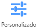 | **Custom Monitors**: Allows adding a custom monitor. This feature is useful to create monitors that will be used only by one device. For more information, see: [Edit/Customize a Monitor](/en/manual/dispositivos/visualizacao-de-monitores#editarcustomizar-um-monitor). |

### Automatic Monitors

Monsta has the ability to automatically identify and add new instances to monitoring, such as network cards, hard drives and other devices. This functionality saves time and avoids the need to configure them manually.

How it works: The system performs periodic scans on the device searching for new instances. When it finds one that has not been added to monitoring and is compatible with the filters, it is automatically added with the default settings.

Settings: You can customize the scan frequency, the types of monitors to look for and a word filter to be analyzed.

Example: When a new network card is connected to a server, Monsta will automatically detect it and add it to monitoring, allowing you to track its performance in real time.

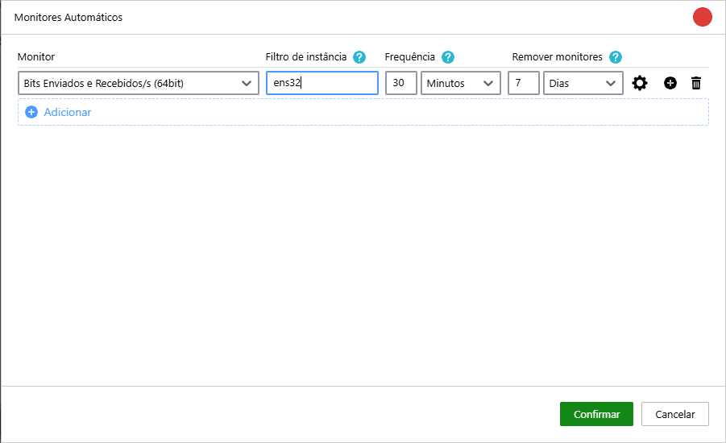

| Icon | Description |
| :---: | :--- |
| 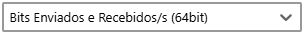 | **Monitor**: The type of search Monsta should perform for new instances. |
| 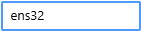 | **Instance filter**: Searches only for instances that contain the characters entered in the filter and ignores the others. |
| 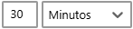 | **Frequency**: Time configured for Monsta to search for and add new instances on the device. |
| 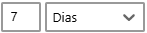 | **Remove monitors**: Monitors in a failed state, that is, whose instance no longer exists, will be removed after the selected period.<aside class="starlight-aside starlight-aside--caution">Do not confuse with monitors in a critical state, whose reading occurs but the values are outside their normal limits.</aside> |
| 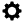 | **Properties**: Allows customizing the properties below for all monitors created by the rule: - Icon; - Metric names; - Alert thresholds; - Check frequency; - Number of attempts. |
|  | **Add rule**: Adds a new rule below the current one. |
| 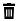 | **Remove rule**: Removes the selected rule. <aside class="starlight-aside starlight-aside--danger">When removing an automatic monitor rule, all monitors created by it will also be removed, along with their respective histories.</aside> |