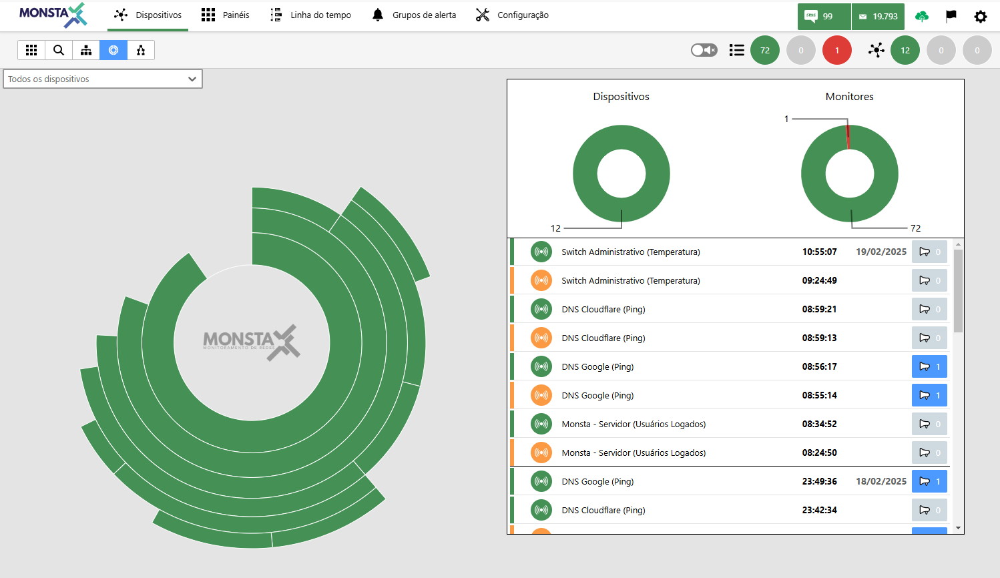
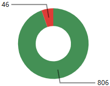
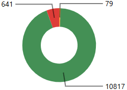
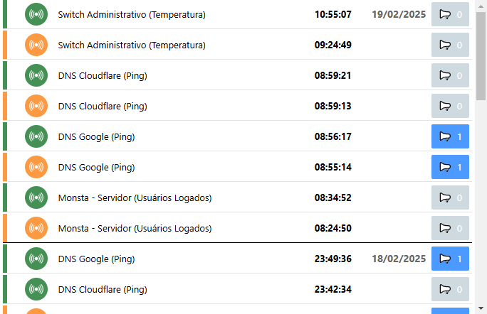

In this mode a hierarchical view of devices is presented with summaries of their statuses and respective monitors from the root of the tree or from a selected parent device.

:::note
Parent devices are configured within devices. See more at: [New Device](/en/manual/dispositivos/novo-dispositivo).
:::

**Parent Device**: Selects from which device Monsta should display the hierarchical network structure.

**Devices**: Displays the total number of devices per status at the current time. 

**Monitors**: Displays the total number of monitors per status at the current time. 

**Timeline**: Shows the timeline for the devices that are part of the selected tree.
 When the alarm is highlighted, it means that one or more alert groups were triggered in that event.