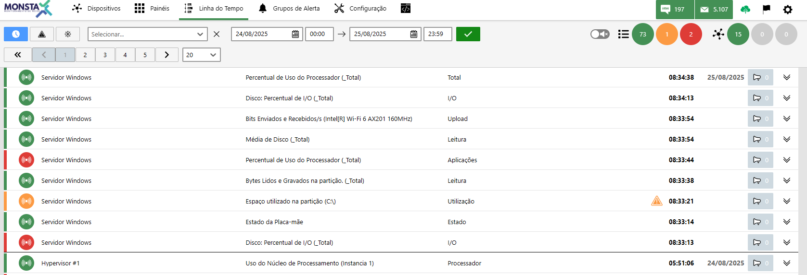
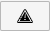
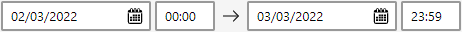
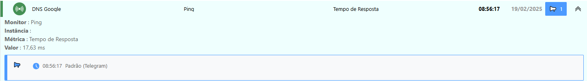
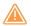
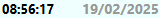

The Timeline is a tool that transforms the continuous recording of data into a visual, chronological representation of all events and changes that occurred in the monitored infrastructure.

:::note
All event and metric records in the Timeline are permanent. Once created, this data cannot be deleted or altered, ensuring the reliability and legal validity of the history for audit and compliance purposes.
:::

## Search Filters

| Ícone | Descrição |
| :---: | :--- |
|  | **Real time**: Shows changes that occur on devices and monitors in real time. |
|  | **Unresolved event**: When active, lists only events that are not in the normal state. |
|  | **Pause**: Freezes the current screen for viewing. |

**Filter by device**: Filters the alerts view to the selected device.

---

**Filter by time range**: Filters alert information by the selected time range.

## Available Information

---

 **Status**: This icon indicates the status the device/monitor entered at the indicated time. It can have the following meanings: 

| Status | Descrição |
| :---: | :--- |
|  | The device/monitor returned to the normal state. | 
|  | The device/monitor is collecting data and is operating but with values in a warning state. |
|  | The device/monitor is collecting data and is operating but with values in a critical state. | 
|  | The device/monitor is unable to report information related to data collection. | 
|  | The device is unreachable due to a problem with another device above it in the network hierarchy. |

| Info | Description |
| :---: | :--- |
| DNS Google | Device: Name of the device where the status change occurred. |
| Ping | Monitor: Name of the monitor where the status change occurred. When the monitor has an instance, its name is shown next to it in parentheses. |
| Tempo de Resposta | Metric: Name of the metric where the event occurred. |
|  | Unresolved event: When this icon appears, it means this event has not yet returned to the normal state. |
|  | Event time: Shows the date and time the event was detected. |
|  | Alert: Indicates whether any alert was triggered during the event. The groups to which the alert was sent will be listed in the event details. |
|  | Details: Expands or hides the event details. |