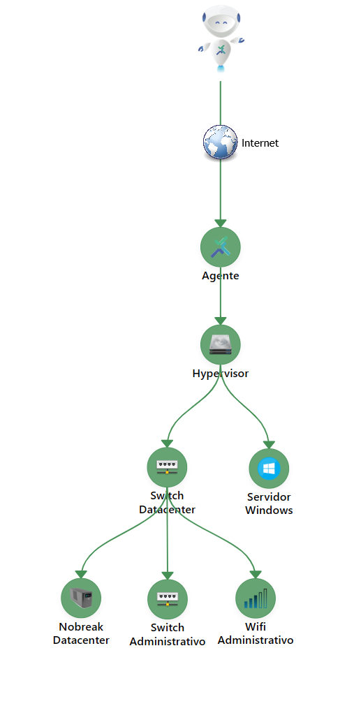

This documentation describes the operation and architecture of the **Monsta Agent**, a tool to extend monitoring of your platform to remote and distributed networks, ensuring performance and security through the QUIC protocol.

## Agent Installation for Windows

- Download the agent program:


|  |  |
| ------------------------------------------------------------------------------------------------------------------------------------------------------ | ---------------------------------------------------------------------------------------------------------- |
| [](https://www.monsta.com.br/monsta/download/agent.msi) | [https://www.monsta.com.br/monsta/download/agent.msi](https://www.monsta.com.br/monsta/download/agent.msi) |


- Logged in as a user with administrator permissions, run the installer "agent.msi".
- When prompted, enter the Monsta license key to which you want to connect the agent.

## Command-line Installation

The **agent.msi** installer supports command-line parameters for automation. Integrated with the **msiexec** utility, it allows installation via **GPO**, eliminating the need for manual interaction with the graphical interface.

Command-line options:


| Option | Description |
| ------------------------------- | ------------------------------------------------------------------------------------------------------------------------------------------------------------------------------------------------------------- |
| `LICENSEKEY=[license key]` | Specifies the license key to which the Agent should connect. Tip: The License Key can be obtained in Monsta under the "Configuration" menu in the "Agents" option. It is shown in the top-right corner. |
| `AGREE=[Y]` | Confirms acceptance of the terms of use. |


Example usage:

```powershell
msiexec /i agent.msi /quiet LICENSEKEY=AAAABBBBCCCCDDDDEEEEFFFFGGGGHHHH AGREE=Y
```

## Device Creation

Once installation is complete, the **Agent** will automatically appear on the **Configuration** screen under **Agents** with the host identification. The monitored device will be **created and listed instantly** on the **Devices** screen with the same host name and ready for configuration and addition of new monitors.

### How to Monitor Devices via the Agent Connection

To cover the entire remote network with a single agent, register the new devices in Monsta and set the device to be under the **hierarchy** of the host where the Agent is installed.

Hierarchy Example:




&nbsp;