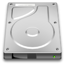
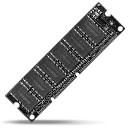
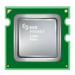
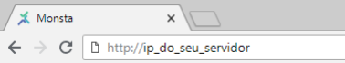
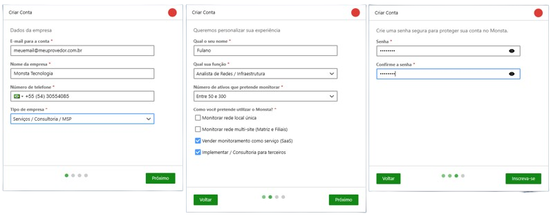
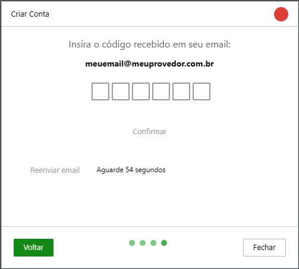
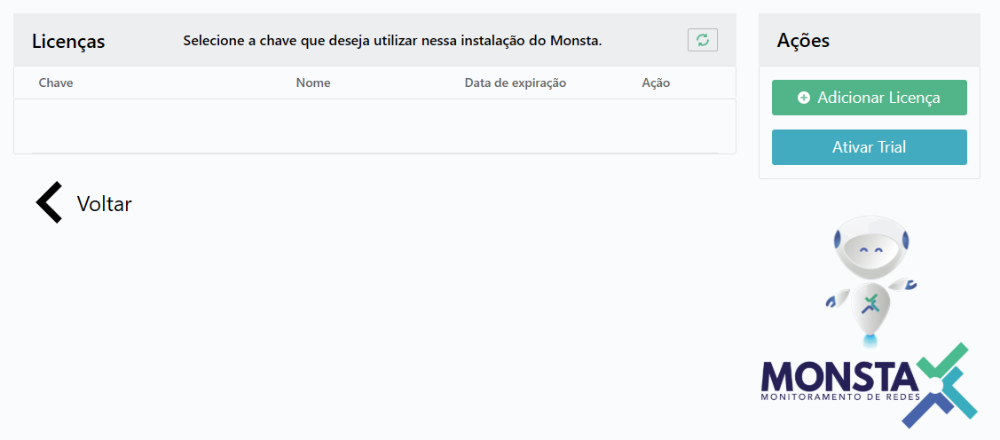
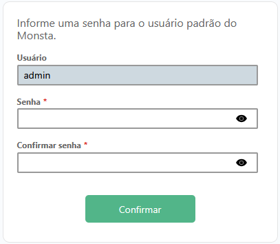
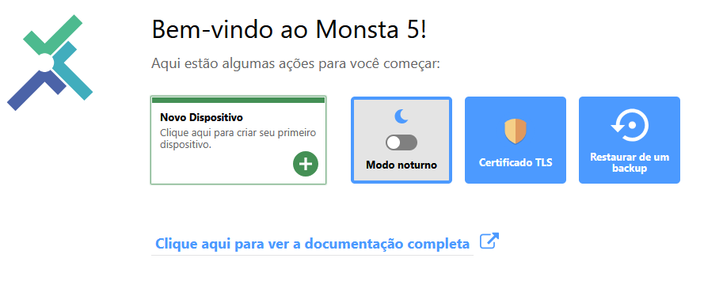

## Minimum requirements

This is the minimum setup for installing Monsta:

| Item | Minimum Requirement |
| --- | --- |
|  | **Disk space**<br />40GB free for /var (configurations, database and logs)<br />300MB free for /opt/monsta (programs and libraries) |
|  | **RAM**<br />2GB of RAM |
|  | **Operating System**<br />Linux 64-bit<br />Recommended Linux OS: Fedora Server |
|  | **Processor**<br />Cores: 2<br />Speed: 1.8GHz |

:::caution[Important]
The above settings generally allow monitoring approximately 500 devices with 10 monitors each, for a total of 5,000 monitors.
:::

## Download the file

Log in to your Linux server as root and run the commands below:

#### Fedora/Red Hat

```shell
yum install -y wget && wget https://www.monsta.com.br/monsta/download/monsta-latest.rpm
```

#### Ubuntu/Debian

```shell
apt-get install -y wget && wget https://www.monsta.com.br/monsta/download/monsta-latest.deb
```

## Installation

After downloading the Monsta installation file, run the following command:

#### Fedora/Red Hat

```shell
dnf install -y monsta-latest.rpm
```

#### Ubuntu/Debian

```shell
export PATH=/usr/local/sbin:/usr/sbin:/sbin:$PATH
dpkg -i monsta-latest.deb
```

Monsta is now installed on your server and can be accessed through ports 80 (http) and 443 (https):

:::note
If your network has a firewall that controls internet access, allow access to the following hosts:  

* mind.monsta.com.br  
* agent.monsta.com.br
:::

:::tip
Communication with the hosts above allows:  

* Automatic backup of configurations.  
* Restoration of backups in case of failure.  
* Sending notifications via Email, SMS and Telegram.  
* Checking the communication status between the Monsta installed on your server and the Monsta Cloud. This allows receiving alerts in case of unexpected monitoring service stoppages, such as improper server shutdown or internet link failure.  
* Authentication of licensing keys.  
* Check and update the system version.  
* Connection with agents for monitoring remote networks.
:::

## First access to Monsta

Open a browser and go to:



You can choose to authenticate using an existing credential via the **"Sign in with my account"** button or start the new user flow by clicking **"Create new account"**.


Fill in the fields to create your cloud account and proceed by clicking "Next":



You will then receive an email containing a code to validate your account. Enter it on the screen below and click Confirm:



After this procedure, you will be directed to the licenses screen. Since this is a new account, no license will be shown and you can choose whether to purchase a license or activate the Trial. Click the "Activate Trial" button to enable a 30-day Monsta trial for your company:



You will be taken to the screen to set a password for the Monsta "admin" user. Type your password and click the "Confirm" button:



You will now be redirected to the Monsta main screen:



From this screen you can create and manage the devices to be monitored.

For more information, consult the [User Manual](/en/manual/manual-usuario) of Monsta.

:::tip
If you installed your server and need help configuring IP addresses on Fedora, use this tutorial: [Change the IP address on a Fedora server](/en/extra/linux/alterar-o-endereco-ip-em-um-servidor-fedora)
:::