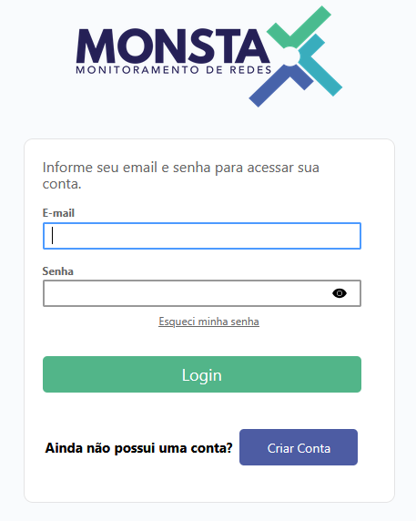
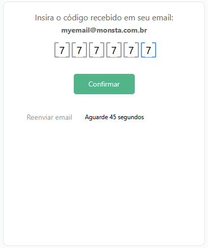
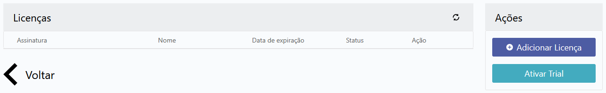

## Minimum requirements

This is the minimum configuration to install Monsta:

| Item | Minimum Requirement |
| :---: | :--- |
|  | **Disk space**<br />40GB free for /var (configurations, database and logs)<br />300MB free for /opt/monsta (programs and libraries) |
|  | **RAM**<br />2GB of RAM |
|  | **Operating System**<br />Linux 64-bit<br />Recommended Linux operating system: Fedora Server |
|  | **Processor**<br />Cores: 2<br />Speed: 1.8GHz |

:::caution[Important]
The above configuration generally allows monitoring approximately 500 devices with 10 monitors each, or a total of 5,000 monitors.
:::

## Download the File

Logged into your Linux server as root, run the commands below:

#### Fedora/Red Hat

```shell
yum install -y wget && wget https://www.monsta.com.br/monsta/download/monsta-latest.rpm
```

#### Ubuntu/Debian

```shell
apt-get install -y wget && wget https://www.monsta.com.br/monsta/download/monsta-latest.deb
```

## Installation

After downloading the Monsta installation file, run the following command:

#### Fedora/Red Hat

```shell
dnf install -y monsta-latest.rpm
```

#### Ubuntu/Debian

```shell
export PATH=/usr/local/sbin:/usr/sbin:/sbin:$PATH
dpkg -i monsta-latest.deb
```

From now on Monsta is installed on your server and can be accessed through ports 80 (http) and 443 (https):

:::note
If your network has a firewall that controls internet access, allow access to the following hosts:  

* mind.monsta.com.br  
* store.monsta.com.br
:::

:::tip
Communication with the hosts above allows:  

* Automatic backup of configurations.  
* Restoration of the backup in case of a failure.  
* Sending notifications by E-mail, SMS and Telegram.  
* Checking the state of communication between the Monsta installed on your server and the Monsta Cloud. This way it is possible to receive alerts in case of unexpected stops of the monitoring service, such as improper server shutdown or internet link failure.  
* Authentication of Licensing Keys.  
* Checking and updating the system version.
:::

## First access to Monsta

Open a browser and go to:


The next screen requests a cloud login. If you don't have an account yet, click "Create Account":



Fill in the fields to create your cloud account and click "Sign up":


You will then receive an email containing a code to validate your account. Enter it on the screen below and click Confirm:



After this procedure, you will be directed to the licenses screen. As this is a new account, no license will be shown and you can choose whether to purchase a license or activate the Trial. Click the "Activate Trial" button to enable Monsta's 30-day trial for your company:



You will be taken to the screen to set a password for the Monsta "admin" user. Enter your password and click the "Confirm" button:


Now you will be redirected to Monsta's main screen:


From this screen you can create and manage the devices to be monitored.

For more information, see the Monsta [User Manual](/en/manual/manual-usuario).

:::tip
If you installed your server and need help configuring IP addresses on Fedora, use this tutorial: [Change the IP address on a Fedora server](/en/extra/linux/alterar-o-endereco-ip-em-um-servidor-fedora)
:::