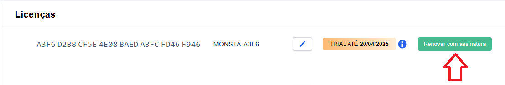

To subscribe to Monsta, you can do it in two ways:

**From the Trial screen**:

If you are using the Monsta Trial version, just click the "Subscribe" button in the upper right corner of your screen. You will be redirected to our website to the payment area. Choose your plan and billing method and when the payment is made, your trial will automatically become a licensed version.

**Through the website**:

- Go to our website [https://www.monsta.com.br, ](https://www.monsta.com.br)click on "Login" in the upper right corner and sign in with your username and password;
- On the screen that appears, in the Licenses tab, select your trial and click subscribe;  
    
- You will be redirected to the payment area. Select your plan and billing method;
- When the payment is completed, your Trial will automatically become a licensed version.