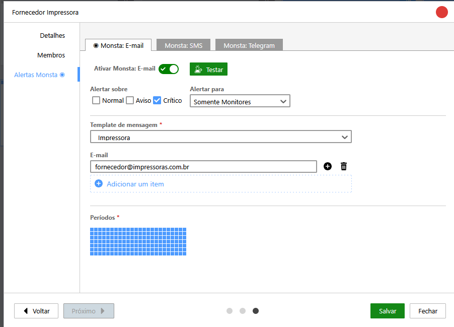
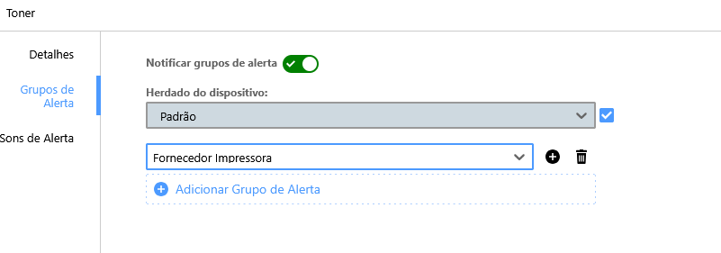

Alerts sent by Monsta can be customized through Message Templates, available at Alert Groups > Message Template. This article demonstrates some customization examples to improve alert messages, so they fit your needs. To understand how Message Templates work and which variables are available, see the Monsta [Alerts](/en/manual/grupos-alertas/alertas#message-templates) article.

## Using variables according to the alert

Some variables are related to the device and others to the monitor. For example, the variable `{{nomemetrica}}` is related to a monitor. Therefore, when using this variable in a device alert, it will be sent empty in the alert. However, it is possible to differentiate in the same template which message will be for a device alert or a monitor alert. The following code is an example that uses this feature.

```
{{#if alertadispositivo}}
> Subject: {{dispositivo.estado}}: Dispositivo {{dispositivo.nome}}.
Estado: {{dispositivo.estado}}
Dispositivo: {{dispositivo.nome}}
IP: {{dispositivo.endereco}}
Horário: {{dataehora}}
{{else}}
> Subject: {{monitor.estado}}: Monitor {{dispositivo.nome}}/{{monitor.nome}}.
Estado: {{monitor.estado}}
Dispositivo: {{dispositivo.nome}}
Monitor: {{monitor.nomecurto}}
{{nomemetrica}} ({{nomeinstancia}}): {{valor}}
IP: {{dispositivo.endereco}}
Horário: {{dataehora}}
{{/if}}
```

What is between `{{#if alertadispositivo}}` and `{{else}}` refers to the message for an alert generated by a device (when it goes offline, for example). What is between `{{else}}` and `{{/if}}` refers to the message for an alert generated by a monitor (when a monitor reaches an alert metric, for example). It is worth mentioning that the "`> Subject:`" field refers to the subject when the alert is sent by email. Telegram and SMS alerts will not have this information.

The example code will generate the following alerts (examples received on Telegram).
- Alert generated by a Device that returned from critical status:

:::tip[Alert]
State: Normal  
Device: Printer  
IP: 192.168.10.10  
Time: 01/01/2026 - 14:50:18
:::

- Alert generated by a Monitor without an instance that entered critical status:

:::tip[Alert]
State: Critical  
Device: Firewall Server  
Monitor: Load (Load Average)  
Load (): 3  
IP: 192.168.10.1  
Time: 01/01/2026 - 11:55:06
:::


- Alert generated by a Monitor with an instance that entered critical status:


:::tip[Alert]
State: Critical  
Device: Mail Server  
Monitor: Partition /home  
Partition (/home): 500 GB  
IP: 192.168.10.2  
Time: 01/01/2026 - 12:33:46
:::


If customization for device and monitor were not used (using the monitor alert message settings for both), the alert message for a device would look like this:

- Alert generated by a Device with monitor variables.


:::tip[Alert]
State: Normal  
Device: Printer  
Monitor:   
 (): False  
IP: 192.168.10.10  
Time: 01/01/2026 - 14:50:18
:::


Customization allows the message to be better structured.

## Customizing with fixed information

In addition to using variables, you can also add information that does not change according to the alert, such as company name, department, person responsible, support number... This data can be useful if you receive alerts from more than one Monsta (to identify where the alert came from) or even for alerts that are sent to managers, suppliers or third parties. Since it is possible to create multiple message templates, you can create an [Alert Group](/en/manual/grupos-alertas/alertas#groups) for a printer supplies vendor that will receive an email when your printer toner is in critical status. Just configure the template in the alert group and add the alert group to the specific monitor.

For example:

- Template for a printer supplies vendor, which can be used exclusively on printer monitors

```
{{#if alertadispositivo}}
> Subject: {{dispositivo.estado}}: Dispositivo {{dispositivo.nome}}.
Alerta da empresa Monsta
Estado: {{dispositivo.estado}}
Dispositivo: {{dispositivo.nome}}
IP: {{dispositivo.endereco}}
Horário: {{dataehora}}
{{else}}
> Subject: {{monitor.estado}}: Monitor {{dispositivo.nome}}/{{monitor.nome}}.
Alerta da empresa Monsta
Nossa impressora ({{dispositivo.nome}}) está alertando que {{nomemetrica}} ({{nomeinstancia}}) está em estado {{monitor.estado}} ({{valor}}).
Por favor, envie um orçamento para suporteti@empresa.com.br
Horário: {{dataehora}}
{{/if}}
```

- Alert generated by a Monitor of the printer in critical status:


:::tip[Alert]
Monsta company alert  
Our printer (Printer XYZ) is reporting that Toner (Toner) is in Critical state (10 %).  
Please send a quote to <suporteti@empresa.com.br> for replacement.  
Time: 01/01/2026 - 12:33:46
:::


Example of the alert group configuration, so the recipient receives only critical monitor alerts:



Configuration of the Toner monitor used in the example:



See another example, for the case of having more than one Monsta server and wanting to identify which one the alert came from.

- Monsta 1 Template

```
{{#if alertadispositivo}}
> Subject: {{dispositivo.estado}}: Dispositivo {{dispositivo.nome}}.
Monsta Matriz - Alerta Dispositivo
Estado: {{dispositivo.estado}}
Dispositivo: {{dispositivo.nome}}
IP: {{dispositivo.endereco}}
Horário: {{dataehora}}
{{else}}
> Subject: {{monitor.estado}}: Monitor {{dispositivo.nome}}/{{monitor.nome}}.
Monsta Matriz - Alerta Monitor
Estado: {{monitor.estado}}
Dispositivo: {{dispositivo.nome}}
Monitor: {{monitor.nomecurto}}
{{nomemetrica}} ({{nomeinstancia}}): {{valor}}
IP: {{dispositivo.endereco}}
Horário: {{dataehora}}
{{/if}}
```

- Alert generated by a Device that returned from critical status:


:::tip[Alert]
Monsta Headquarters - Device Alert  
State: Normal  
Device: Printer  
IP: 192.168.10.10  
Time: 01/01/2026 - 14:50:18
:::


- Alert generated by a Monitor with an instance that entered critical status:


:::tip[Alert]
Monsta Headquarters - Monitor Alert  
State: Critical  
Device: Mail Server  
Monitor: Partition /home  
Partition (/home): 500 GB  
IP: 192.168.10.2  
Time: 01/01/2026 - 12:33:46
:::


- Monsta 2 Template

```
{{#if alertadispositivo}}
> Subject: {{dispositivo.estado}}: Dispositivo {{dispositivo.nome}}.
Monsta Filial - Alerta Dispositivo
Estado: {{dispositivo.estado}}
Dispositivo: {{dispositivo.nome}}
IP: {{dispositivo.endereco}}
Horário: {{dataehora}}
{{else}}
> Subject: {{monitor.estado}}: Monitor {{dispositivo.nome}}/{{monitor.nome}}.
Monsta Filial - Alerta Monitor
Estado: {{monitor.estado}}
Dispositivo: {{dispositivo.nome}}
Monitor: {{monitor.nomecurto}}
{{nomemetrica}} ({{nomeinstancia}}): {{valor}}
IP: {{dispositivo.endereco}}
Horário: {{dataehora}}
{{/if}}
```

- Alert generated by a Device that returned from critical status:


:::tip[Alert]
Monsta Branch - Device Alert  
State: Normal  
Device: Printer  
IP: 192.168.11.10  
Time: 01/01/2026 - 14:50:18
:::


- Alert generated by a Monitor with an instance that entered critical status:


:::tip[Alert]
Monsta Branch - Monitor Alert  
State: Critical  
Device: Firewall Server  
Monitor: Partition /home  
Partition (/home): 500 GB  
IP: 192.168.11.2  
Time: 01/01/2026 - 12:33:46
:::


## Conclusion

There are countless ways to customize Monsta alert messages. Use these examples to explore ideas that fit your scenario. If you have any additional questions, contact our support.