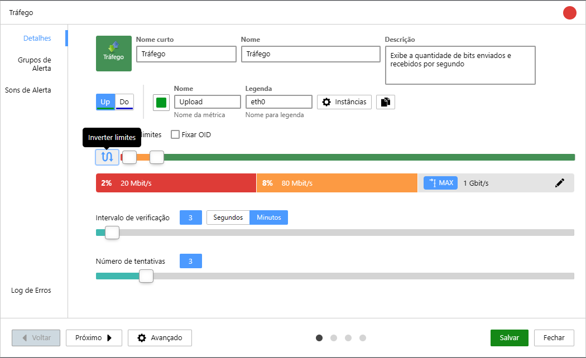

When monitoring the speed or performance of your internet link (such as *throughput*), you want to be alerted when the speed **falls below an acceptable value**.

Traffic monitors in Monsta, by default, assume that **the higher the value, the worse the problem.** But you can invert this logic to monitor your link so it works with: **the lower the value, the worse the problem**.

Use the **Invert Limits** feature to apply this logic:

## Inverting the Logic

To ensure you receive alerts when the speed falls below the minimum acceptable, follow these steps:

- Click on the traffic monitor;
- Click the "Edit" button;
- Click the "Invert Limits" button  
    
- Adjust the percentage bars to choose the thresholds at which you want to be alerted.

In the example image above, the monitor is set to alert for a 1G link in the following situations:

| Field | Example Value | Objective |
| --- | --- | --- |
| **Critical Threshold** | 2% | Monsta will send a critical state alert if traffic is **below or equal to** 20 Mbps. |
| **Warning Threshold** | 8% | Monsta will send a warning alert if traffic is **between** 80 Mbps and **above** 20Mbps. |

After defining your thresholds, click the **Save to record your changes** button.