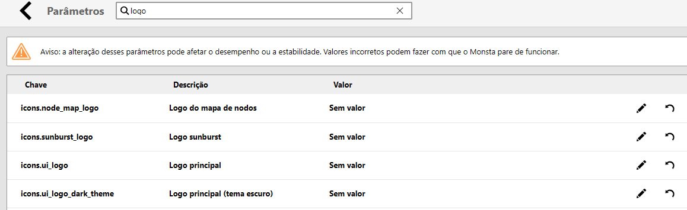

The Monsta White Label feature allows you to **customize the platform with your own brand**, providing a consistent and professional experience for your customers. Instead of displaying Monsta's original brand, you can **replace it with your own** to identify your company.

## Benefits of the White Label feature

- **Strengthening your brand**: Customizing with your brand creates a unique visual identity, increasing recognition and trust from your customers.
- **Consistent experience**: Your customers will perceive they are using a product that is entirely yours, without third-party elements, reinforcing your company's image.
- **Professionalism**: Customization conveys an image of professionalism and care, showing that your company pays attention to every detail of the customer experience.
- **Flexibility**: The White Label feature allows you to adapt Monsta to your brand's visual identity, ensuring seamless integration with your other marketing materials.

## How to use the White Label feature

1. Go to the menu **Configuration -&gt; Parameters;**
2. In the **"Search"** field, filter the content by **"Logo"**;
3. Click the **"Unlock"** button;  

    
4. Click the **"Edit"** button for the image you want to change, then click **"Select..."**;
5. Upload the image with the new logo;
6. Click the **"Confirm"** button to save the change.

After this procedure, the new image will be displayed in the selected logo.

## Important notes

- **Usage rights**: Ensure you have the rights to use the trademarks and logos you will use in the customization.
- **Visual consistency**: Maintain the visual consistency of your brand across all marketing materials, including the customized software.

By using the White Label feature, you can offer a product with your brand's visual identity, **reinforcing your company's recognition and your customers' trust**.