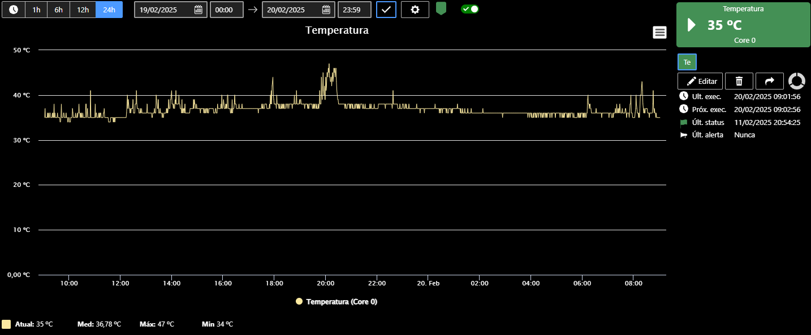
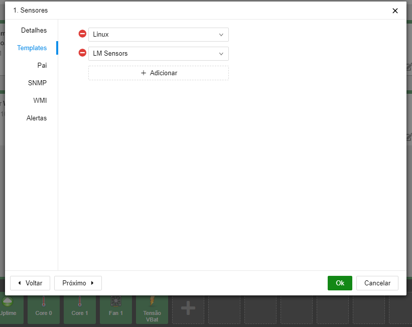

Tutorial con el objetivo de activar el paquete LM Sensors en distribuciones Linux para monitorización a través de Monsta.


:::note
Existen diversas distribuciones Linux, cada una con sus particularidades. La información siguiente puede no funcionar en su distribución.
:::


## Instalar y configurar el paquete LM Sensors

Conectado como root, en la consola del servidor Linux que será monitorizado escriba el siguiente comando:  
• Para distribuciones que usan yum:

```shell
yum install lm_sensors
```

• Para distribuciones que usan apt-get

```shell
apt-get install lm_sensors
```

Tras instalar el paquete, ejecute el siguiente comando para detectar los sensores existentes en su servidor y grabar el archivo de configuración de lm-sensors:

```shell
sensors-detect --auto
```

Una vez finalizada la detección de sensores, podrá mostrar en la consola los elementos disponibles y sus mediciones mediante el comando sensors, como en el ejemplo siguiente:

```shell
sensors
```


> coretemp-isa-0000  
> Adapter: ISA adapter  
> Physical id 0: +25.0°C (high = +82.0°C, crit = +102.0°C)  
> Core 0: +23.0°C (high = +82.0°C, crit = +102.0°C)  
> Core 1: +23.0°C (high = +82.0°C, crit = +102.0°C)  
> it8728-isa-0a30  
> Adapter: ISA adapter  
> in0: +0.91 V (min = +2.40 V, max = +0.24 V)  
> in1: +1.49 V (min = +1.68 V, max = +2.59 V)  
> in2: +2.94 V (min = +0.04 V, max = +0.18 V)  
> +3.3V: +3.43 V (min = +4.75 V, max = +3.17 V)  
> in4: +2.08 V (min = +1.73 V, max = +0.22 V)  
> in5: +1.06 V (min = +1.58 V, max = +0.01 V)  
> in6: +2.23 V (min = +0.22 V, max = +1.34 V)  
> 3VSB: +3.26 V (min = +0.05 V, max = +0.91 V)  
> Vbat: +3.19 V  
> fan1: 1165 RPM (min = 22 RPM)  
> fan3: 0 RPM (min = 249 RPM)  
> fan4: 0 RPM (min = -1 RPM)  
> fan5: 0 RPM (min = -1 RPM)  
> temp1: +14.0°C (low = -1.0°C, high = +127.0°C) sensor = thermal diode  
> temp2: -128.0°C (low = -1.0°C, high = +127.0°C) sensor = disabled  
> temp3: -78.0°C (low = -1.0°C, high = +127.0°C) sensor = Intel PECI  
> intrusion0: ALARM


## Instalar el servicio SNMP

Consulte nuestro tutorial en [Configuración del SNMP en Linux](/es/extra/linux/snmp-linux).

## Monsta

Para monitorizar los sensores en Monsta, durante la creación del dispositivo añada la plantilla “LM Sensors” como en el ejemplo siguiente. De este modo, al insertar un monitor en Monsta también se mostrarán los monitores correspondientes a LM Sensors.

