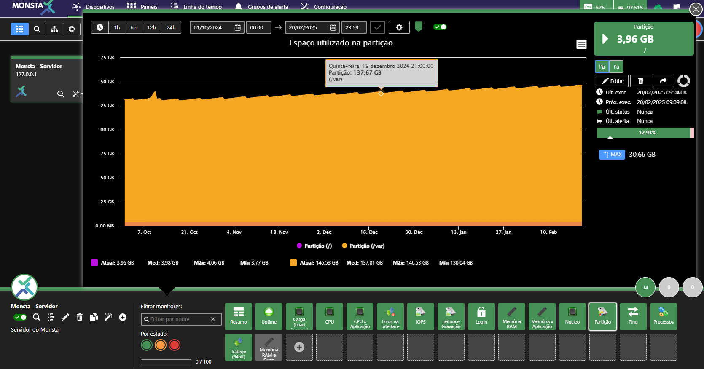
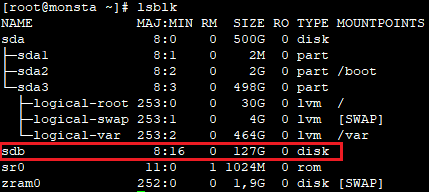
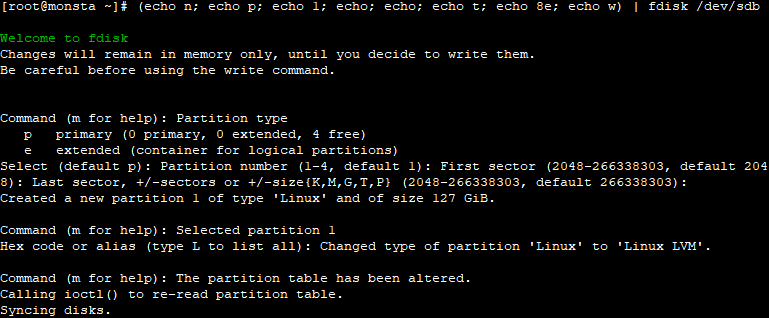
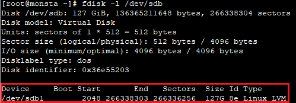
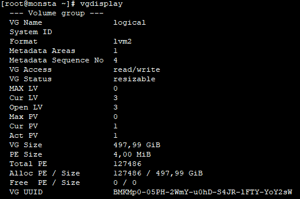
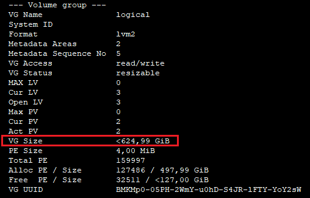
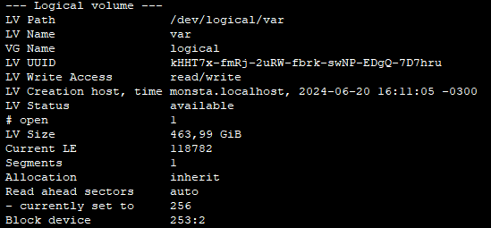
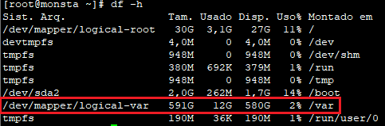

Este tutorial explica cómo aumentar una partición configurada sobre LVM usando un disco nuevo. Antes de continuar, agregue un nuevo disco virtual a su VM o un disco físico nuevo a un servidor no virtualizado.


:::caution[Atención]
Existen diversas distribuciones de Linux, cada una con sus particularidades. La información siguiente fue probada en el sistema operativo Fedora Server 40 y puede no funcionar en otras distribuciones.
:::


## Identificar y crear una nueva partición

Conectado como root, en la pantalla del servidor Linux cuya partición se incrementará, escriba el siguiente comando:

```shell
lsblk
```

Este comando listará las particiones en los discos físicos disponibles para Linux. El resultado del comando será algo como:



En este ejemplo, el disco físico /dev/sdb con 127GiB es el disco adicional y será usado para aumentar el volumen LVM.

Para usar toda la partición para crear un volumen LVM, use el siguiente comando:

```shell
(echo n; echo p; echo 1; echo; echo; echo t; echo 8e; echo w) | fdisk /dev/sdb
```



Para verificar si el nuevo disco se inicializó correctamente, escriba de nuevo el comando:

```shell
fdisk -l /dev/sdb
```

El disco /dev/sdb debe mostrarse como una partición del tipo LVM:



## Aumentar el espacio en el volumen lógico

Ahora que hay una partición con espacio libre, necesitamos indicar a Linux que la añada al volumen lógico existente. Para ello, ejecute los siguientes comandos:

```shell
pvcreate /dev/sdb1
```

Este comando creará un nuevo volumen físico que podrá asignarse a un grupo de volúmenes. Para saber qué volúmenes existen, escriba el siguiente comando:

```shell
vgdisplay
```

La salida deberá ser como en el siguiente ejemplo:



En nuestro ejemplo se aumentará el volumen `logical`. Para hacerlo, ejecute el comando:

```shell
vgextend logical /dev/sdb1
```

Ejecute de nuevo el siguiente comando para verificar si el tamaño del grupo de volúmenes ha aumentado comparando el parámetro `VG Size`:

```shell
vgdisplay
```



Ahora es necesario aumentar el volumen lógico. Para listar los volúmenes existentes, ejecute el siguiente comando:

```shell
lvdisplay
```

Identifique el volumen de la partición `/var`, como se muestra en la imagen siguiente:



Para aumentar el tamaño del volumen /dev/logical/var, ejecute los siguientes comandos:

```shell
lvextend /dev/lvar/var /dev/sdb1
xfs_growfs /dev/logical/var
```


:::tip
El comando `xfs_growfs` se utiliza para el sistema de archivos xfs. Si su partición utiliza el formato `extfs`, utilice el comando `resizefs /dev/logical/var`, por ejemplo.
:::


El comando `vextend` aumenta el volumen lógico y el comando `xfs_growfs` indica al sistema de archivos que utilice todo el nuevo espacio disponible. Para verificar si la partición se ha ampliado correctamente, utilice el siguiente comando:

```shell
df -h
```

En nuestro ejemplo, la partición `/var` deberá tener 591GB de tamaño.

