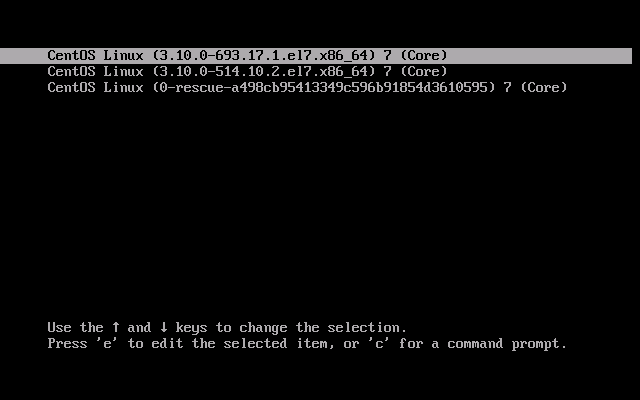
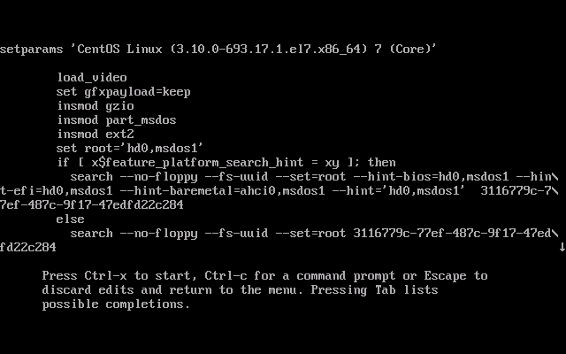
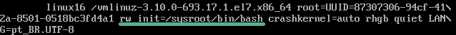
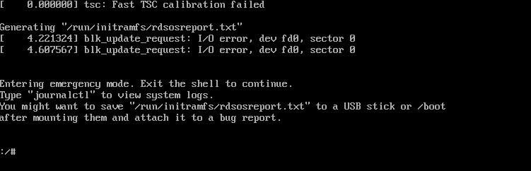

Este tutorial tiene como objetivo recuperar la contraseña de root en un servidor Linux CentOS.

## Recuperar la contraseña del usuario root

Al iniciar el servidor Linux aparecerá la pantalla de arranque similar a la imagen siguiente:



Pulse la tecla “e”; con ello se abrirá el modo de edición de las configuraciones de arranque como en la imagen siguiente:



Busque la línea que comienza con “linux” o "linux16" y al final añada "rw init=/sysroot/bin/bash" según el ejemplo siguiente:



Pulse CTRL + X para iniciar Linux con las nuevas configuraciones. Debería aparecer la siguiente pantalla:



Escriba los siguientes comandos para cambiar la contraseña:

```shell
chroot /sysroot
passwd root
touch /.autorelabel
exit
reboot
```