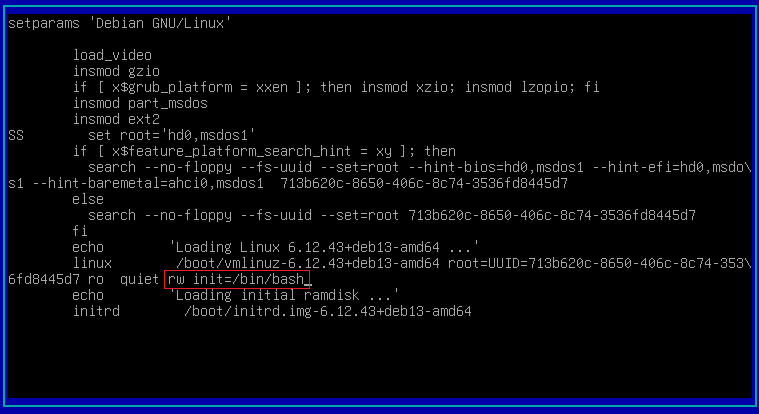

La contraseña de root puede restablecerse usando el menú de **GRUB** (Grand Unified Bootloader) para iniciar el sistema en modo de usuario único (*single-user mode*) o con un *shell* de recuperación.

## Requisitos previos

- Acceso físico a la consola del servidor/máquina.
- El sistema operativo Debian debe usar **GRUB** como *bootloader*.

## Paso a paso para restablecer la contraseña

### 1. Acceder al menú de GRUB

1. **Reinicie** su sistema Debian.
2. Espere a que el menú de GRUB se muestre en pantalla;
3. Use las teclas de flecha (↑ y ↓) para seleccionar la entrada del kernel predeterminada de Debian (generalmente la primera opción).

### 2. Editar los parámetros de inicio

1. Pulse la tecla `e` para editar los comandos de arranque de la entrada seleccionada.
2. Use las flechas hacia abajo para localizar la línea que comienza con `linux` (o `linuxefi`). Esta línea contiene la ruta del kernel y sus parámetros de inicio.
3. En esta línea, localice y sustituya el parámetro `ro` (solo lectura) por `rw` (lectura-escritura).
4. Al **final de esa misma línea**, añada el siguiente parámetro para cargar el shell bash como el proceso de inicio principal:  
      
    `init=/bin/bash`  
    Ejemplo de cómo quedaría la línea modificada:
    
    > `linux /boot/vmlinuz-5.10.0-23-amd64 root=UUID=... rw quiet init=/bin/bash`



### 3. Iniciar el sistema y cambiar la contraseña

1. Pulse `Ctrl+X` para iniciar el sistema con los nuevos parámetros.
2. El sistema omitirá el proceso de inicio normal y cargará directamente un *shell* como usuario *root* (indicado por `#`).
3. Ejecute el comando `passwd` para restablecer la contraseña del usuario *root*:
    
    ```shell
    passwd    
    ```
4. Introduzca la **nueva contraseña** y confírmela cuando se le solicite. Los caracteres no se mostrarán (comportamiento de seguridad por defecto).
5. Un mensaje como `password updated successfully` (contraseña actualizada con éxito) confirmará el cambio.

### 4. Reiniciar el sistema

1. Reinicie el sistema después de cambiar la contraseña. Use el comando `exec` para volver al proceso de arranque normal:
    
    ```shell
    exec /sbin/init 6
    ```
2. Debian se reiniciará. En el *prompt* de inicio de sesión, podrá usar el nombre de usuario `root` y la **nueva contraseña** que acaba de establecer.