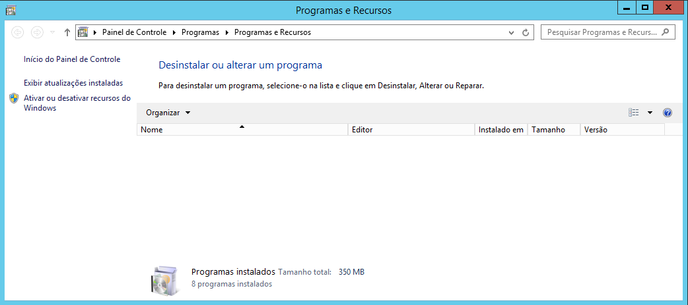
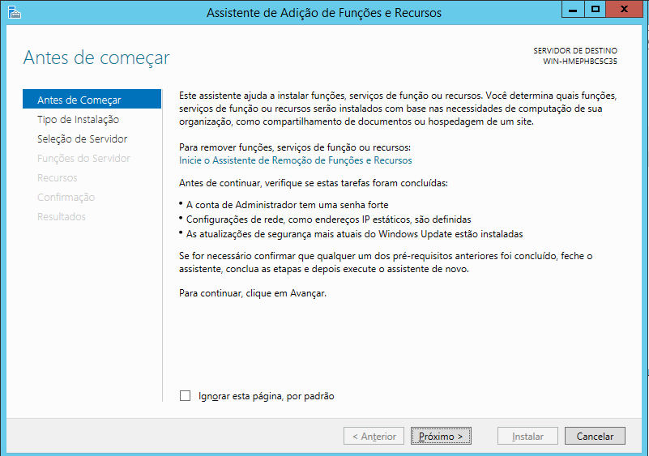
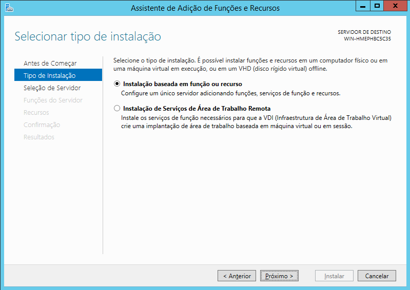
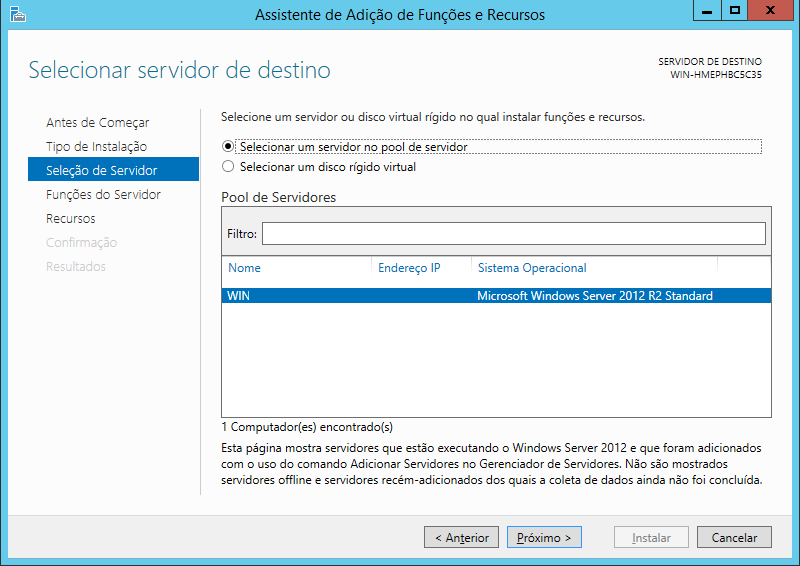
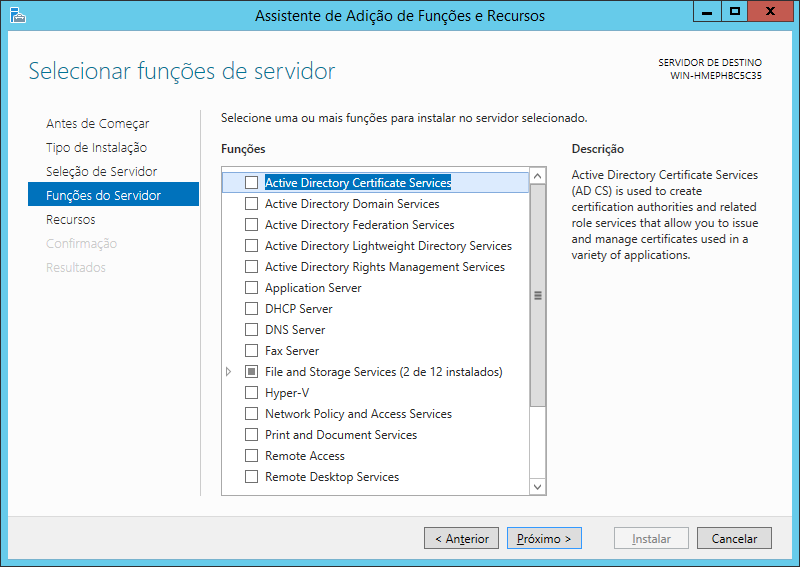
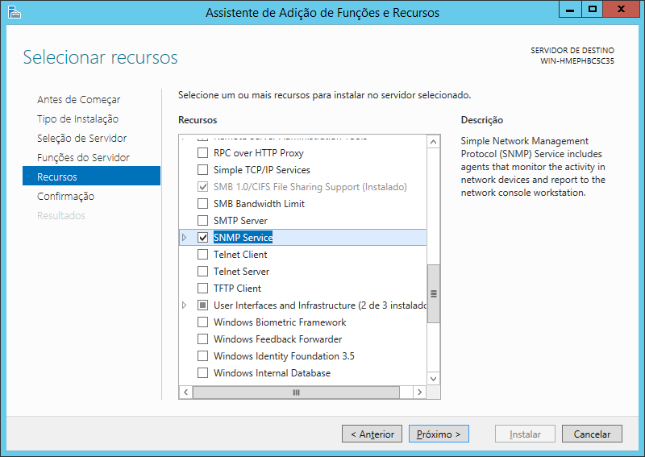
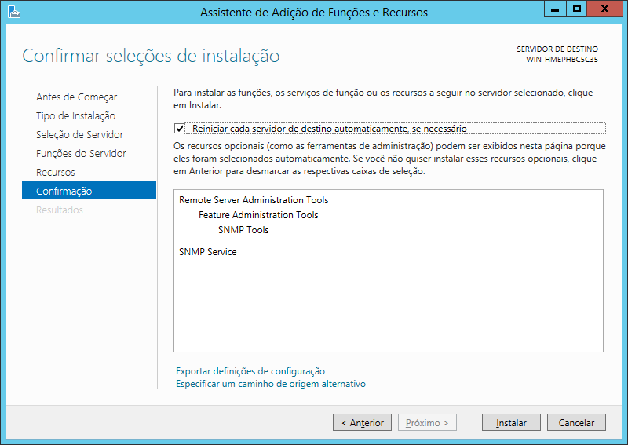
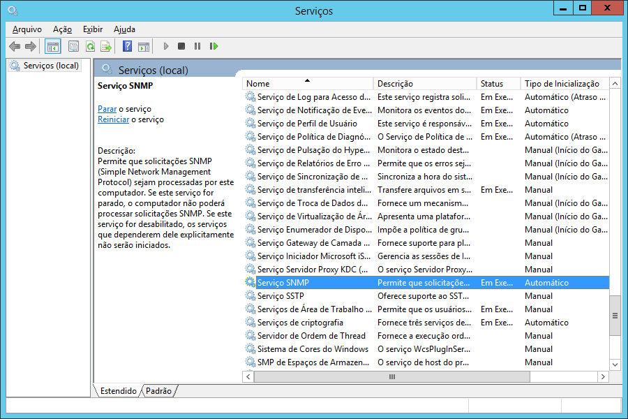
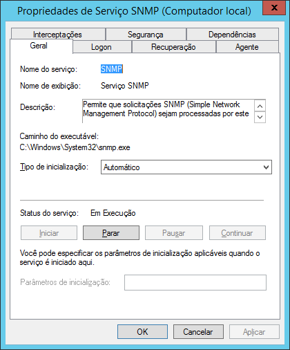
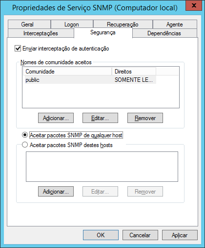

Tutorial con el objetivo de activar una configuración básica de los servicios SNMP en sistemas operativos Windows.

## Configurar el servicio SNMP

Inicie sesión como administrador, en el símbolo del sistema escriba:

```powershell
control appwiz.cpl
```

A continuación se mostrará la siguiente pantalla:

• Haga clic en “Activar o desactivar características de Windows”;

  
• Haga clic en el botón “Siguiente”;

  
• Seleccione “Instalación basada en funciones o características” y haga clic en el botón “Siguiente”;

  
• Seleccione el servidor en el que desea instalar el SNMP y haga clic en el botón “Siguiente”;

  
• Haga clic en el botón “Siguiente”;

  
• Marque el elemento “Servicio SNMP”;  
• En la ventana que se abra haga clic en el botón “Agregar características”;  
• Haga clic en el botón “Siguiente”;

  
• Marque la opción “Reiniciar automáticamente cada servidor de destino si es necesario”;  
• Haga clic en el botón “Instalar”;  
• Finalizada la instalación haga clic en el botón “Cerrar”;

En el símbolo del sistema, escriba:

```powershell
services.msc
```

A continuación aparecerá la siguiente pantalla:

• Seleccione el elemento “Servicio SNMP”;  
• Haga clic en el menú “Acción” y seleccione “Propiedades”;

  
• En la pestaña “General”, establezca el campo “Tipo de inicio” en “Automático”;

  
• En la pestaña “Seguridad” haga clic en el botón “Agregar”;  
• En “Derechos de la comunidad” seleccione la opción “SOLO LECTURA”;  
• En “Nombre de la Comunidad” escriba “public”;  
• Haga clic en el botón “Agregar”;  
• Marque la opción “Aceptar paquetes SNMP de cualquier host”;  
• Haga clic en el botón “Ok”.

## Permitir el acceso al servicio SNMP en el Firewall de Windows Server 2012

Para permitir el servicio SNMP en el Firewall de Windows, acceda al símbolo del sistema y escriba:

```
netsh advfirewall firewall add rule name="Servidor SNMP" new dir=in action=allowenable=yes profile=public remoteip=any localport=161 protocol=udp
```


:::note
En general, el SNMP de Windows viene habilitado solo para la red local.
:::


- - - - - -