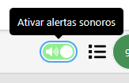
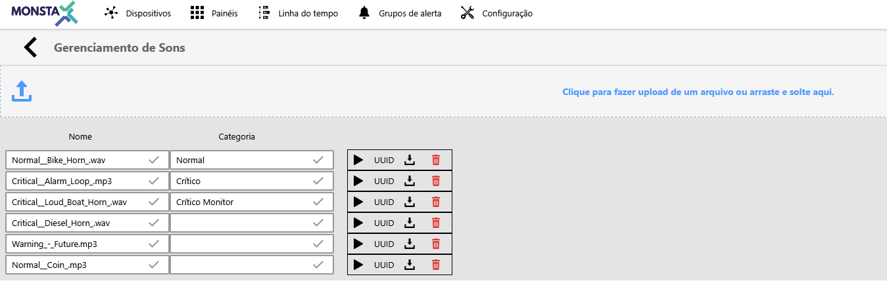
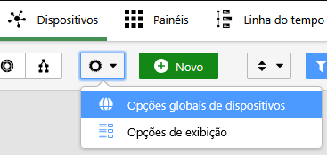
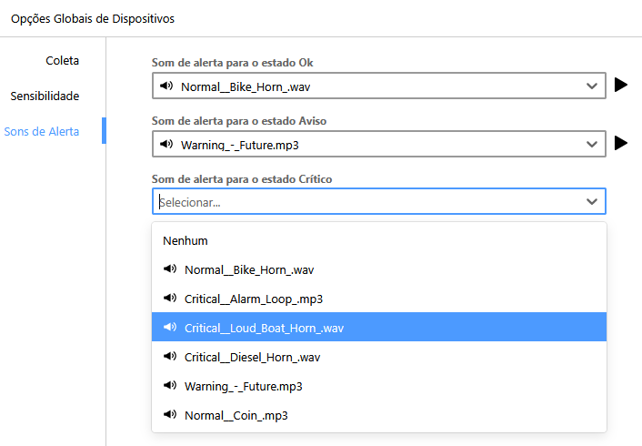
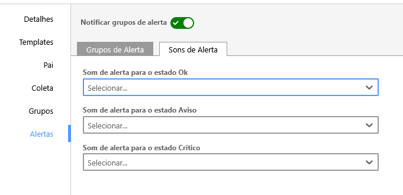
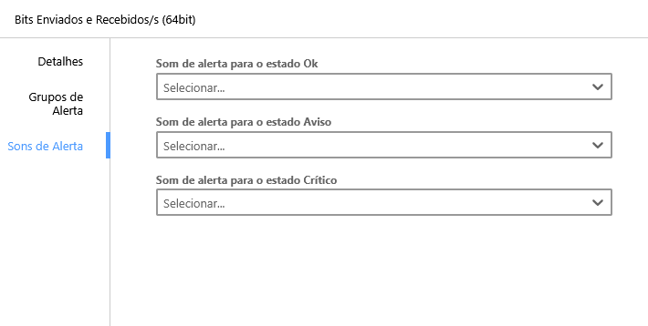

Monsta permite generar alertas sonoras siempre que haya un cambio en el estado de dispositivos o monitores. Es posible personalizar diferentes sonidos para cada tipo de estado, tanto para monitores como para dispositivos.

Si, al activar los sonidos de alerta, Monsta no emite ningún sonido, verifique si los archivos de audio están debidamente configurados siguiendo los pasos a continuación

## Gestión de Sonidos

Es posible cargar varios archivos de audio para ser utilizados como alertas sonoras en Monsta.

Para subir y visualizar los archivos cargados, acceda a: **Configuración** > **Sonidos**. En esta pantalla, podrá añadir nuevos archivos de audio, gestionar los ya existentes y nombrar categorías para facilitar la identificación de cada sonido.

## Opciones Globales

Con los archivos de sonido debidamente cargados, es necesario configurar Monsta para utilizarlos como alertas.

En la pantalla de **Dispositivos**, acceda a la configuración de **Opciones globales de dispositivos**.

A continuación, en la pestaña **Sonidos de Alerta**, seleccione el archivo de sonido deseado para cada tipo de estado.

Asegúrese de que el botón de activación de los sonidos de alerta esté habilitado. A partir de ese momento, Monsta deberá emitir los sonidos según lo configurado.

## Sonidos para dispositivos y monitores

Además de definir los sonidos de forma global, es posible definir sonidos específicos para cada dispositivo o monitor.

Al editar un dispositivo, acceda a la pestaña **Alertas** > **Sonidos de Alerta** y seleccione el sonido deseado. Así, cuando haya un cambio en el estado de ese dispositivo, el sonido emitido será el que se haya configurado individualmente.

De la misma forma, al editar un monitor, es posible seleccionar un sonido para él en la pestaña **Sonidos de alerta**.

- - - - - -