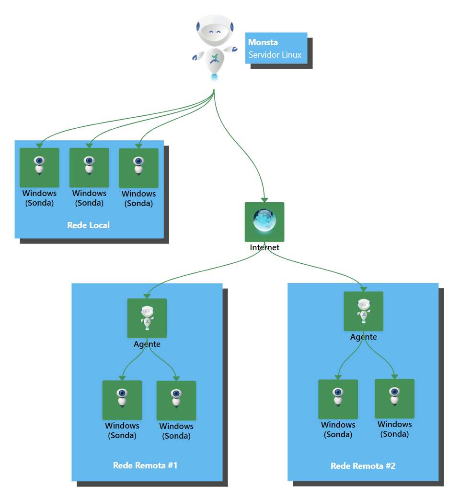

Este artículo tiene como objetivo explicar brevemente la diferencia entre la [Sonda](/es/start/instalacao/sonda-windows) y el [Agente](/es/start/instalacao/agente-instalacao-zero-conf) de Monsta.

## Diferencias

La principal diferencia entre la Sonda y el Agente es el propósito de cada uno:

- La Sonda de Monsta surgió por la necesidad de monitorizar equipos Windows mediante WMI. Una vez instalada en el equipo, Monsta puede obtener información de WMI de Windows a través de la Sonda.
- El Agente de Monsta surgió por la necesidad de monitorizar equipos en redes remotas, inaccesibles desde Monsta. Con el Agente instalado en un equipo de la red remota, Monsta puede comunicarse con él para obtener información de los equipos de la red sin necesidad de redireccionamiento de puertos o VPN.

## Cuadro comparativo: Agente vs. Sonda

| Característica | **Agente** | **Sonda** |
| --- | --- | --- |
| **Comportamiento** | **Activo** — inicia la conexión de salida al servidor Monsta | **Pasivo** — espera solicitudes del servidor Monsta |
| **Sistemas suportados** | Windows, Linux y Raspberry PI | Solo Windows |
| **Uso de VPN / Port Forwarding** | No necesita | Necesario (Monsta necesita alcanzar la Sonda) |
| **Protocolo de comunicação** | QUIC (cifrado, de extremo a extremo) | WMI (API de Microsoft) |
| **Ambientes com NAT / IP dinâmico** | Soportado de forma nativa | Puede ser limitado |
| **Cache de dados offline** | Sí — almacena métricas localmente si se pierde la conexión | No |
| **Ideal para** | Redes remotas, sucursales, entornos distribuidos sin VPN | Monitorización local de servidores/estaciones Windows |
| **Custo** | De pago | Gratuito |

## Resumen

La Sonda es una herramienta más sencilla, enfocada en recopilar métricas de máquinas Windows (CPU, RAM, disco, red) y responde cuando el servidor Monsta la consulta. El Agente es una solución más robusta y multiplataforma, ideal para ampliar la monitorización a redes remotas — él mismo inicia la comunicación con el servidor, prescindiendo de VPN, redirección de puertos o IP fija.

## Más información

Otros artículos relacionados con los Agentes y la Sonda:

- 📄[Agentes](/es/manual/configuracoes/agentes)
- 📄[Agente: Instalación Zero Conf](/es/start/instalacao/agente-instalacao-zero-conf)
- 📄[¿Puedo monitorizar una red remota instalando el Agente Monsta en un solo servidor?](/es/faq/conceitos-fundamentais/posso-monitorar-uma-rede-remota-instalando-o-agente-monsta-em-apenas-um-servidor)
- 📄[La Arquitectura de Comunicación del Agente](/es/tech/arquitetura-comunicacao/a-arquitetura-de-comunicacao-do-agente)
- 📄[¿Monsta necesita el agente instalado en cada máquina?](/es/faq/conceitos-fundamentais/o-monsta-precisa-de-agente-instalado-em-cada-maquina)
- 📄[Protocolo QUIC - El Futuro de las Comunicaciones en Internet](/es/tech/arquitetura-comunicacao/protocolo-quic)
- 📄[¿Para qué sirve la Sonda de Monsta?](/es/faq/conceitos-fundamentais/para-que-serve-a-sonda-do-monsta)
- 📄[Sonda: Monitorización Windows](/es/start/instalacao/sonda-windows)
- 📄[WMI (Windows Management Instrumentation)](/es/tech/protocolos-coleta/wmi)