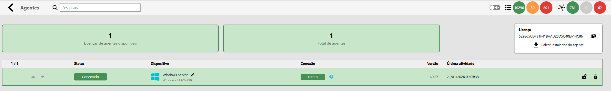
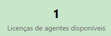
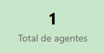
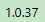
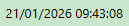

El Agente de Monitorización de Monsta Tecnologia permite gestionar infraestructuras de TI complejas y distribuidas, garantizando que la monitorización sea eficiente, segura y no sobrecargue su red de área amplia (WAN). El Agente es multiplataforma, su instalación es rápida y sencilla en cualquier entorno de TI, siendo compatible con los principales sistemas operativos: Windows y Linux (incluidas las distribuciones más populares).

## ¿Cómo funciona el Agente Monsta?

El Agente Monsta actúa como un Proxy de Monitorización Distribuida para sus sucursales y redes remotas. Supervise activos de forma centralizada y segura, eliminando la complejidad del redireccionamiento de puertos, VPNs o la exigencia de IPs fijos/estáticos.

## Beneficios arquitectónicos

| **Recurso** | **Descripción** |
| --- | --- |
| **Coleta Local** | El Agente se instala en la red remota y realiza la recopilación de datos de todos los dispositivos *localmente*. |
| **Comunicação Consolidada** | **Agrega y almacena** temporalmente las métricas antes de enviarlas al servidor central de Monsta en un único flujo. |
| **Segurança Otimizada** | Solo el Agente necesita abrir comunicación con el servidor central, exigiendo menos reglas de firewall y reduciendo la superficie de ataque. |
| **Tolerância a Falhas** | En caso de pérdida temporal de la conexión WAN, el Agente continúa recopilando y almacenando datos (caching), garantizando que ninguna información se pierda. |

## Gestión de Agentes y Monitorización Distribuida

| Ícone | Descrição |
| :---: | :--- |
|  | **Buscar**: Use el campo de filtro para localizar agentes específicos. Al escribir, la lista se actualizará automáticamente para mostrar solo los resultados que coincidan con el texto ingresado. |
|  | **Licencias de agentes disponibles**: Este campo indica la cantidad de agentes disponibles en su suscripción. Si necesita monitorizar más dispositivos, puede acceder al área de cliente en nuestro sitio web y añadir tantas licencias como sean necesarias en su plan. |
|  | **Total de agentes**: Cantidad de agentes configurados y ocupando una licencia. |
|  | **Ordenación**: Las flechas permiten reordenar la lista de agentes. Este orden define la prioridad de uso de las licencias contratadas: los agentes situados por encima del límite de su cuota serán monitorizados, mientras que los excedentes permanecerán en espera. |
|  | **Estado**: Indica la condición actual de cada dispositivo en la red:  • **Conectado**: El agente está activo y se comunica normalmente con el servidor. • **Desconectado**: El agente está sin conexión o se ha producido una pérdida de comunicación. • **Límite Excedido**: El agente se instaló, pero no está monitorizado porque se alcanzó la cuota de licencias de su plan. • **Bloqueado**: La comunicación del agente está bloqueada. |
|  | **Dispositivo**: Muestra información sobre el Sistema Operativo donde el agente se está ejecutando. |
|  | **Conexión**: Exclusivo para agentes conectados, este campo indica la ruta de comunicación.  • **Directo**: El agente se comunica directamente con el servidor. • **Híbrido**: El agente utiliza un servidor intermediario (Proxy) para sortear restricciones de firewall o aislamiento de red. |
|  | **Versión**: Indica la versión actual del agente instalada en el host. Este campo se gestiona automáticamente por el sistema: siempre que se lance una nueva actualización, Monsta realizará la actualización de forma automática, garantizando que usted siempre disponga de las funcionalidades y correcciones más recientes sin intervención manual. |
|  | **Última actividad**: Registra la fecha y hora exacta de la última comunicación recibida del agente. Es el principal indicador para verificar si la monitorización se está realizando en tiempo real. |
|  | **Bloquear agente**: Permite interrumpir o reanudar la comunicación de un agente específico manualmente. Cuando se bloquea, el agente deja de enviar datos al servidor, pero permanece instalado y configurado, pudiendo reactivarse en cualquier momento con un clic. |
|  | **Eliminar agente**: Elimina permanentemente el agente de su lista de monitorización. **Nota**: Por seguridad, esta acción solo está permitida para agentes que tengan el estado **Desconectado**. Si el agente aún está activo, es necesario detener el servicio en el host antes de la eliminación. |

:::caution[Atención]
El soporte para los agentes está disponible a partir de la versión **6** de Monsta.
:::