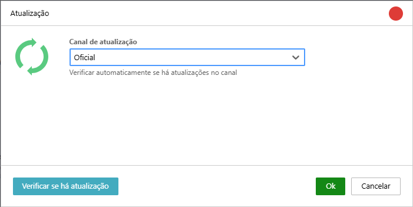
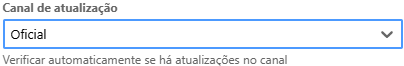

Mantenga su software siempre actualizado con la versión más reciente y aproveche las nuevas funciones, mejoras de rendimiento y correcciones de errores.

| Opción | Descripción |
| :--- | :--- |
|  | Ofrecemos dos canales de actualización para que elija:  • **Oficial**: Este canal está recomendado para la mayoría de los usuarios. Ofrece actualizaciones probadas y aprobadas, garantizando la estabilidad y la seguridad del software. • **Beta**: Este canal es para usuarios que desean probar las funciones más recientes de primera mano. Las actualizaciones beta pueden incluir nuevas funcionalidades y mejoras, pero también pueden presentar algunos errores o inestabilidades. |
|  | Haga clic en el botón "Comprobar si hay actualizaciones" para que el software busque nuevas versiones disponibles en el canal seleccionado. |

:::note[Preservación de la configuración]
Las actualizaciones de Monsta están diseñadas para mantener la integridad de las configuraciones existentes. Los parámetros personalizados en los monitores — incluida la frecuencia de recolección (intervalo), el número de intentos (retries) y los umbrales de alerta (thresholds) — no se modifican durante el proceso de actualización de la plataforma.
:::