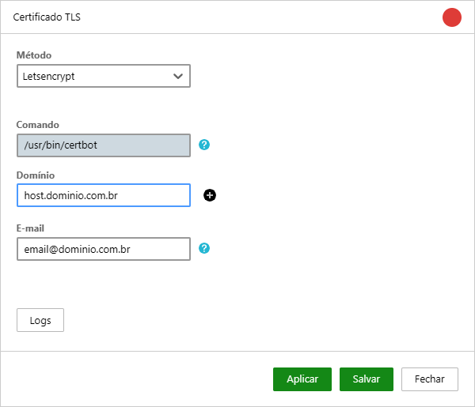
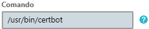
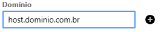
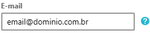
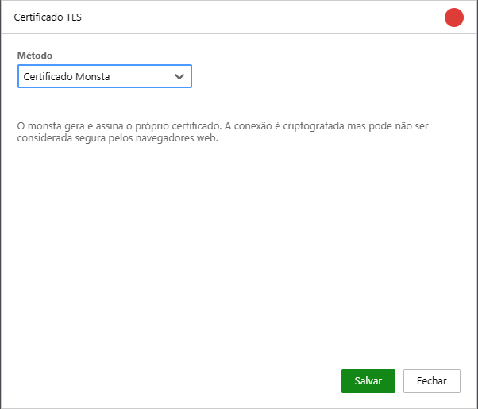
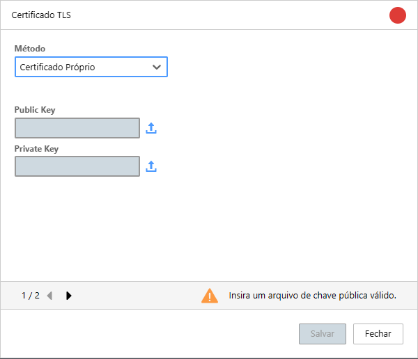
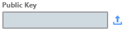
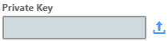

A pantalla de gestión de certificados TLS permite que configure y administre los certificados digitales utilizados para proteger las comunicaciones de su software, garantizando la seguridad y la privacidad de los datos transmitidos.

A continuación se especifican los métodos disponibles.

## Let's Encrypt

Marque este método para habilitar el uso de *Let's Encrypt*. *Let's Encrypt* es una Autoridad de Certificación (AC) gratuita y automatizada que permite obtener certificados TLS/SSL de forma fácil y rápida. Una vez habilitado, Monsta se encarga de renovar el certificado.

:::caution[Importante]
Este método requiere instalar certbot en el Linux donde está instalado Monsta. Asegúrese de que su servidor tenga acceso a Internet.
:::

| Opción | Descripción |
| :--- | :--- |
|  | **Comando**: Indica dónde debe estar instalado el software certbot. |
|  | **Dominio**: Permite al usuario indicar el/los dominio(s) por los que Monsta responderá. <aside class="starlight-aside starlight-aside--caution">
Atención
Asegúrese de que la URL indicada tenga acceso al puerto 80/TCP en Monsta, ya que certbot utiliza esa comunicación para generar y renovar el/los certificado(s).</aside> |
|  | **Correo electrónico**: Let's Encrypt necesita una dirección de correo electrónico para contacto. Proporcione un correo electrónico de su propiedad. |

## Certificado Monsta

Seleccione este método para generar un nuevo certificado autofirmado. Un certificado autofirmado es un certificado digital que está firmado por el propio Monsta. Es útil para entornos de prueba o para uso interno, pero no se recomienda para entornos de producción, ya que no ofrece el mismo nivel de confianza que un certificado emitido por una Autoridad de Certificación (AC) confiable.

## Certificado Propio

Si su empresa ya dispone de un certificado para su uso, utilice esta opción para subir esos archivos. Monsta acepta solo claves **RSA** codificadas en formato **PEM**.

| Opción | Descripción |
| :--- | :--- |
|  | **Clave pública**: Es la clave que cifrará los datos enviados desde el navegador al servidor de Monsta. Utilice este campo para subir el archivo. |
|  | **Clave privada**: Es la clave que descifra la información proveniente de la clave pública. Utilice este campo para subir el archivo correspondiente. |