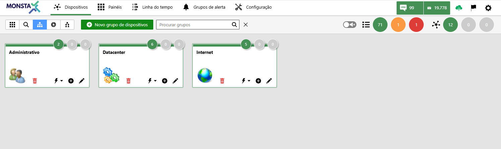
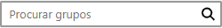
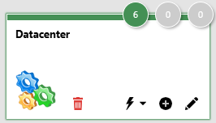
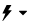
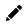
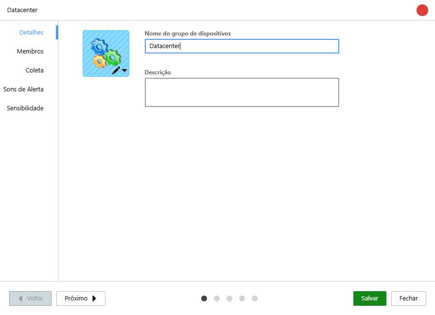
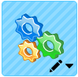
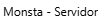
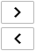
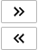

Monsta permite crear grupos en los que se pueden registrar dispositivos de forma individual. Los dispositivos registrados en un grupo heredan sus configuraciones, tales como usuarios, contraseñas, datos SNMP, y estas se superponen a las configuraciones globales.

Los grupos de dispositivos se utilizan para optimizar tareas rutinarias, como configuraciones, disponer para un usuario cuáles dispositivos tiene acceso o para una visualización rápida del estado general de sus dispositivos registrados.

---

**Nuevo grupo de dispositivos**: Crea un nuevo grupo.

---

**Buscar grupos**: Filtra los grupos de acuerdo con el texto informado.

---

**Caja del grupo**: Presenta el nombre del grupo y una visualización rápida sobre la cantidad de dispositivos registrados y sus estados. 

| Ícone | Descrição |
| :---: | :--- |
|  | Indica el total de dispositivos registrados en el grupo por estado. |
|  | Indica el nombre del grupo. |
|  | Asigna acciones que serán heredadas por el grupo. Para más información, consulte [Opciones Globales](/es/manual/dispositivos/opcoes#opciones-globales-de-dispositivos). |
|  | Añade un nuevo dispositivo al grupo seleccionado. |
|  | Abre la pantalla de edición del grupo. |

## Agregar/Editar un grupo de dispositivos

### Detalles

Información básica sobre el grupo. 

| Opção | Descrição |
| :---: | :--- |
|  | Permite seleccionar un icono para el grupo. |
| **Nome do grupo de dispositivos** | Permite introducir un nombre para el grupo en edición. |
| **Descrição** | Un breve comentario sobre el grupo en edición. |

### Miembros
Son los dispositivos que forman parte del grupo.

| Ícone | Descrição |
| :---: | :--- |
|  | Listado de miembros del grupo. |
|  | Añade o elimina miembros seleccionados. |
|  | Añade o elimina todos los miembros. |

### Recopilación
Son las configuraciones de los principales métodos de búsqueda que serán heredadas por los dispositivos que forman parte del grupo. Para más información, consulte [Recopilación](/es/manual/dispositivos/novo-dispositivo#coleta).

### Sonidos de alerta
Configura los sonidos de alerta que serán heredados por los dispositivos miembros de este grupo. Para más información, consulte [Sonidos de alerta](/es/manual/dispositivos/novo-dispositivo#grupos-de-alerta).

### Sensibilidad
Define el comportamiento del tiempo de actividad (uptime) de los dispositivos miembros de este grupo. Para más información, consulte [Sensibilidad](/es/manual/dispositivos/opcoes#sensibilidade).