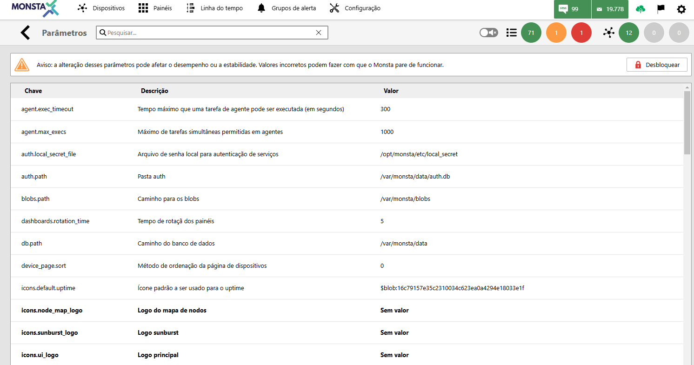

La pantalla de parámetros de configuración de Monsta le permite personalizar el software según sus preferencias y necesidades, definiendo tiempos de espera, imágenes y rutas importantes para el funcionamiento del programa.

En esta pantalla es posible sustituir, por ejemplo, los logotipos de Monsta.

:::danger[Atención]
Tenga cuidado al modificar estas opciones, ya que una configuración incorrecta puede impedir el acceso a Monsta.
:::