En esta sección es posible personalizar todos los datos relacionados con la configuración de Monsta y también la restauración de copias de seguridad de la base de datos.

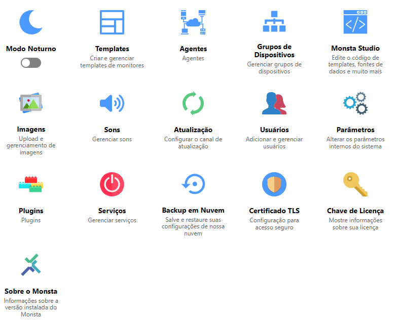

| Opción | Descripción |
| :---: | :--- |
| 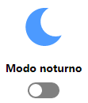 | Cuando está activado, invierte los colores de la pantalla de Monsta. |
| 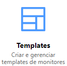 | Permite crear, editar y eliminar templates y monitores existentes. Para más información consulte: [Plantillas](/es/manual/configuracoes/templates). |
| 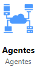 | Permite personalizar la configuración de los agentes y bloquearlos. Para más información consulte: [Agentes](/es/manual/configuracoes/agentes). |
| 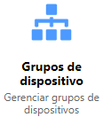 | Permite añadir y eliminar grupos de dispositivos así como gestionarlos. Para más información consulte: [Grupo de Dispositivos](/es/manual/configuracoes/grupo-de-dispositivos). |
| 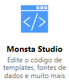 | Permite crear, editar y eliminar fuentes de datos, búsquedas de instancias, métodos de uptime y acciones. Para más información consulte: [Monsta Studio](/es/manual/configuracoes/monsta-studio). |
| 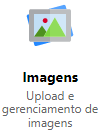 | Gestiona la biblioteca de imágenes de Monsta. Para más información consulte: [Imágenes](/es/manual/configuracoes/imagens). |
| 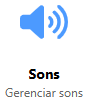 | Es la biblioteca de sonidos de Monsta donde se gestionan los archivos que estarán disponibles para las alertas. Para más información consulte: [Sonidos](/es/manual/configuracoes/sons). |
| 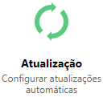 | Alterna entre los canales de actualización de Monsta. Se pueden elegir los canales: - **Oficial**: Canal con actualizaciones consideradas estables. - **Beta**: Canal con actualizaciones en fase de pruebas.
| 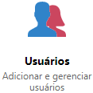 | Gestiona los usuarios en Monsta. Para más información consulte: [Usuarios](/es/manual/configuracoes/usuarios). |
| 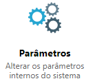 | Permite cambiar los parámetros de configuración general de Monsta. <aside class="starlight-aside starlight-aside--danger">
Precaución
Los parámetros configurados de forma incorrecta pueden dejar a Monsta inoperativo.</aside> Para más información consulte: [Parámetros](/es/manual/configuracoes/parametros). |
| 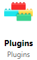 | Permite activar o desactivar recursos disponibles en Monsta. Para más información consulte: [Complementos](/es/manual/configuracoes/plugins). |
| 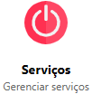 | En esta opción es posible visualizar el estado de los servicios de Monsta y, si es necesario, reiniciarlos individualmente. Para más información consulte: [Servicios](/es/manual/configuracoes/servicos). |
| 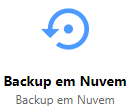 | En esta opción es posible restaurar una copia de seguridad de las configuraciones de Monsta. Para más información consulte: [Copia de seguridad en la nube](/es/manual/configuracoes/backup-em-nuvem). |
| 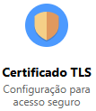 | Instale y gestione sus certificados para acceder a la interfaz web de Monsta. Es posible utilizar certificados propios, generados por Monsta o automatizarlos mediante Letsencrypt. Para más información consulte: [Certificado TLS](/es/manual/configuracoes/certificado-tls). |
| 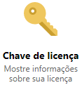 | Muestra información sobre la clave de licencia utilizada. Para más información consulte: [Clave de licencia](/es/manual/configuracoes/chave-de-licenca). |
| 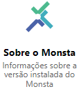 | Muestra información sobre la versión actual. |