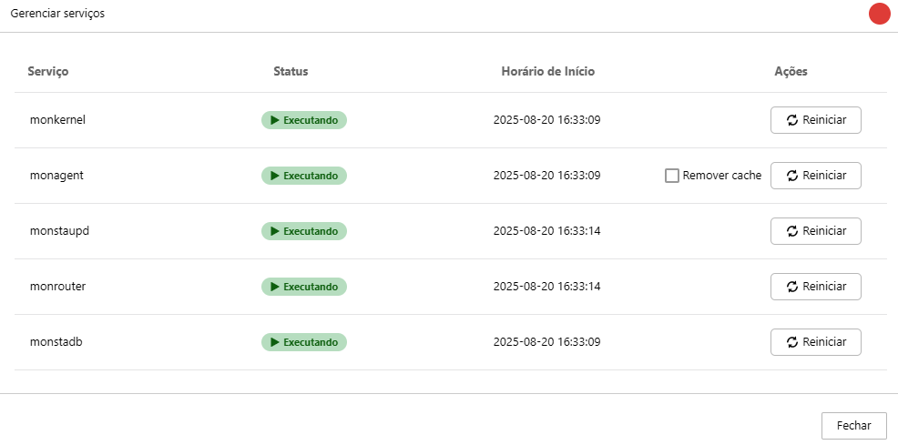

La pantalla **Gestionar Servicios** ofrece una visión general del estado de los servicios esenciales para el funcionamiento de Monsta. Le permite supervisar y gestionar cada servicio individualmente, garantizando que el sistema opere sin interrupciones.

## Cómo Usar

En esta pantalla, verá una lista de servicios, cada uno con la siguiente información:

- **Nombre del Servicio**: El nombre del servicio en ejecución.
- **Estado**: El estado actual del servicio, indicado por un icono de estado. Los estados más comunes son:    
    - **Verde**: El servicio está **activo** y funcionando correctamente.
    - **Rojo**: El servicio está **inactivo** o tiene algún problema.
- **Hora de Inicio**: Indica la fecha y la hora en que se inició el servicio.
- **Acciones**: En esta columna, encontrará el botón para **reiniciar** el servicio.    
    - **Reiniciar**: Haga clic en este botón para reiniciar un servicio específico. Esto puede ser útil para resolver problemas puntuales sin necesidad de reiniciar todo el sistema.

## Servicios

| Servicio | Descripción |
| --- | --- |
| `monkernel` | Es el núcleo del sistema, responsable de los logs y de la interfaz entre los demás servicios y la base de datos. |
| `monagent` | Responsable de la recopilación de información de los equipos. |
| `monstaupd` | Es el subsistema que verifica periódicamente si hay nuevas actualizaciones de Monsta. |
| `monrouter` | Es el servidor HTTP responsable de proporcionar la interfaz HTTP al usuario. |
| `monstadb` | Base de datos de las recopilaciones de información. |