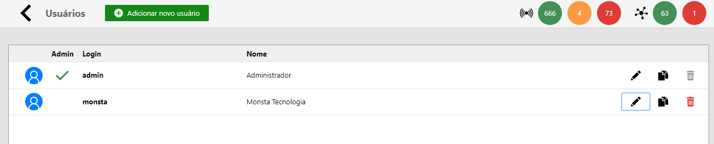
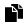
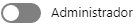
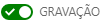
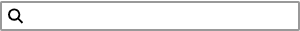
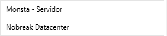
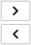
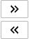
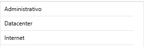
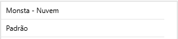

O Monsta é multi-usuário, ou seja, ele permite que vários usuários sejam utilizados simultaneamente no sistema com permissões personalizadas. O sistema de gerenciamento de usuários do Monsta permite informar quais dispositivos, grupos, painéis ou grupos de alerta podem ser visualizados e gerenciados por cada integrante.

| Ícone / Opção | Descrição |
| :---: | :--- |
|  | Añade un nuevo usuario para acceder a la plataforma. |
| **Admin** | Cuando está marcado, indica que el usuario en la lista tiene permisos de administrador y acceso a todos los dispositivos, monitores y recursos disponibles. |
| **Login** | Es el nombre para iniciar sesión en Monsta. |
| **Nome** | Nombre del usuario. |
|  | Edita las propiedades del usuario seleccionado. |
|  | Clona las propiedades del usuario actual a uno nuevo. |
|  | Elimina el usuario seleccionado. |

## Crear/Editar un Usuario

### Detalles
Son la información básica del usuario. 

| Opção | Descrição |
| :--- | :--- |
| **Login** | Nombre de usuario. No puede ser modificado para usuarios ya existentes. |
| **Nome Completo** | Información del nombre completo del usuario. |
| **Alterar Senha** | Permite cambiar la contraseña del usuario en edición. |
|  | **Administrador**: Asigna propiedades de administrador cuando está activado. El usuario tendrá acceso a todos los dispositivos, monitores y recursos disponibles en Monsta. <aside class="starlight-aside starlight-aside--note">Cuando un usuario no es administrador, la vista jerárquica no estará disponible para él.</aside> |

### Dispositivos
Permite al administrador definir exactamente qué dispositivos podrá visualizar y gestionar un usuario específico en el sistema.

| Ícone / Opção | Descrição |
| :--- | :--- |
|  | **Escritura**: El usuario recibe permisos de escritura (modificación). Podrá: • Modificar y eliminar dispositivos; • Añadir, modificar y eliminar monitores (servicios/métricas) en los dispositivos existentes.  Cuando está desmarcado, el usuario solo puede visualizar datos. No se permiten cambios en la lista de dispositivos, monitores ni en sus configuraciones. |
|  | **Filtro de Dispositivos**: Filtra los dispositivos por el texto indicado. |
|  | **Lista de Dispositivos**: En la columna a la izquierda están listados todos los dispositivos que están siendo monitorizados en Monsta. En la columna a la derecha, están listados los dispositivos que el usuario podrá visualizar e interactuar. Estos son los activos a los que el usuario accederá. |
|  | **Botones de Selección Individual**: Mueve los dispositivos seleccionados entre las columnas de la lista de dispositivos. |
|  | **Botones de Selección General**: Mueve todos los dispositivos de una columna a otra en la lista de dispositivos. |

### Grupos
Configura los grupos en los que el usuario tendrá acceso a los dispositivos miembros.

| Ícone / Opção | Descrição |
| :--- | :--- |
|  | **Lista de Grupos de Dispositivos**: En la columna a la izquierda están listados todos los grupos registrados en Monsta. En la columna a la derecha, están listados los grupos a los que el usuario tendrá acceso. Los dispositivos pertenecientes a ese grupo se mostrarán en la pestaña "Dispositivos", en la columna a la derecha, marcados solo como lectura. |
|  | **Filtro de Grupos de Dispositivos**: Filtra los grupos por el texto indicado. |
|  | **Botones de Selección Individual**: Mueve los grupos seleccionados entre las columnas de la lista de grupos de dispositivos. |
|  | **Botones de Selección General**: Mueve todos los grupos de una columna a otra en la lista de grupos de dispositivos. |

### Grupos de Alerta
Configura los grupos de alerta a los que el usuario tendrá acceso.

| Ícone / Opção | Descrição |
| :--- | :--- |
|  | **Escritura**: El usuario recibe permisos de escritura (modificación). Podrá gestionar alertas.  Cuando está desmarcado, el usuario solo puede visualizar datos. No se permiten cambios en los grupos de alerta. |
|  | **Filtro de Grupos de Alerta**: Filtra los grupos por el texto indicado. |
|  | **Botones de Selección Individual**: Mueve los grupos seleccionados entre las columnas de la lista de grupos de alerta. |
|  | **Botones de Selección General**: Mueve todos los grupos de una columna a otra en la lista de grupos de alerta. |