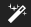
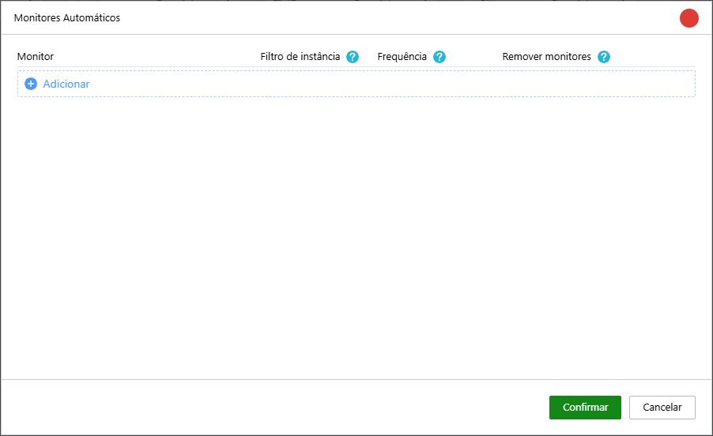
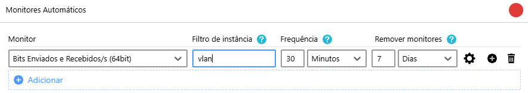

Los **monitores automáticos** son una característica fundamental de Monsta, diseñada para simplificar y acelerar la configuración de su entorno de monitorización. En lugar de añadir manualmente cada monitor que desea supervisar en sus dispositivos, Monsta utiliza mecanismos inteligentes para **descubrir automáticamente** los elementos presentes en su infraestructura y añade los monitores para cada uno de ellos.

#### Cómo Funciona:

Al configurar el descubrimiento automático, Monsta explora las instancias del monitor que usted especifique, utilizando protocolos de red como **SNMP (Simple Network Management Protocol), WMI, SSH** o **API**. Al identificar una instancia nueva, Monsta crea un nuevo monitor con su nombre. En caso de que la instancia sea eliminada del dispositivo, el algoritmo de monitores automáticos detecta y elimina la instancia de su monitorización basándose en el tiempo transcurrido desde la eliminación.

**Por ejemplo**:

- Para un servidor Windows, Monsta puede detectar automáticamente las interfaces de red existentes y crear un monitor para cada una de ellas;
- En equipos que trabajan con VPN, Monsta puede identificar las interfaces creadas para nuevos usuarios y añadirlas automáticamente, así como eliminar la interfaz de la monitorización si la misma deja de existir transcurridos los días configurados en la regla del monitor.

Tras el descubrimiento automático, tendrá la oportunidad de **seleccionar los monitores** creados y **personalizar la configuración** de cada uno de ellos, como los umbrales de alerta y la frecuencia de recogida de datos. Los monitores automáticos son una herramienta poderosa para iniciar su monitorización de forma rápida e inteligente, permitiéndole centrarse en analizar los datos y garantizar la salud de su infraestructura TI.

#### Cómo agregar una regla de monitor automático:

1. Haga clic en el dispositivo para el que desea crear la regla de monitor automático;
2. Haga clic en el botón Se mostrará la siguiente pantalla: 
3. Haga clic en "Agregar";
4. Personalice la regla según sus necesidades con los parámetros siguientes:  
    
| Opção | Descrição |
| :--- | :--- |
| Monitor | Seleccione el monitor que desea automatizar |
| Filtro de instância | Puede informar un texto que se utilizará para filtrar los nombres de instancias existentes y creará solo monitores que "contengan" ese contenido. |
| Frequência | Es el tiempo en que Monsta verificará si se ha creado alguna nueva instancia. En caso de que se identifiquen nuevos elementos, se crearán sus respectivos monitores. |
| Remover monitores | En caso de fallo en la recogida de datos de un monitor, esto significa que puede haber sido eliminado del equipo. Tras los días configurados en esta opción, Monsta eliminará esos monitores. |

**Ejemplo**:

En la imagen anterior, la regla creada añadirá monitores que contengan la palabra "vlan" en su nombre. Cada 30 minutos Monsta realizará una exploración para verificar si existen nuevas instancias y las añadirá a la monitorización. Si un monitor automático entra en estado de fallo, y en 7 días no recupera las recogidas, será eliminado de la monitorización.