Al hacer clic en el botón "Nuevo" es posible añadir un dispositivo al monitoreo de Monsta.

## Detalles

Define la información básica sobre el equipo.

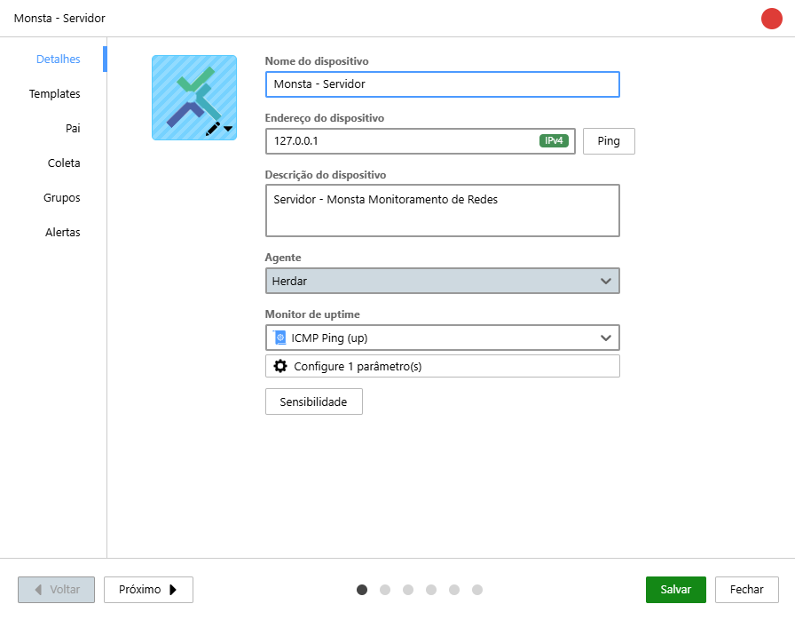

| Ícone | Descrição |
| :---: | :--- |
| 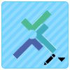 | **Ícono**: Permite seleccionar un ícono para el dispositivo. |
|  | **Nombre del dispositivo**: Será el nombre mostrado en los modos de visualización. |
| 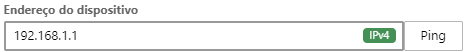 | **Dirección del dispositivo**: Es la dirección IPv4, IPv6 o el host del dispositivo. Es posible hacer ping a la dirección para probarla. |
|  | **Descripción del dispositivo**: Permite insertar un breve texto sobre el equipo. |
|  | **Agente**: Lugar desde donde se lanzarán las recopilaciones del dispositivo. Esta información es de solo lectura. |
|  | **Monitor de uptime**: Método utilizado para identificar si el dispositivo está activo. Por defecto se envían paquetes icmp echo-request (ping). Los métodos de verificación pueden permitir informar algunos parámetros para las consultas, como por ejemplo el tamaño del paquete icmp a enviar o el puerto TCP a verificar en el dispositivo. |
| 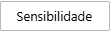 | **Sensibilidad**: Configura el nivel de sensibilidad del dispositivo para paquetes de tipo ping (icmp). Para más información, consulte la página [Sensibilidad](/es/manual/dispositivos/opcoes#sensibilidad). |

## Templates

Son los monitores disponibles para cada tipo de equipo. Cada plantilla posee monitores específicos para ser utilizados, y se puede utilizar más de una plantilla en un dispositivo.

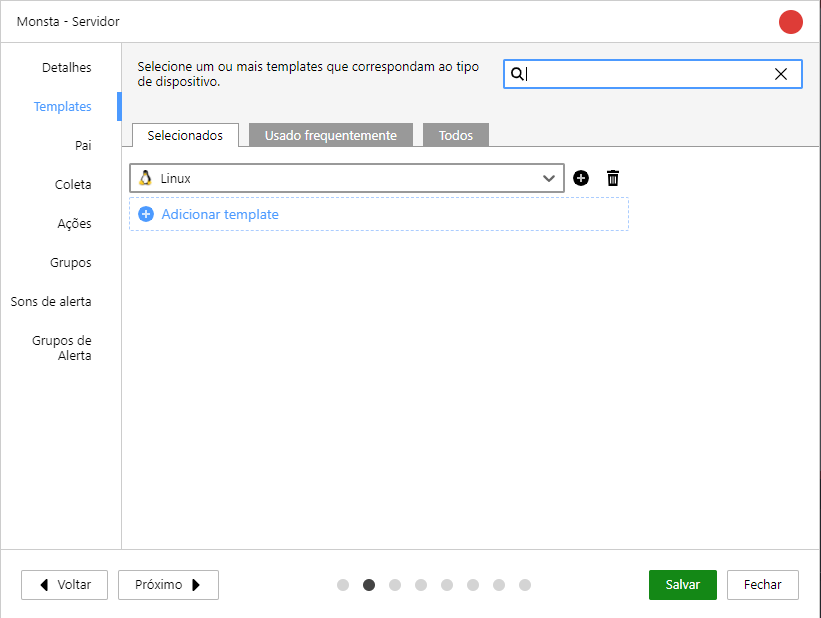

| Opção | Descrição |
| :--- | :--- |
| **Seleccionados** | Son las plantillas utilizadas en este dispositivo. |
| **Usado frequentemente** | Es una lista de las plantillas más utilizadas en su Monsta, lo que permite una selección más ágil. |
| **Todos** | Es el listado de todas las plantillas disponibles en Monsta. |

## Pai

Define la dependencia jerárquica del activo. Utilizado para organizar el mapa de la red y optimizar el sistema de notificaciones, relacionando los dispositivos con sus dependencias.

:::caution[Importante]
Esta información será utilizada por el sistema de envío de alertas para que Monsta dispare una comunicación únicamente del dispositivo que esté con problema.
:::

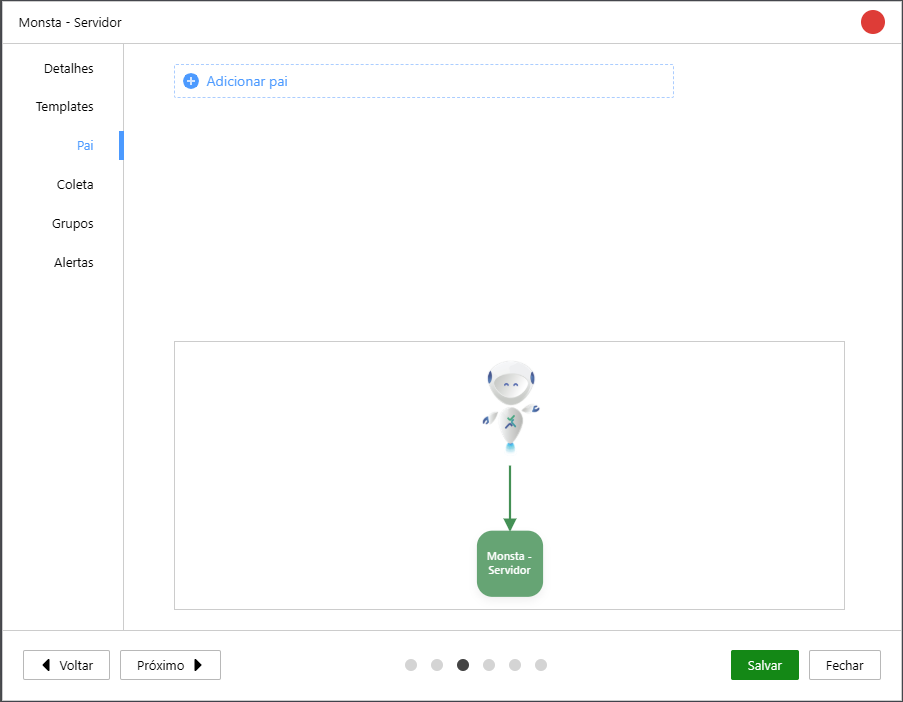

## Coleta

En esta pantalla aparecen los principales métodos para la búsqueda de información de los dispositivos utilizados por Monsta. Su funcionalidad principal es permitir que el usuario utilice una configuración por defecto para los monitores utilizados, además de probar si la comunicación está funcional.

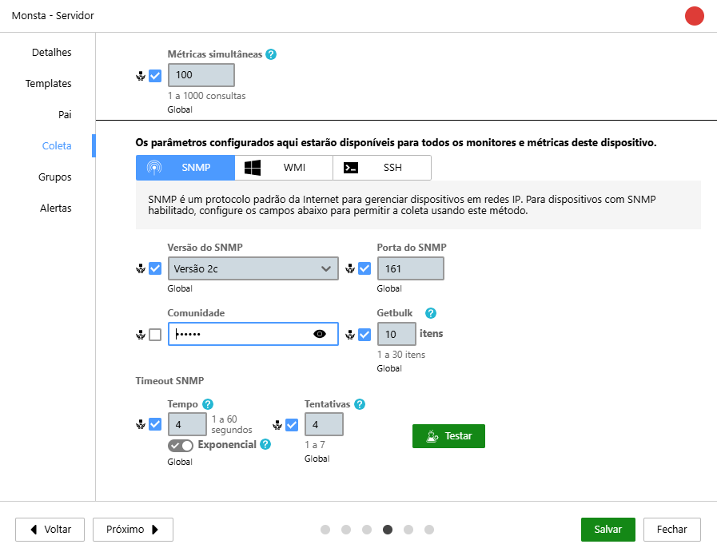

| Ícone | Descrição |
| :---: | :--- |
|  | **Métodos de recopilación**: Son los tipos de recopilación por defecto ejecutados por Monsta. Al hacer clic en estos métodos es posible configurar parámetros generales que serán usados por los monitores de los dispositivos. Para recopilar datos de Servidores y Estaciones Windows, utilice la Sonda. Para más información, consulte nuestro tutorial [Sonda: Monitorización de Windows](/es/start/instalacao/sonda-windows). |
|  | **Heredar del Grupo o Global**: Esta propiedad, cuando está marcada, obtiene los valores configurados globalmente o del grupo al que pertenece el dispositivo. Para más información consulte [Opciones globales de dispositivos](/es/manual/dispositivos/opcoes#opciones-globales-de-dispositivos). |
|  | **Propiedad**: Permite cambiar el valor de esta propiedad de recopilación. Si la opción "Heredar valor del grupo o global" está marcada, esta propiedad heredará el valor configurado. |
|  | **Exponencial**: Cuando está disponible, utiliza un algoritmo de timeout para la recopilación. Este algoritmo duplica el tiempo de timeout en cada recopilación fallida, iniciando en 1 segundo. |
|  | **Probar**: Cuando está disponible, permite probar si el dispositivo responde a los parámetros configurados. |

## Grupos

Los dispositivos en Monsta pueden formar parte de grupos y heredar sus configuraciones. En esta pantalla es posible consultar los grupos a los que pertenece el dispositivo además de añadir otros. Para añadir grupos, consulte Grupos de Dispositivos.

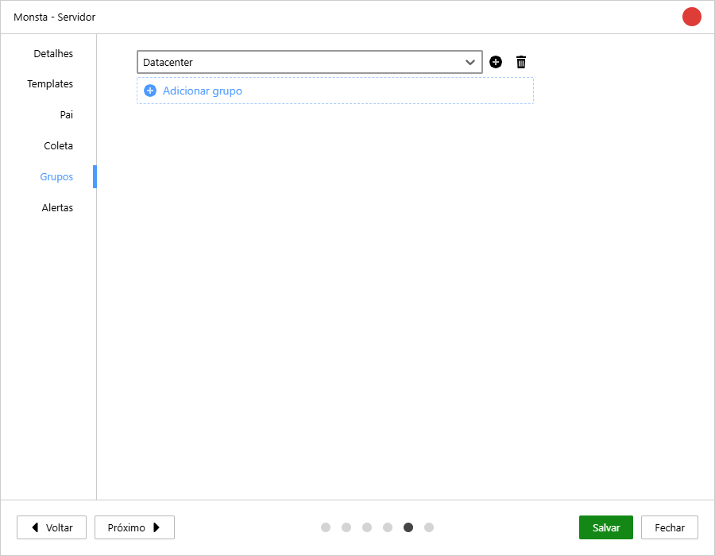

| Ícone | Descrição |
| :---: | :--- |
| 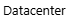 | **Nombre del grupo**: Indica el grupo al que pertenece el dispositivo. |
|  | **Añadir grupo**: Permite añadir un nuevo grupo al que pertenecerá el dispositivo. |
|  | **Eliminar grupo**: Elimina el dispositivo del grupo seleccionado. |

## Alertas

Monsta tiene la capacidad de emitir sonidos cuando un dispositivo o monitor cambia de estado. En esta pantalla podrá personalizar los sonidos individualmente para el dispositivo en cuestión.

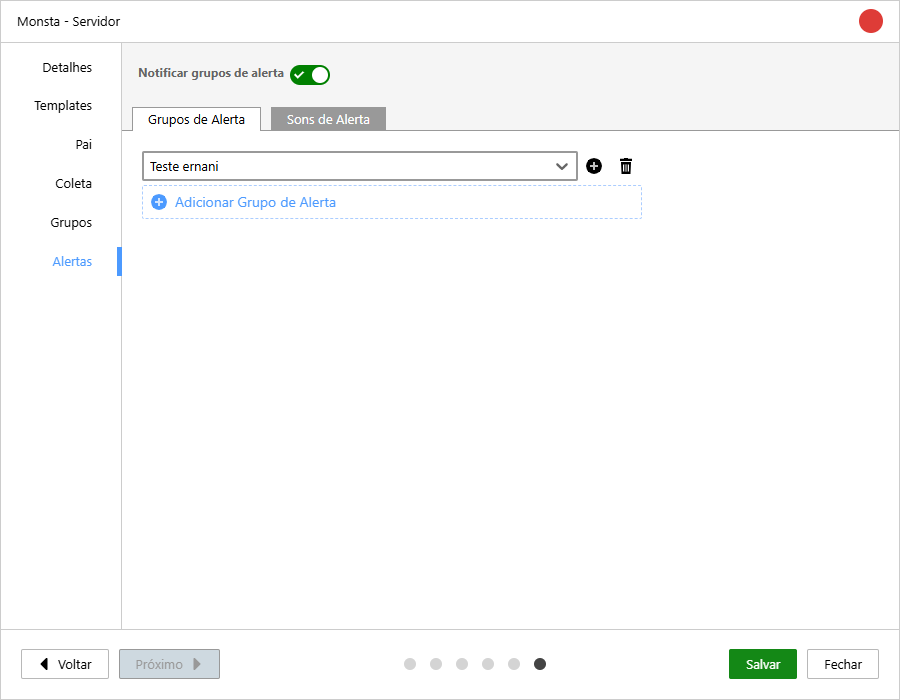

### Grupos de Alerta

Los grupos de alerta se utilizan para el envío de mensajes cuando un dispositivo o monitor cambia de estado. Estos grupos pueden personalizarse para cada dispositivo o monitor o asignarse sonidos específicos al dispositivo en cuestión. Para más información sobre los grupos de alerta consulte [Alertas](/es/manual/grupos-alertas/alertas).

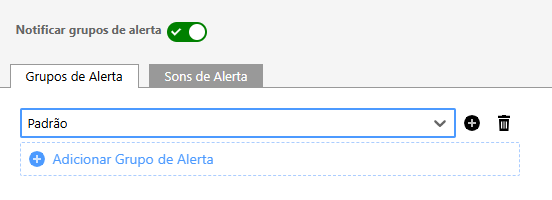

| Ícone | Descrição |
| :---: | :--- |
|  | **Notificar grupos de alerta**: Habilita/Deshabilita el envío de alertas para el dispositivo seleccionado. |
| 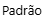 | **Seleccionar**: Indica el grupo de alerta al que pertenece el dispositivo. |
|  | **Añadir grupo de alerta**: Permite añadir un nuevo grupo de alerta al que pertenecerá el dispositivo. |
|  | **Eliminar grupo de alerta**: Elimina el dispositivo del grupo de alerta seleccionado. |
| 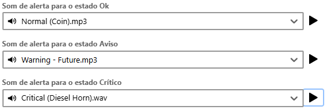 | **Sonidos de Alerta**: Permite seleccionar un sonido específico para cada estado del dispositivo. |