## Monitores

Los monitores son información existente en un equipo, como CPU, memoria, disco, etc. Cada equipo dispone de recursos exclusivos que pueden ser monitorizados. Los colores de los monitores varían según su estado.

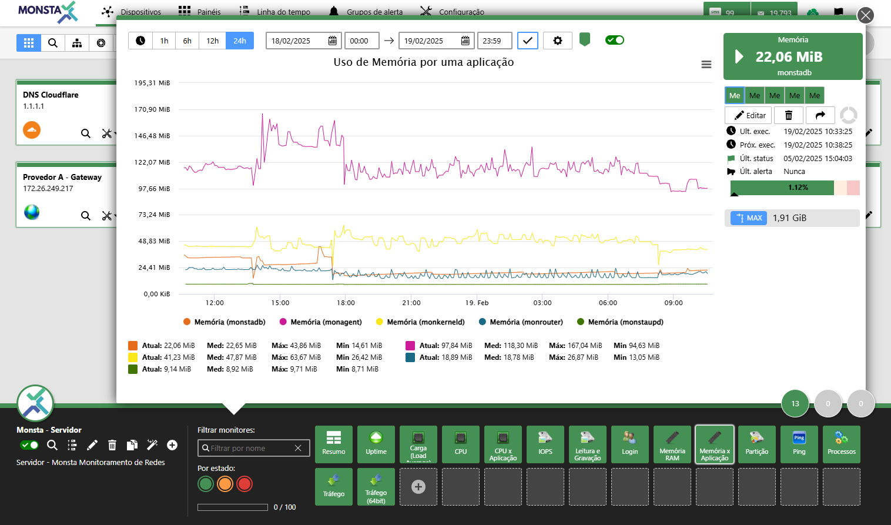

---

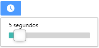
**Gráfico en tiempo real**: Muestra el gráfico actualizando sus datos en el intervalo de tiempo seleccionado. 

:::caution
Intervalos menores que el tiempo de actualización de los datos del equipo pueden generar gráficos con información incorrecta, tales como lecturas en cero o picos por encima del máximo permitido por el equipo.
:::

---

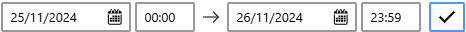 
 **Periodo de Muestreo**: Personaliza el periodo del gráfico a generar. 

---

 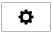 
 **Propiedades del Gráfico**: Abre la pantalla con las propiedades del gráfico mostrado. 

| Ícone | Descrição |
| ----------------------------------------------------------------------------------------------------------------------------------------------------------- | ------------------------------------------------------------------------------------------------------------------------------------------------------------------------------------------------------------------------------------------------------------------------------------------------------------------- |
|  | **Título**: Nombre que aparecerá en la parte superior del gráfico. |
|  | **Límites por lectura**: Cuando está activado, rellena todo el gráfico según el estado del periodo durante las lecturas. |
|  | **Mostrar marcadores de estado**: Cuando hay un cambio de estado en el periodo de tiempo presentado, Monsta añade una marca para visualizar cuándo y a qué estado se produjo el cambio. |
| 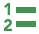 | **Ocultar valores**: Elimina los valores informados de la parte inferior de la presentación del gráfico. |
|  | **Ocultar leyenda**: Elimina la leyenda de la presentación del gráfico. |
| 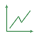 | **Mostrar solo variación**: Renderiza el gráfico únicamente con sus variaciones para una mejor visualización de los cambios. |
|  | **Color de la leyenda**: Personaliza el color del texto de las leyendas en la parte inferior del gráfico. |
|  | **Color de fondo**: Personaliza el color de fondo del gráfico. |
|  | **Tamaño de la fuente de la leyenda**: Personaliza el tamaño de la leyenda en la parte inferior del gráfico. |
|  | **Ancho de la línea**: Personaliza el ancho de la línea renderizada en el gráfico. |
| 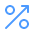 | **Mostrar indicador de percentil**: Añade al gráfico el percentil seleccionado. |
| **Agrupar Dados por Tempo** | **Agrupar los datos por tiempo**: Cuando hay un periodo de tiempo mayor a dos días, Monsta agrupa los datos y genera una media de la información automáticamente para presentarla en el gráfico. En esta propiedad es posible elegir el intervalo que utilizará este agrupamiento o simplemente desactivar esta opción. |

---

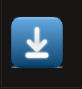

**Activar monitorización**: Este botón permite habilitar o pausar la recopilación de datos y la visualización de gráficos para el activo seleccionado. Cuando el monitor está **desactivado**, la recopilación se interrumpe inmediatamente, cesando el procesamiento de métricas y el envío de alertas asociadas, sin eliminar el historial de datos ya almacenado.

---

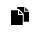

**Clonar monitor**: Utilice esta funcionalidad para replicar el monitor. Al accionar este botón, se abrirá una lista para seleccionar el dispositivo de destino, heredando todas las métricas, umbrales de alerta y parámetros de verificación configurados.  

---

 **Valor de la métrica**: Indica el nombre de la métrica, el valor de la lectura actual y si el resultado es mayor, menor o igual a la lectura anterior.

---

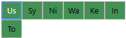 
**Métricas**: Muestra la información sobre cada recurso individual monitorizado. 

---

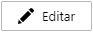 
**Editar**: Modifica las propiedades del monitor seleccionado. 

---

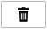 
**Eliminar**: Elimina el monitor seleccionado. 

---

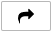 
**Publicar**: Crea un enlace para publicar el gráfico sin necesidad de autenticación. Para más información, consulte [Publicar un Monitor](#publicar-um-monitor)

---

 
**Número de intentos**: Indica la cantidad de intentos del monitor antes de salir del estado normal. 

---

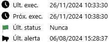 
**Información del monitor**: Muestra la fecha de la última verificación, la fecha de la próxima verificación, el último cambio de estado y la fecha del último alerta enviado. 

---

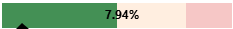 
**Porcentaje**: Muestra el porcentaje de recurso utilizado por la métrica seleccionada cuando hay un valor máximo informado. 

---

 
**Exportar / Calcular Área**: El gráfico de recopilaciones de información ofrece tres opciones principales para interactuar con los datos visualizados:

- **Exportar como imagen**: En la esquina superior derecha del gráfico, haga clic en el icono de "Download" o "Exportar" para guardar el gráfico como un archivo de imagen. Esto le permite usar la imagen en informes, presentaciones o compartirla fácilmente.
- **Exportar datos**: Puede exportar los datos brutos en formatos de hoja de cálculo para análisis posteriores. Los formatos disponibles son CSV y XLS.
- **Informe de consumo**: Para un análisis más detallado, puede calcular el área bajo la curva del gráfico. Esta función es ideal para obtener valores acumulados o totales a lo largo del periodo seleccionado. Haga clic en la opción "Relatório de Consumo" y el resultado se mostrará en un cuadro de texto, listo para copiarse o utilizarse en sus cálculos.

### Publicar um Monitor

La publicación de un monitor permite al usuario crear un enlace para acceso en internet sin la necesidad de usuario y contraseña.

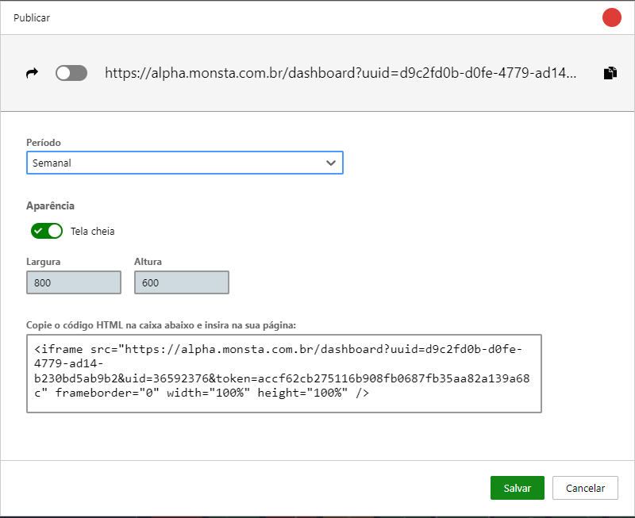

- **Publicar**: Habilita la creación del enlace para el monitor seleccionado.
- **Período**: Permite elegir el tiempo de publicación del gráfico. Por seguridad, no se permiten periodos mayores a un mes.
- **Pantalla completa**: Cuando está activado, utiliza toda la pantalla para mostrar el gráfico.
- **Ancho y Alto**: Define las dimensiones del gráfico en píxeles.
- **Código HTML**: Este código es generado por Monsta para el monitor seleccionado y puede utilizarse para publicar el gráfico en un panel de terceros.

### Editar/Customizar um Monitor

La edición de un monitor permite personalizar información importante sobre su comportamiento, como la frecuencia de las recopilaciones, límites de alerta y su script de cómo obtener la información.

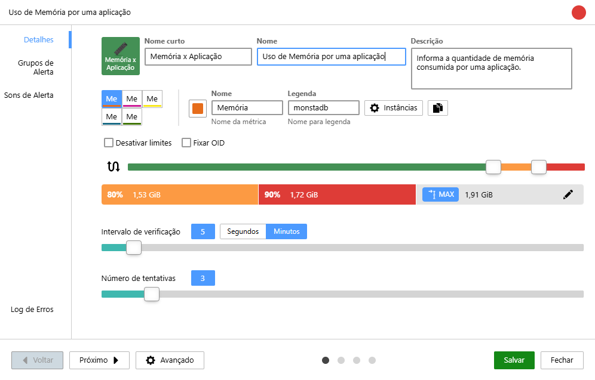

#### Detalhes

**Ícone**: Permite seleccionar el icono que se mostrará en pantalla. 

---

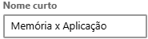
**Nome curto**: Es el texto que aparecerá en el icono del monitor. 

---

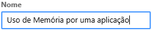
**Nome**: Es el texto que se mostrará en la parte superior del gráfico del monitor. 

---

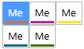
**Métricas**: Son los recursos cuyos datos serán recopilados para el gráfico. 

---

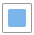
**Cor**: Selecciona el color que será renderizado por la métrica en el gráfico. 

---

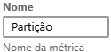
**Nome da métrica**: Es el nombre que se mostrará en la leyenda del indicador de la lectura actual. 

---

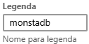
**Legenda**: Es el nombre que se mostrará en la leyenda del gráfico y en el indicador de valor actual referente a la métrica seleccionada. 

---

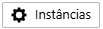
**Instâncias**: Permite cambiar la instancia actual de la métrica. 

---

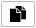
**Clonar**: Permite añadir una nueva métrica al mismo monitor. 

---

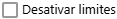
**Desativar Limites**: Cuando está marcado, desactiva el envío de alertas para el monitor en edición. La métrica seleccionada será considerada siempre en estado normal. 

---

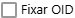
**Fixar OID**: Cuando está desmarcada, Monsta verificará si el nombre de la instancia monitorizada sigue en la misma OID y en caso de cambio, la nueva posición será localizada automáticamente. Cuando esta opción está marcada, Monsta recopilará datos siempre de la misma OID, independientemente del nombre de la instancia. 

---

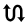
**Inversão da Lógica de Limite (Threshold Inversion)**: Esta opción permite que usted cambie la **lógica de alerta** de un monitor. Use esta funcionalidad para métricas donde un **valor bajo** indica un problema (p. ej.: la velocidad de una interfaz de red no debe bajar de cierto nivel) o donde necesite monitorizar rangos específicos de valores. 

---

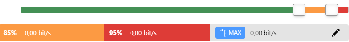
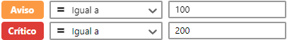
**Porcentaje para alertas**: Permite seleccionar en qué valores la métrica entrará en estado de alerta. Cuando hay un valor máximo definido, la configuración de las alertas será en porcentaje; de lo contrario, los límites se informan textualmente. 

---

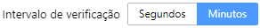
**Intervalo de verificación**: Permite seleccionar la frecuencia con la que se ejecutará el monitor. 

---

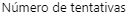
**Número de intentos**: Permite seleccionar cuántas veces se debe comprobar el monitor antes de salir de su estado normal. Cuando un monitor vuelve al estado normal antes de alcanzar este límite, ese contador se reinicia. | 

---

#### Grupos de alerta

**Notificar grupo de alerta**: Cuando está activado, envía alertas a los grupos seleccionados; de lo contrario, Monsta no enviará alertas aunque el monitor cambie de estado.

---

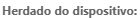
**Herdado do dispositivo**: Son los grupos de alerta definidos en la edición del dispositivo. Una vez que son heredados, no es posible eliminarlos del monitor, solo desactivarlos.

---

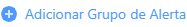
**Adicionar Grupo de Alerta**: Añade grupos que recibirán las alertas cuando el monitor cambie de estado. Para más información consulte [Alertas](/es/manual/grupos-alertas/alertas).

---

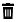
**Remover Grupo de Alerta**: Elimina el grupo de alerta seleccionado.

---

#### Sons de Alerta

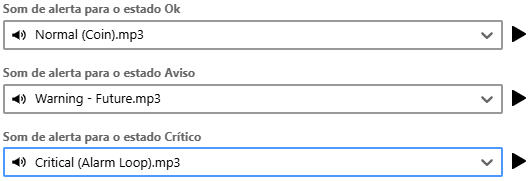
Permite añadir sonidos de alerta personalizados para cada estado del monitor.

---

#### Log de Erros

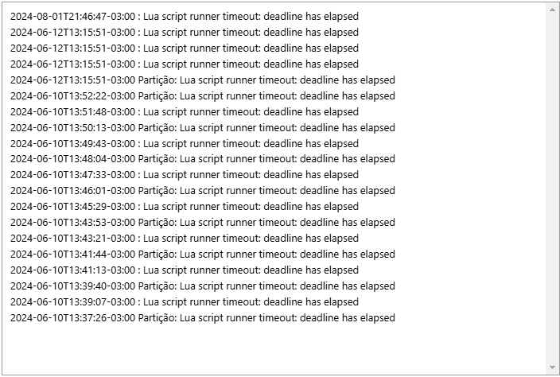
Informa de las últimas fallas que ocurrieron con la recopilación del monitor. Este registro es útil para conocer el motivo por el cual alguna recopilación no se está realizando con éxito.

#### Avançado

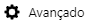

##### Métricas

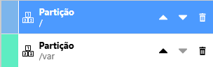
Métricas: Permite cambiar el orden de visualización de la métrica, eliminarla o editarla. Para más información sobre cómo editar una métrica consulte [Métricas](/es/manual/configuracoes/templates#métricas). 

---

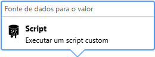 
Fuente de datos para el valor: Es el método que Monsta utilizará para recopilar información para esta métrica. Para más información, consulte [Métricas](/es/manual/configuracoes/templates#métricas). 

---

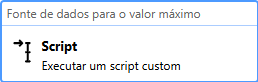
Fuente de datos para el valor máximo: Utilizado cuando el monitor posee un valor máximo límite. Para más información, consulte [Métricas](/es/manual/configuracoes/templates#métricas). 

---

##### Parámetros

En esta pestaña se indicarán los parámetros utilizados por el monitor seleccionado y sus respectivos valores empleados.