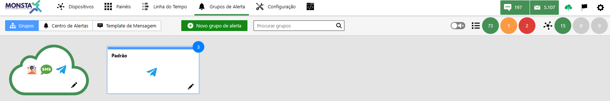

:::caution[Atención]
El funcionamiento de este recurso requiere, obligatoriamente, que el software de Monsta tenga comunicación con el host mind.monsta.com.br.
:::

:::tip
La pantalla de alertas permite trabajar con grupos donde se indican los contactos que deberán recibir los avisos correspondientes cuando un dispositivo o monitor cambie su “estado”.
:::

## Grupos

En esta pantalla se gestionan los grupos de usuarios que recibirán las notificaciones y el tipo de servicio, ya sea por correo electrónico o SMS.

| Opción | Descripción |
| :---: | :--- |
|  | **Nuevo Grupo**: Crea un nuevo grupo para el envío de alertas. |
|  | **Buscar Grupo**: Muestra en pantalla solo los grupos que coinciden con la búsqueda introducida. |
|  | **Grupo Nube**: Este grupo envía alertas en caso de pérdida de comunicación entre Monsta y la nube en [https://mind.monsta.com.br](https://mind.monsta.com.br). Este recurso es muy útil en casos como la caída del enlace a Internet en la empresa o el apagado inesperado del servidor sin el conocimiento del usuario. Este grupo no puede ser removido del sistema y no está disponible para dispositivos o monitores. El color de su borde indica el estado de la conexión con la nube: - **Verde**: Comunicación establecida; - **Rojo**: Fallo en la comunicación. |
| 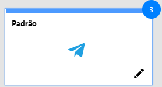 | **Grupo Predeterminado**: Este grupo es obligatorio en el sistema y no puede ser eliminado, solo modificado. El número mostrado en la esquina superior derecha del recuadro del grupo se refiere al número de dispositivos que lo utilizan en sus alertas. Cuando el recuadro del grupo se presenta en color gris, esto indica que no tiene alertas activadas. |
|  | **Alertas activas**: Los iconos presentados dentro del recuadro del grupo indican qué alertas están activas en ese momento para el mismo. |
| 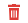 | **Eliminar Grupo**: Elimina el grupo seleccionado. <aside class="starlight-aside starlight-aside--caution">
Atención
Sólo se permitirá eliminar un grupo cuando el mismo no forme parte de ningún dispositivo o monitor. Esta información podrá obtenerse en la pestaña [Miembros](#membros) al editar el grupo.</aside> |
|  | **Editar Grupo**: En esta opción el usuario podrá agregar y eliminar dispositivos y monitores que forman parte de este grupo, así como definir los tipos de alerta que se enviarán, sus destinatarios y los horarios permitidos para el envío de los mensajes. |

### Editando grupos de alertas

#### Detalles

En esta pestaña se definen el icono, nombre y comentario sobre el grupo.

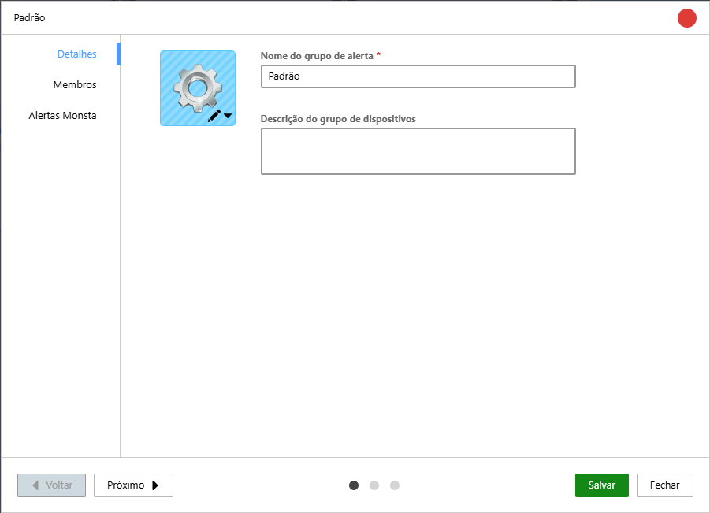

| Opción | Descripción |
| :---: | :--- |
|  | Es posible asignar una imagen al grupo de alertas que se mostrará en pantalla. |
| **Nombre del grupo de alertas** | Es el nombre que se presentará en la pantalla de grupos, así como el que se mostrará al editar la opción de grupos de alertas dentro de los dispositivos o monitores. |
| **Descripción** | Permite añadir un comentario sobre el grupo en cuestión. |

#### Miembros  

En esta pestaña es posible visualizar los dispositivos y monitores que recibirán alertas de este grupo, así como añadir nuevos dispositivos o eliminar los existentes.

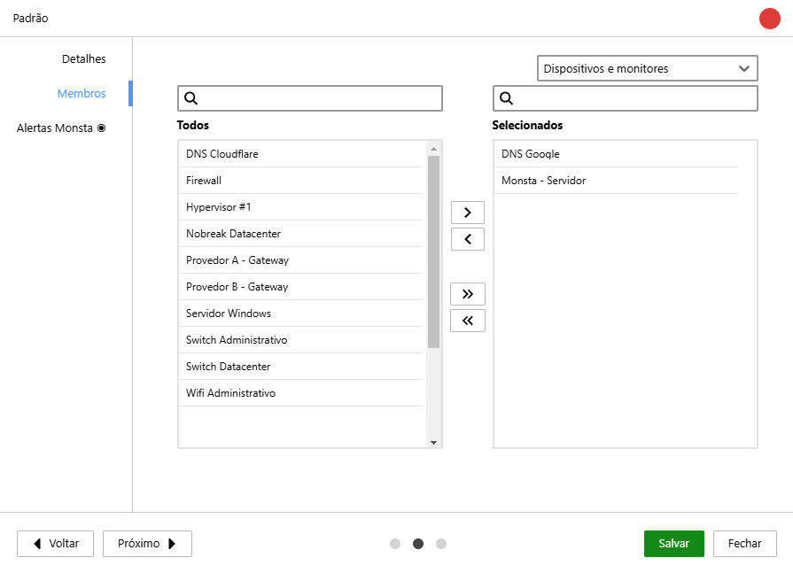

| Opción | Descripción |
| :---: | :--- |
| **Todos** | Este componente muestra todos los dispositivos existentes en Monsta. Haga clic sobre un dispositivo para seleccionarlo y utilice los botones al lado para añadirlo al grupo. |
| **Seleccionados** | Este componente muestra los dispositivos y monitores que forman parte del grupo en cuestión. Haga clic sobre un elemento para seleccionarlo y utilice los botones al lado para eliminarlo del grupo. |

#### Alertas Monsta  

Esta pestaña muestra las alertas estándar de Monsta que utilizan nuestra nube para ser enviadas a los destinatarios. Las opciones de envío disponibles son Correo electrónico, SMS y Telegram. Las Alertas Monsta no requieren configuraciones especiales ya que se integran automáticamente con la nube durante la instalación del software. 

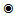 
Para facilitar la visualización, las alertas activas se marcan con el icono anterior en su pestaña.

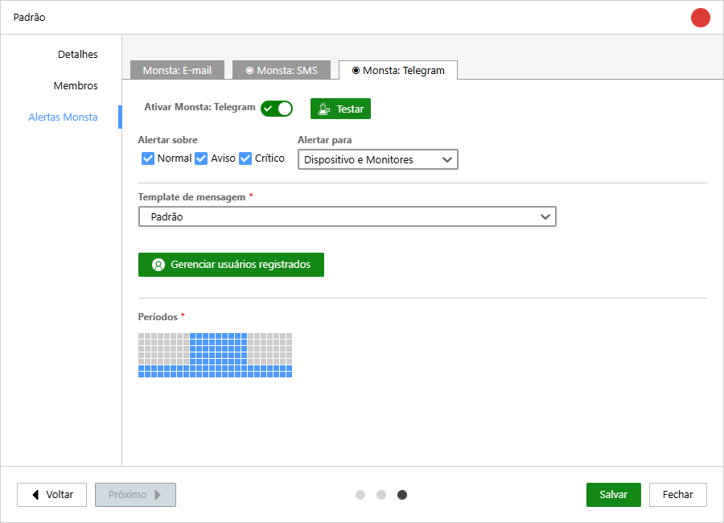

| Opción | Descripción |
| :---: | :--- |
|  | Activa o desactiva el tipo de alerta en cuestión. |
|  | Envía una prueba a los destinatarios existentes. Esta opción es útil para verificar si todos los destinos están configurados correctamente, como direcciones de correo electrónico, números de SMS o usuarios de Telegram. |
| 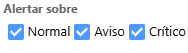 | Estas opciones permiten seleccionar el tipo de evento en el que debe enviarse la alerta. Cuando está desmarcada, Monsta no realizará envíos para el estado seleccionado. |
| 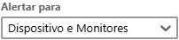 | Aquí es posible elegir el objeto que se utilizará para el disparo de alertas. Puede usar esta opción para recibir alertas solo cuando el dispositivo se vuelve incomunicable, pero optar por no recibir una alerta si el monitor de CPU alarma por un uso elevado. |
| **Plantilla del mensaje** | Las plantillas son modelos de mensajes que se enviarán a los usuarios. Puede personalizar cómo se enviarán los mensajes a sus destinatarios. Para más información, consulte "Plantillas de mensajes". |
|  | Esta opción está disponible solo para Telegram. Muestra los usuarios que forman parte del grupo y permite eliminarlos manualmente. Para que un usuario se una, debe usar el código que aparece al inicio de esta pantalla y enviarlo al bot "MonstaTecnologiaBot". Las instrucciones de cómo proceder están especificadas en esta misma pantalla. |
| 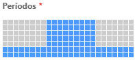 | Los periodos son los intervalos de tiempo en los que las alertas pueden ser enviadas. Al crear un grupo, el valor predeterminado es 24x7. Los cuadrados en gris indican que los horarios seleccionados están inactivos y Monsta no enviará alertas al grupo en esos intervalos de tiempo. |

## Centro de alertas

En esta pantalla se gestionan los grupos de usuarios que recibirán las notificaciones y el tipo de servicio, ya sea por correo electrónico o SMS.

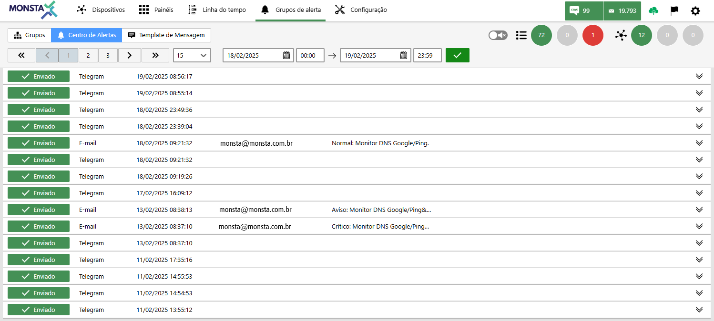

  
**Barra de visualización**: Permite al usuario establecer la cantidad de elementos por página y el periodo que la información debe mostrarse en pantalla.

| Información | Descripción |
| :---: | :--- |
|  | **Estado**: Informa sobre el estado del mensaje enviado a un usuario. |
| 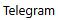 | **Tipo**: Indica por qué medio se envió el mensaje. |
| 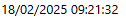 | **Fecha y hora**: Indica la fecha y hora del envío. |
| 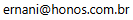 | **Destinatario**: Indica el destinatario del mensaje. Esta información no está disponible para alertas por Telegram debido a que los mensajes se envían a un Bot. |
| 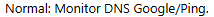 | **Origen**: Indica el dispositivo y monitor que originaron la alerta. |
|  | **Contenido**: Muestra el contenido enviado por la alerta. |

## Plantillas de mensajes

Con nuestras plantillas, puede crear mensajes personalizados para cada tipo de alerta, garantizando que la información más importante se entregue a los responsables de forma rápida y eficiente. Elija entre una variedad de variables para incluir detalles como el nombre del dispositivo, la gravedad de la alerta y la hora de ocurrencia, entre otros.

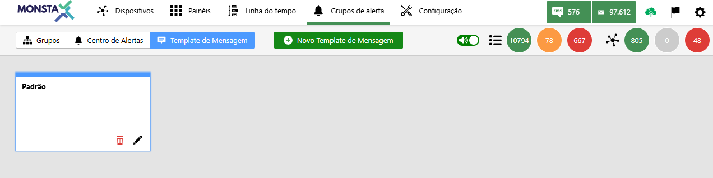

Cree una nueva plantilla y personalice el mensaje como desee.

---

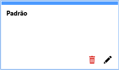
Esta es la casilla que representa la plantilla existente. Al hacer clic sobre ella, el usuario accede a la opción de editar la información existente. 

| Ícono | Descripción |
| :---: | :--- |
|  | Elimina la plantilla existente. <aside class="starlight-aside starlight-aside--caution">
Atención
La plantilla no podrá eliminarse si está en uso por algún grupo de alertas. La plantilla **Predeterminada** forma parte del sistema y tampoco podrá eliminarse.</aside> |
|  | Abre la edición de la plantilla para el usuario. |

### Editando una plantilla de mensaje

En esta pantalla el usuario puede personalizar el mensaje enviado por los grupos de alerta. Se listan las variables existentes que pueden utilizarse y un sencillo lenguaje de programación para trabajar con condiciones.

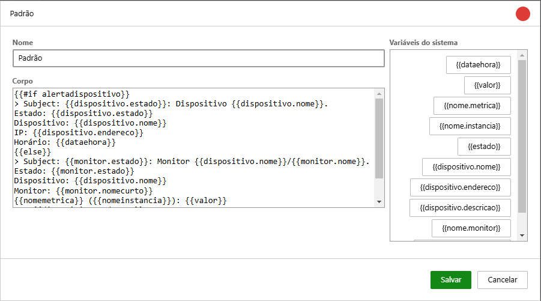

| Opción | Descripción |
| :--- | :--- |
| **Nombre** | Es el nombre que se mostrará en la pantalla de plantillas, así como el que se mostrará para la selección al editar la opción de grupos de alerta. |
| **Cuerpo** | Este es el texto del mensaje de alerta que se enviará al usuario. Cuando se usan variables o comandos de programación, estos deberán ir, obligatoriamente, entre "{{ }}". |
| **Variables del sistema** | Son las variables con información del sistema que están disponibles para ser usadas en las plantillas de alerta. Para agilizar la personalización del texto del cuerpo con las variables, basta con hacer un "doble clic" sobre la variable deseada para insertarla en el texto. |

#### Variables del sistema

| Variable | Descripción
| --- | --- |
| `dataehora` | Devuelve la fecha (d/m/a) y la hora actual (h:m). |
| `dispositivo.descricao` | Devuelve la descripción del dispositivo. |
| `dispositivo.endereco` | Devuelve la dirección IP del dispositivo. |
| `dispositivo.estado` | Devuelve el estado actual del dispositivo obtenido por el monitor Uptime. |
| `dispositivo.estadoanterior` | Devuelve el estado anterior del dispositivo obtenido por el monitor Uptime. |
| `dispositivo.nome` | Devuelve el nombre del dispositivo. |
| `estado` | Devuelve el estado del dispositivo. |
| `monitor.estado` | Devuelve el estado actual del monitor. |
| `monitor.estadoanterior` | Devuelve el estado anterior del monitor. |
| `monitor.nome` | Devuelve el nombre del monitor. |
| `monitor.nomecurto` | Devuelve el nombre mostrado en el icono del monitor. |
| `nome.metrica` | Devuelve el nombre de la métrica. |
| `nome.instancia` | Devuelve el nombre de la instancia. |
| `valor` | Devuelve el valor de la lectura. |

:::caution[Atención]
No hay soporte para *emojis* ni imágenes en las plantillas de alerta. El mensaje enviado por la alerta debe ser solo texto.
:::