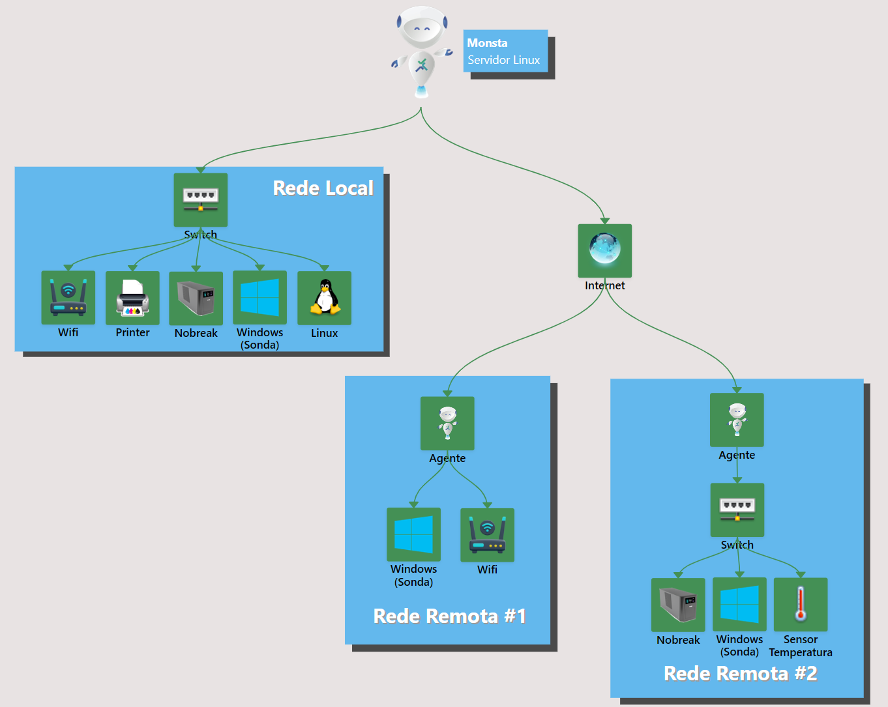

Monsta, desarrollado por Monsta Tecnologia, es una **plataforma de monitorización de infraestructura de Tecnología de la Información (TI)** diseñada para ofrecer una visión integral y en tiempo real de la salud y el rendimiento de diversos componentes de un entorno de TI. Permite que empresas y profesionales de TI identifiquen, diagnostiquen y resuelvan problemas de infraestructura de forma proactiva, garantizando la continuidad de los servicios y la optimización de los recursos.

**Principales Características y Funcionalidades**:

- **Paneles Gráficos Intuitivos y Dinámicos**: La plataforma ofrece paneles de visualización personalizables que presentan métricas e información crucial de forma clara y de fácil interpretación. Estos paneles pueden adaptarse para mostrar datos específicos relevantes para diferentes áreas de la infraestructura.
- **Monitorización en Tiempo Real**: Monsta recopila y muestra datos de rendimiento en tiempo real, permitiendo a los usuarios seguir la actividad y el estado de sus sistemas en el momento exacto en que ocurren los eventos.
- **Detección Precisa de Problemas**: A través de configuraciones de umbrales y alertas inteligentes, Monsta es capaz de identificar anomalías y potenciales problemas de rendimiento antes de que causen interrupciones significativas.
- **Alertas y Notificaciones**: El sistema de alertas notifica a los usuarios mediante canales como SMS, correo electrónico y Telegram, sobre eventos críticos o que requieren atención, permitiendo una respuesta rápida y eficiente.
- **Copia de Seguridad Automática en la Nube**: Monsta ofrece la funcionalidad de copia de seguridad automática de configuraciones y datos de monitorización en la nube, garantizando la seguridad y la disponibilidad de esa información en caso de fallos locales.
- **Monitorización de Dispositivos y Servicios**: La plataforma es escalable y capaz de monitorizar una amplia gama de dispositivos de infraestructura (servidores, redes, firewalls, etc.) y servicios (aplicaciones, bases de datos, sitios web, etc.), con la posibilidad de supervisar un número ilimitado de elementos dependiendo del plan contratado.
- **Monitorización de Redes Remotas mediante Agentes**: Monsta permite ampliar la visibilidad de la infraestructura más allá de la red local, alcanzando unidades remotas, clientes externos o entornos en la nube de forma segura y simplificada a través de sus agentes.

## Ejemplo de una estructura de red monitorizada por Monsta

