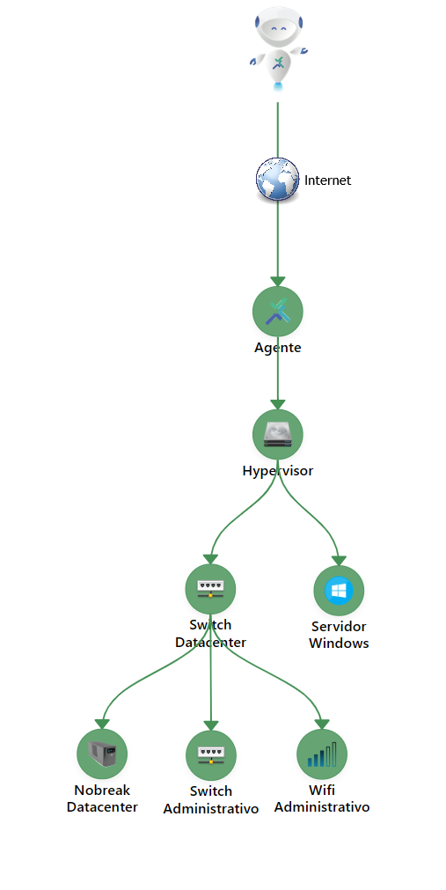

Esta documentación describe el funcionamiento y la arquitectura del **Agente Monsta**, una herramienta para extender el monitoreo de su plataforma a redes remotas y distribuidas, garantizando rendimiento y seguridad mediante el protocolo QUIC.

## Instalación del Agente para Windows

- Descargue el programa del agente:

| :---: | :--- |
| [](https://www.monsta.com.br/monsta/download/agent.msi) | <br> [https://www.monsta.com.br/monsta/download/agent.msi](https://www.monsta.com.br/monsta/download/agent.msi) |

- Conectado con un usuario con permisos de administrador, ejecute el instalador "agent.msi".
- Cuando se le solicite, introduzca la clave de licencia de Monsta a la que desea conectar el agente.

## Instalación mediante la línea de comandos

El instalador **agent.msi** admite parámetros de línea de comandos para automatización. Integrado con la utilidad **msiexec**, permite instalar mediante **GPO**, eliminando la necesidad de intervención manual en la interfaz gráfica.

Opciones de la línea de comando:

| Opción | Descripción |
| --- | --- |
| `LICENSEKEY=[chave de licença]` | Indica la clave de licencia a la que deberá conectarse el Agente. <aside class="starlight-aside starlight-aside--tip"><p class="starlight-aside__title">Consejo</p>La clave de licencia puede obtenerse en Monsta dentro del menú "Configuração" en la opción "Agentes". Se muestra en la esquina superior derecha.</aside> |
| `AGREE=[Y]` | Confirma la aceptación de los términos de uso. |

**Exemplo de uso:**

```powershell
msiexec /i agent.msi /quiet LICENSEKEY=AAAABBBBCCCCDDDDEEEEFFFFGGGGHHHH AGREE=Y
```

:::

:::tip
**Firewall**:  

- No es necesario redirigir ningún puerto al servidor de Monsta;  
- Para garantizar conexiones directas, permita el puerto **58580/UDP** (salida) en el firewall de su servidor de Monsta hacia Internet;  
- Permita el acceso del servidor de Monsta a los hosts mind.monsta.com.br y agent.monsta.com.br.
:::

## Creación del Dispositivo

Una vez completada la instalación, el **Agente** aparecerá automáticamente en la pantalla de **Configuração** en el ítem **Agentes** con la identificación del host. El dispositivo monitorizado será **creado y listado instantáneamente** en la pantalla de **Dispositivos** con el mismo nombre del host y listo para la configuración y la adición de nuevos monitores.

### Cómo Monitorizar Dispositivos a través de la Conexión del Agente

Para cubrir toda la red remota con un único agente, registre los nuevos dispositivos en Monsta y defina que el dispositivo está bajo la **jerarquía** del host donde el Agente está instalado.

Ejemplo de Jerarquía:



##