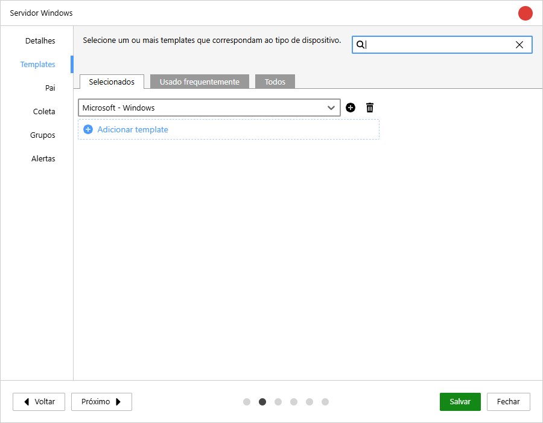
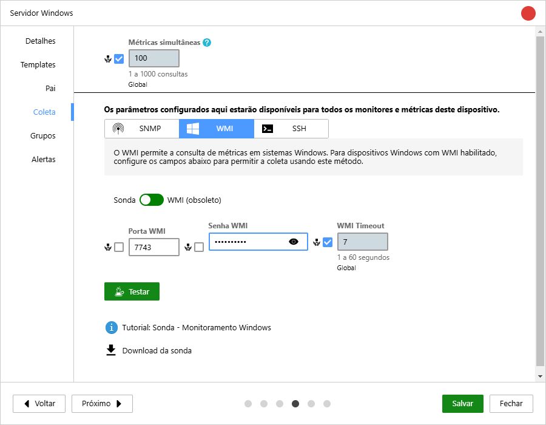

A **Sonda Monsta** es un software de recolección local diseñado para instalarse directamente en servidores y dispositivos **Windows, Linux y Raspberry PI**. Su función principal es recopilar métricas de rendimiento, integridad y disponibilidad del sistema anfitrión, funcionando como una extensión nativa de recolección para la plataforma Monsta.

## Características y Capacidades Técnicas

### 1. Arquitectura Pasiva (Bajo Demanda)

La sonda opera estrictamente bajo un modelo **pasivo de petición y respuesta**. No inicia comunicaciones con la red de forma autónoma; el tráfico de datos ocurre solo cuando Monsta se pone en contacto para realizar el _polling_ (solicitud de recolección).

### 2. Integración con la API WMI (Windows)

En entornos Microsoft, la sonda utiliza de forma nativa la API WMI (_Windows Management Instrumentation_), permitiendo extraer contadores de rendimiento detallados de servidores y estaciones de trabajo sin la necesidad de configuraciones complejas de administración remota en la red.

### 3. Ejecución de Comandos y Scripts PowerShell

La sonda actúa como un brazo de automatización directamente en el sistema operativo del host.

- **Comandos Locales:** Puede ejecutar comandos directamente en el sistema operativo anfitrión.
- **Scripts PowerShell:** Admite el disparo de scripts personalizados, permitiendo monitorizar aplicaciones específicas o crear rutinas de validación a medida.

### 4. Diagnóstico de Salud de Discos Físicos

El software tiene la capacidad de leer indicadores de hardware y el estado de integridad de los discos duros y SSD instalados en el dispositivo. Esto posibilita la identificación temprana de fallos físicos (_bad blocks_) y la degradación del almacenamiento.

### 5. Comunicación Cifrada

Todo el intercambio de información entre el servidor central de Monsta y la Sonda instalada en el dispositivo está **100% cifrado**, garantizando la seguridad de las métricas transmitidas e impidiendo la intercepción de datos sensibles de la infraestructura.

## Instalación de la Sonda

1. Descargue el programa de la sonda en el sistema operativo Windows que desea monitorizar;

|  | Link para download |
| --- | --- |
| [](https://www.monsta.com.br/monsta/download/MonstaProbe.exe) | [https://www.monsta.com.br/monsta/download/MonstaProbe.exe](https://www.monsta.com.br/monsta/download/MonstaProbe.exe) |

2. Con una sesión iniciada por un usuario administrador, ejecute el instalador "monstaprobe.exe" (consulte [Instalación por línea de comandos](#instalação-pela-linha-de-comando) para instalación en lote);
3. Configure los parámetros de puerto y contraseña que se solicitarán durante la instalación.  

## Instalación por línea de comandos {#instalação-pela-linha-de-comando}

El instalador MonstaProbe.exe acepta opciones en la línea de comandos. Puede utilizarlas para automatizar la instalación en una red a través de una GPO, sin necesidad de interacción con la interfaz gráfica.

| Opción &nbsp; &nbsp; &nbsp; &nbsp; &nbsp; | Descripción |
| :--- | :--- |
| `--agree` | Acepta los términos de uso de la sonda colectora. |
| `--port` | Indica el puerto que será utilizado por la sonda colectora. Si no se especifica, el valor por defecto será 7744 (TCP). |
| `--passwd` | Asigna la contraseña que utilizará la sonda colectora. La contraseña por defecto será *monsta@dm* en caso de no especificarse. |

**Ejemplo de uso**

```powershell
MonstaProbe.exe --agree --port 1234 --passwd senha
```

:::note
**port**: Es el puerto que será utilizado por la sonda para que Monsta se conecte. El valor por defecto es **7744** (TCP).  
**password**: Es la contraseña de autenticación para la sonda en el equipo instalado. El valor por defecto es `monsta@dm`.
:::

## Configuración en Monsta

Dentro de Monsta, al crear un dispositivo, solo configúrelo para utilizar las plantillas de Microsoft.



Y rellene el campo "Usuário WMI" con cualquier información (será descartada posteriormente) y el campo "Senha WMI" con la contraseña indicada durante la instalación de la sonda.



Después de crear el dispositivo ya puede utilizar los monitores disponibles de la plantilla.

##