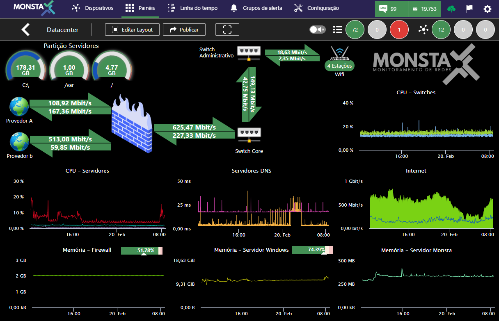
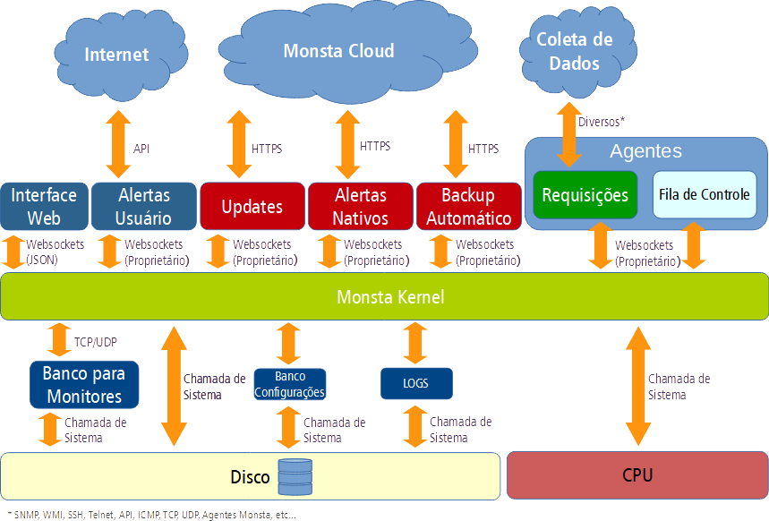

Monsta es una solución completa y intuitiva para el monitoreo de redes, diseñada para proporcionar información detallada sobre sus dispositivos y recursos, permitiendo que usted mantenga su red funcionando sin problemas y evite interrupciones. Con una interfaz amigable y potentes recursos, el \[Nombre del Software\] ofrece una visión integral de su red, permitiendo que usted tome decisiones informadas y optimice el rendimiento de su infraestructura.

## Principales características

- **Monitoreo exhaustivo de dispositivos**: Controle el rendimiento y la salud de todos sus dispositivos de red, incluidos servidores, enrutadores, switches, firewalls y mucho más.
- **Información detallada sobre recursos**: Obtenga información profunda sobre el uso de CPU, memoria, disco, ancho de banda y otros recursos importantes de cada dispositivo.
- **Generación de gráficos y paneles**: Visualice datos de rendimiento en tiempo real mediante gráficos y paneles personalizables, permitiendo que usted identifique tendencias y cuellos de botella.
- **Alertas inteligentes**: Reciba notificaciones instantáneas sobre problemas y eventos críticos, permitiendo que usted tome medidas preventivas y corrija problemas antes de que afecten a sus usuarios.
- **Predicción de problemas**: Utilice herramientas de análisis avanzadas para identificar patrones y prever posibles problemas, permitiendo que usted se prepare y evite interrupciones.
- **Interfaz intuitiva y fácil de usar**: Monsta fue diseñada para ser fácil de usar, incluso para usuarios sin conocimientos técnicos avanzados.
- **Informes personalizables**: Genere informes detallados sobre el rendimiento de su red, permitiendo que usted siga el progreso y comparta información con su equipo.
- **Bajo consumo de hardware**: Gracias a su arquitectura optimizada, Monsta garantiza un rendimiento excepcional con el mínimo consumo de recursos. Esto se traduce en mayor velocidad, fluidez y capacidad de respuesta, incluso en entornos con alta demanda.
- **Desarrollo 100% propio**: Solución 100% desarrollada por Monsta Tecnología, fruto de nuestra experiencia y dedicación para ofrecer el mejor software de monitoreo de redes del mercado.
- **Copias de seguridad automáticas**: Monsta realiza una copia de seguridad en la nube, automáticamente, de todas sus configuraciones.

## ¿Para qué sirve Monsta?

Monsta tiene como objetivo garantizar el funcionamiento continuo de los servicios esenciales en su organización, monitorizando de forma continua el hardware y software existentes en su red y emitiendo alertas a los responsables.

## Requisitos mínimos

Sugerido para monitorizar 500 dispositivos y 5.000 monitores.

| Item | Requisito mínimo |
| :---: | :--- |
|  | **Espacio en disco** 40GB libres para /var (configuraciones, base de datos y registros)1  300MB libres para /opt/monsta (programas y bibliotecas) |
|  | **Memoria RAM** 1GB de memoria RAM |
|  | **Sistema Operativo** Linux 64 bits Sistema operativo recomendado: Fedora Server 40 |
|  | **Procesador** Núcleos: 2 Velocidad: 1.8GHz |

:::note
1 El tamaño de la partición depende de la cantidad de información que se almacenará. Los datos de monitoreo se comprimen antes de guardarse en disco.
:::

## Especificaciones

| Categoría / Ítem | Especificación |
| :--- | :--- |
| **DESARROLLO** | |
| Lenguaje de Desarrollo | Rust, Typescript y Go |
| Lenguaje HTML | HTML 5 |
| Lenguaje de los Scripts | LUA, Python y MagoVM (Propietario) |
| **SISTEMAS** | |
| Servidor HTTP | Monrouter (desarrollo propio) |
| Sistema Operativo | Linux de 64 bits |
| Comunicación con la nube | HTTP y HTTPS con criptografía TLS |
| Mecanismos de Recolección | SNMP, WMI, ICMP, TCP, API y fuentes externas. (Permite al usuario crear su propio mecanismo) |
| **ALERTAS NATIVAS** | |
| SMS | Envío a través de Twilio y Zenvia |
| E-mails | Envío a través de AWS |
| Telegram | Envío a través del bot MonstaTecnología en Telegram |
| **BASE DE DATOS (Historial de Monitores)** | |
| MonstaDB | (Propietario) Modelo `nosql` para consultas en tiempo real |
| En Memoria | Sí |
| Protección contra corrupción de datos | Sí |
| Persistente | Sí |
| Compresión de datos | Sí |
| Descarte de información | No (los datos no se resumen con el paso de los días) |
| **BASE DE DATOS (Configuraciones)** | |
| Base de Datos | (Propietario) Modelo SQL |
| En Memoria | Sí |
| Protección contra corrupción de datos | Sí |
| Persistente | Sí |
| Compresión de datos | Sí |
| Descarte de información | No |

## Arquitectura de software

## Prueba antes de comprar

Prueba Monsta en su organización para evaluar su funcionamiento y comportamiento. La versión de evaluación no tiene límite de monitores o dispositivos y si le ha gustado la herramienta, todo el trabajo que ha realizado no se descarta, bastando activar la clave de licencia del software para convertir la versión de evaluación en definitiva.

## Sobre la empresa

Monsta es una empresa de tecnología centrada en la detección y solución de problemas de infraestructura de TI. Nuestro objetivo es hacer que la monitorización de la red sea una tarea simple y automatizada, a través de una herramienta confiable y de bajo costo para el mercado.