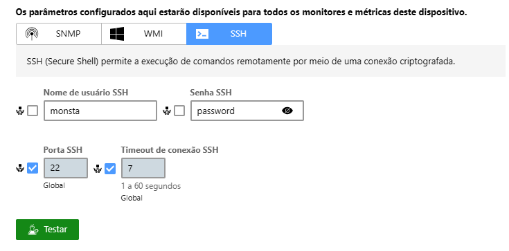
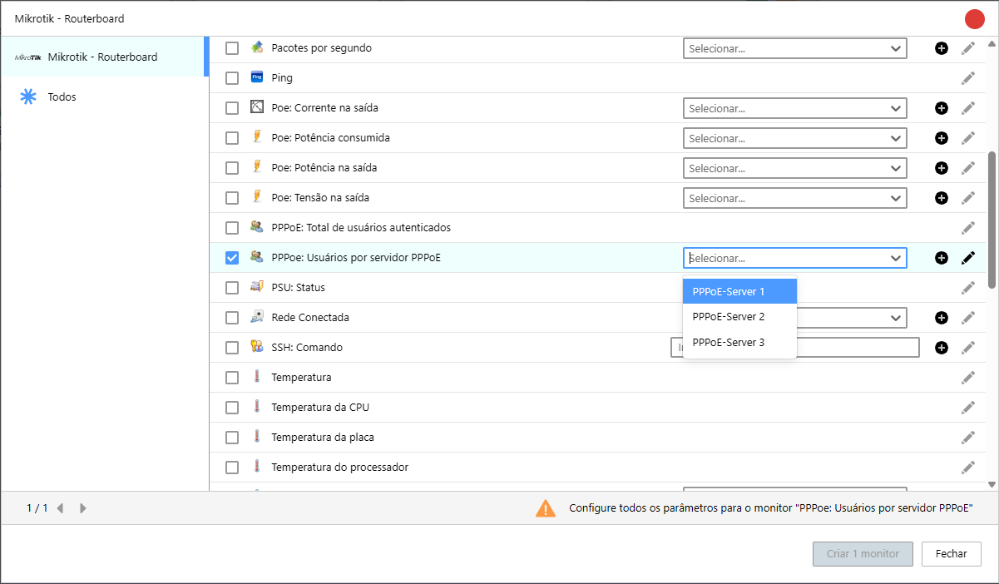
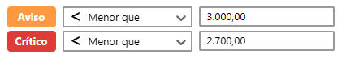

Para proveedores que utilizan el **Mikrotik** como concentrador PPPoE, saber el número exacto de clientes conectados en cada servidor es una métrica esencial. Esta guía rápida muestra cómo puedes configurar el **Monsta** para monitorizar el total de usuarios por `pppoe-server`.

## 1. Recopilación de datos

El método utilizado para obtener el recuento *por servidor* en Mikrotik es mediante la ejecución de un comando vía **SSH** (*Secure Shell*).

### 1.1. Configuración de acceso en Mikrotik

Antes de configurarlo en Monsta, tu Mikrotik debe permitir el acceso SSH:

1. **Crea un usuario específico**: en Mikrotik, crea un usuario (p. ej.: `monsta`) con una contraseña fuerte y permisos mínimos (solo lo necesario para ejecutar el comando, como `read`).
2. **Habilita el servicio SSH**: asegúrate de que el servicio SSH (puerto 22, por defecto) esté activo y de que el Firewall de Mikrotik permita conexiones entrantes desde la IP donde está instalado tu Monsta.

## 2. Configuración del monitor en Monsta

Haz clic en el botón para añadir un nuevo dispositivo e introduce la siguiente información:

1. En la pestaña Detalles, rellena la siguiente información: 
    1. **Nombre del dispositivo**: en este campo escribe cualquier texto que identifique tu equipo;
    2. **Dirección IP**: indica la IP del Mikrotik;
2. En la pestaña Plantillas, selecciona "Mikrotik Routerboard;
3. En la pestaña Recopilación, rellena la opción "SSH" con el usuario, la contraseña y el puerto en caso de que sea distinto del 22. 

:::tip
Puedes usar el botón "Probar" para comprobar si la conexión está bien.
:::

4. Haz clic en Guardar para crear el nuevo dispositivo.

*Pantalla de configuración del SSH*

## 3. Creación del monitor de usuarios

Después de crear el dispositivo, haz clic sobre él para que los monitores aparezcan en la parte inferior de la pantalla. Haz clic en "+" para añadir un nuevo monitor.

En la ventana de monitores, busca "PPPoE: Usuarios por servidor PPPoE" y selecciona qué servidor deseas monitorizar la cantidad de usuarios.

*Pantalla para añadir monitores*

Haz clic en el botón para crear el monitor.

Ahora tu Monsta monitoriza el total de usuarios dentro de ese servidor. Si deseas añadir el monitoreo de otros servidores, basta con hacer clic de nuevo en "+" y seleccionar las opciones disponibles.

:::tip
Al abrir el monitor para visualizar su gráfico, haz clic en el botón "Editar" situado en la esquina superior derecha e indica los límites en los que te gustaría recibir alertas en caso de problemas.
:::

*Ejemplo de límites de alerta*