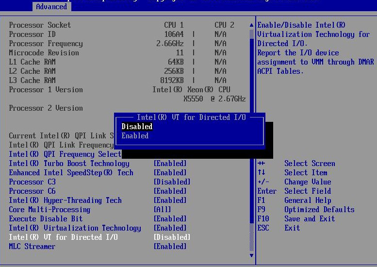
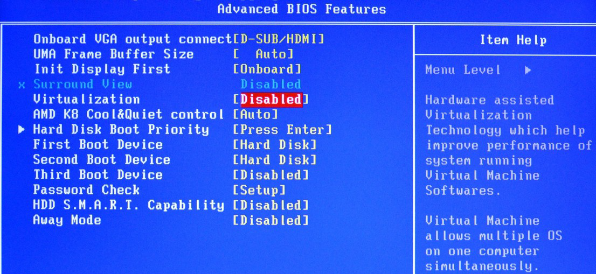
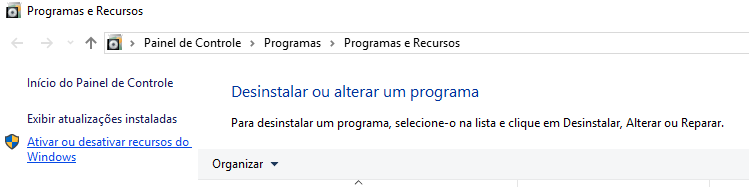
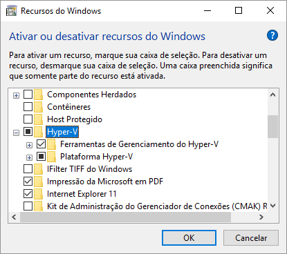
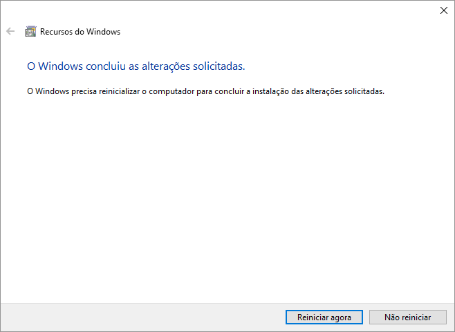
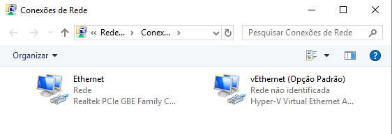
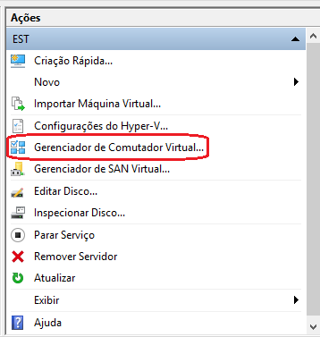
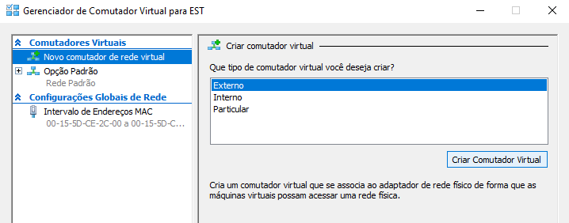
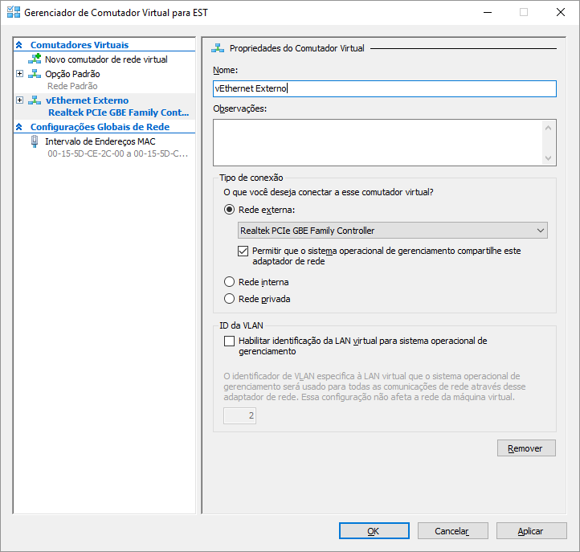
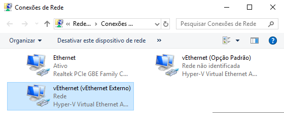

Tutorial com o objetivo de demonstrar o procedimento para instalar o sistema de virtualização da Microsoft, Hyper-V, em um servidor Windows.

O Hyper-V é o ambiente de virtualização de servidores da Microsoft e faz parte das atuais versões de Windows disponíveis no mercado. Para estações de trabalho ele está disponível a partir da versão 8 (64 bits) e para servidores está disponível a partir da versão 2008 Server (64 bits).


:::note
A versão utilizada para este tutorial é a Windows 10 Pro.
:::


## Habilitar a virtualização na BIOS do computador

O Hyper-V necessita que o hardware onde o Windows está instalado tenha suporte a virtualização para funcionar. Esse recurso pode vir desabilitado em alguns computadores. Para habilitá-lo reinicie o equipamento, acesse sua bios (em geral através das teclas F1 ou Delete) e habilite a opção para virtualização do processador conforme exemplos abaixo:





Salve as alterações e reinicie o computador.

## Instalar o Hyper-V

Logado com permissões de Administrador no Windows, execute o programa abaixo:

```powershell
appwiz.cpl
```

A tela para gerenciar programas e recursos irá abrir.



- Clique na opção “Ativar ou desativar recursos do Windows



- Marque a opção “Hyper-V”e todos seus subitens.
- Clique no botão Ok.



- Clique no botão “Reiniciar agora”.

Após reiniciar o Windows o Hyper-V estará disponível.

## Adicionar uma interface de rede externa

Quando o Hyper-V é instalado uma nova interface de rede chamada de vEthernet é criada conforme imagem abaixo:



  
Para criar uma interface com acesso externo, execute o programa abaixo:

```powershell
virtmgmt.msc
```

Será aberto o sistema de gerenciamento do Hyper-V. Execute os passos a seguir:



- No menu Ações, clique em “Gerenciador de Comutador Virtual”.



- Clique na opção “Novo comutador de rede virtual”;
- Selecione a opção “Externo”;
- Clique no botão “Criar Comutador Virtual”.



- Digite um nome para o novo comutador;
- No “Tipo de conexão” seleciona a opção “Rede Externa” e a placa de rede para o seu comutador;
- Clique no botão “Ok” para criar o comutador.

A partir de agora uma nova interface de rede estará disponível em seu computador. Se necessário, configure os endereços IP’s para essa nova interface.



## Instalar o Monsta em um servidor Linux

Quer instalar o Monsta em um servidor Linux? Utilize nosso [Manual de Instalação](/pt-br/start/instalacao/instalacao-monsta).
