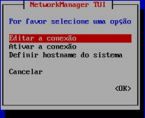
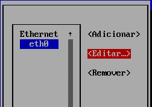
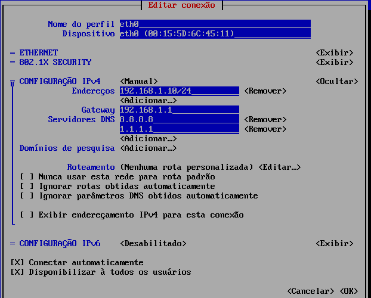
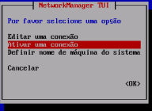
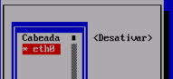
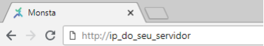
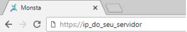

Este tutorial passo a passo irá guiá-lo no processo de alteração do endereço IP em um servidor Linux Fedora. Aprenda a configurar um endereço IP estático ou dinâmico para garantir a conectividade de rede ideal para o seu servidor.

## Configurar o IP do servidor

Entre com as credenciais de root em seu servidor. Uma vez logado, instale o programa para gerenciar interfaces de rede:

```shell
dnf install -y NetworkManager-tui
```

Depois de instalado, execute o gerenciador:

```
nmtui
```

Siga a sequência abaixo para editar as configurações de rede:



- Selecione “Editar a conexão”;
- Pressione “Enter”.

- Selecione sua conexão de rede;
- Selecione “Editar”.

Utilize a tecla “TAB” para navegar entre os campos. Caso sua rede possua um servidor DHCP habilitado, deixe os campos de “CONFIGURAÇÃO DO IPVx” em Automático. Se quiser um IP fixo para seu servidor, faça o seguinte:
- Selecione o campo “CONFIGURAÇÃO DO IPVx” e pressione “Enter”;- Selecione o modo “Manual”;
- Selecione “Exibir” e pressione “Enter”;
- Preencha os campos conforme as configurações da sua rede; Lembre-se de informar a máscara de rede após o endereço IP. No exemplo ao lado a máscara é /24.
- Ao final, selecione “OK”;
- Pressione “Enter”.
- Pressione a tecla “ESC” para retornar a tela inicial.

- Selecione “Ativar uma conexão” e pressione “Enter”.

- Selecione a placa de rede que teve seu IP alterado e pressione “Enter” para desativá-la;
- Em seguida, pressione “Enter” novamente para ativá-la.
- Pressione “ESC” até sair do programa e retornar ao prompt de comando.

## Acessar o Monsta

Após configurar o endereço IP do servidor, abra um navegador de internet e acesse:



ou

  
  
A tela de login do Monsta será apresentada. Para efetuar o login, utilize suas credencias.

## Regras de Firewall (Opcional)

Se a sua rede possui um firewall que controla os acessos à internet, libere os seguintes hosts e portas:

>- Host ``a.ntp.br`` e 2.fedora.pool.ntp.org  
>- Host ``mind.monsta.com.br`` na porta 443/TCP  
>- Host ``mind.monsta.com.br`` na porta 80/TCP

As portas acima para ``mind.monsta.com.br`` e ``www.monsta.com.br`` permitem:

>- Backup automático das configurações.  
>- Restauração do backup em caso de alguma falha.  
>- Envio de notificações por E-mail, SMS e Telegram.  
>- Checagem do estado da comunicação entre o Monsta instalado em seu servidor e o a Nuvem do Monsta. Com isso é possível receber alertas em caso de paradas inesperadas do serviço de monitoramento, tal como o desligamento impróprio do servidor ou falha no link de internet.  
>- Autenticação das Chaves de Licenciamento.  
>- Verificar e atualizar a versão do sistema.

:::tip
Utilize este tutorial para configurar regras do seu firewall caso sua instalação do Fedora tenha instalado o sistema FirewallD: [FirewallD - Gerenciamento de Firewall](/pt-br/extra/linux/firewalld-gerenciamento-de-firewall)
:::